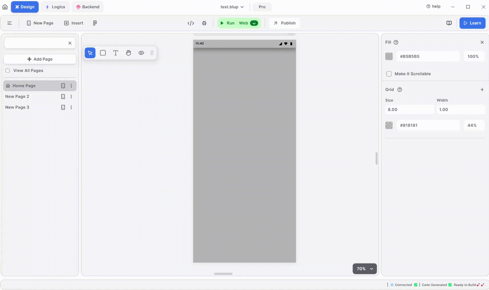

# How to know Debug prints in blup

<figure><figcaption>
Debug Print
</figcaption></figure>

Debugging is an essential aspect of application development, and Blup provides a straightforward way to utilize debug print statements to monitor your app's performance and diagnose issues. Here's a step-by-step guide to help you effectively use debug print statements in Blup:

#### Step 1: Run Your Application

Start by running your Blup application. This initiates the processes and scripts that you want to monitor.

#### Step 2: Access the Debug Panel

Once your application is running, locate the "View Details" button at the bottom of your screen and click on it. This action will open a detailed view of your application's current state.

#### Step 3: Navigate to the Debug Panel

In the bottom right corner of the detailed view screen, you'll find the debug panel. This panel is crucial as it displays all the debug print statements that your application generates.

#### Step 4: Analyze Debug Prints

The debug panel shows the real-time output of your application's debug print statements. These statements are lines of code that you insert into your application to print specific information about its operation. They help you understand the flow of your application, monitor variable values, and identify where things might be going wrong.

### Benefits of Using Debug Prints in Blup

1. **Immediate Feedback**: Debug print statements provide instant feedback about your application's performance and behavior, allowing you to quickly pinpoint issues.
2. **Simplified Debugging**: By strategically placing debug prints in your code, you can simplify the debugging process, making it easier to trace and resolve problems.
3. **Enhanced Understanding**: Debug prints offer insights into how your application works, which can be invaluable for both novice and experienced developers.


<mark style="color:blue;">Note: Debugging means finding and fixing problems in your application.</mark>


### Tips for Effective Debugging

* **Use Descriptive Messages**: Ensure your debug print statements are clear and descriptive. This makes it easier to understand the output without referring back to the code.
* **Limit Output**: Too many debug prints can clutter the debug panel. Use them judiciously to avoid overwhelming yourself with information.
* **Remove Debug Prints**: Once you've identified and fixed the issues, remove or comment out unnecessary debug prints to keep your code clean.

If you have any ideas to make Blup better you can share them through our [Discord community channel](https://discord.com/channels/940632966093234176/965313562425823303)

## Music to go with.


Lofi music

