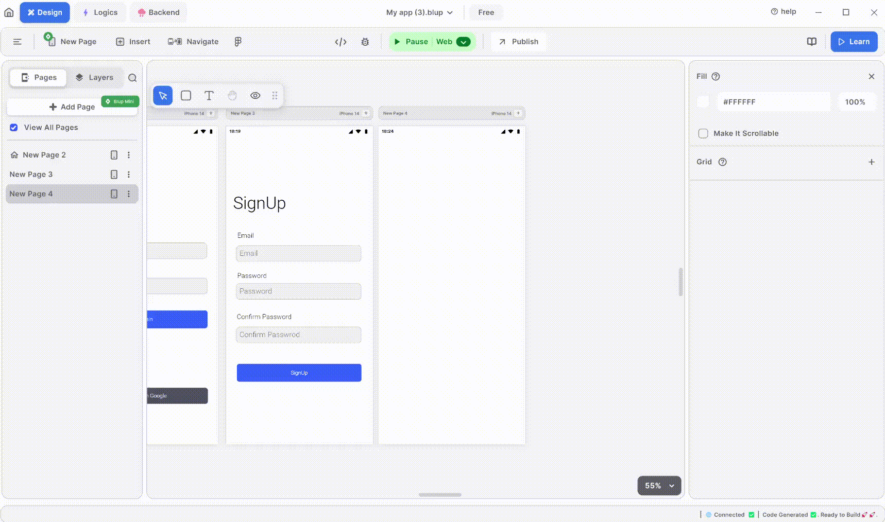

# How to use the camera in blup?

<figure><figcaption>
Camera View
</figcaption></figure>

### **Camera View**

Learn to integrate and use the camera in Blup for capturing photos and videos directly within your app.

**To use the camera in Blup, follow these steps:** 📸&#x20;

1. **Click on the "Insert" tab.** 📋
   * Begin by navigating to the "Insert" tab in your Blup interface.
2. **Drag and drop the "Camera" widget onto your UI screen.** 🖱️
   * Locate the "Camera" widget from the list of available widgets and drag it to the desired spot on your app’s UI screen.
3. **Adjust the camera functionality to suit your needs.** ⚙️
   * Once the widget is in place, you can customize its properties. This includes setting the resolution, choosing the flash mode (on, off, auto), and selecting the capture mode (photo or video).
4. **Test the camera.** 🧪
   * After configuring the camera settings, click on the "Run" button to see how the camera works in real time. Capture photos or videos to ensure everything is functioning as expected.

For more detailed information about the camera components and their properties, click [here](https://docs.blup.in/how-to-use-camera).


<mark style="color:blue;">Note: If you want to learn more about the Camera components,</mark> [<mark style="color:blue;">Click Here</mark>](wiki/design-ui/insert-widgets/cameraview-widget.md)<mark style="color:blue;">.</mark>


### Join Our Community

Do you have ideas to make Blup even better? Share your thoughts and suggestions with us on our  [Discord community channel](https://discord.com/channels/940632966093234176/965313562425823303). We love hearing from our users and continuously strive to improve Blup based on your feedback! 💡

## Music to go with.


Lofi music

