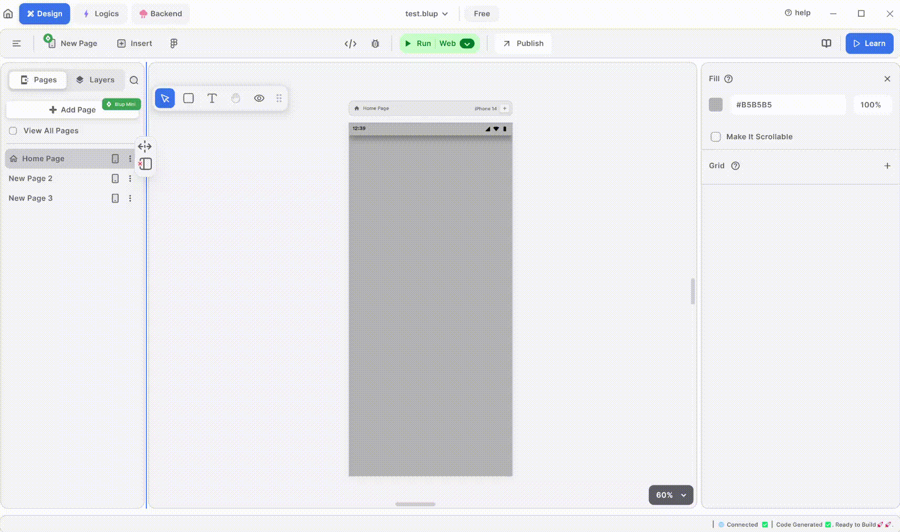

# How to use WebView in Blup

Integrating and using WebView in Blup allows you to display web content seamlessly within your application. This guide will walk you through the steps to set up and customize a WebView in your Blup app.

#### WebView Overview

WebView is a powerful tool that enables you to embed web pages directly into your app. This can be useful for displaying web content like articles, web forms, or entire websites without the need for users to leave your app.

<figure><figcaption>
Web View
</figcaption></figure>

### Step-by-Step Guide to Using WebView in Blup

&#x20;

### 1. **Insert WebView**:

To get started, you need to add a WebView widget to your UI screen. This is a simple process:

* Open your UI editor in Blup.
* Drag and drop the WebView widget to your desired position on the screen.
* Customize the height and width of the WebView to fit your design preferences. You can adjust these dimensions to make sure the WebView looks perfect within your app layout.

### 2. Set WebView URL:

Once you have placed the WebView widget, the next step is to specify the URL you want the WebView to load:

* In the UI editor, select the WebView widget you just added.
* Find the URL setting option and enter the web address of the content you want to display. This URL can be any web page that you wish to embed within your application.

### 3. Run Emulator:

To see how your WebView looks and behaves in your app, you should launch the emulator or simulator:

* Click on the “Run” button to start the emulator.
* The emulator will show your app with the WebView integrated.
* Navigate to the screen where you added the WebView to check if it displays the web content as expected.


<mark style="color:blue;">Note: If you want to learn more about the WebView components,</mark> [<mark style="color:blue;">Click Here</mark>](wiki/design-ui/insert-widgets/web-view-widget.md)<mark style="color:blue;">.</mark>


#### Additional Tips

* **Interactive Web Content:** Make sure the web content you are displaying is mobile-friendly and interactive to enhance user experience.
* **Testing:** Regularly test the WebView across different devices and screen sizes to ensure consistent performance and appearance.
* **Updates:** Keep the URL updated to reflect the latest web content you want to showcase in your app.

### Share Your Ideas

We are always looking to improve Blup. If you have any ideas or suggestions to make Blup better, join our  [Discord community channel](https://discord.com/channels/940632966093234176/965313562425823303) and share your thoughts with us!

## Music to go with.


Lofi music

