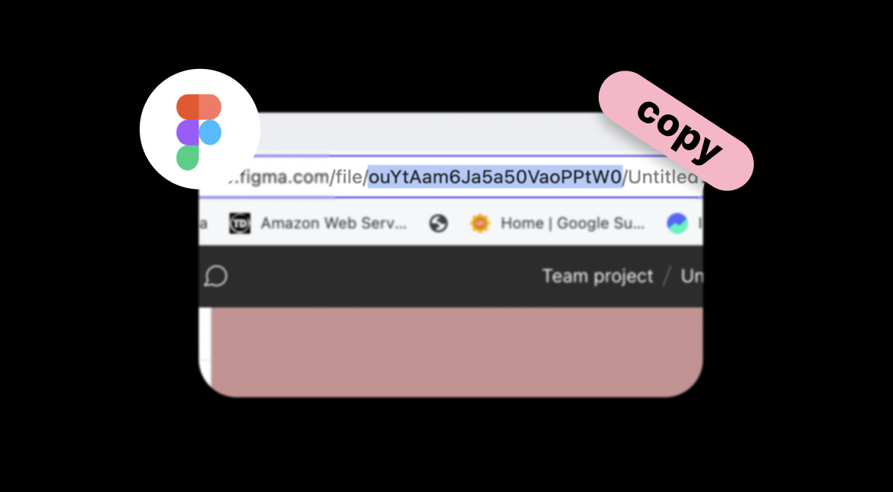
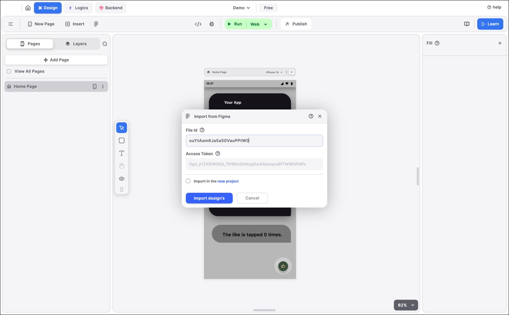
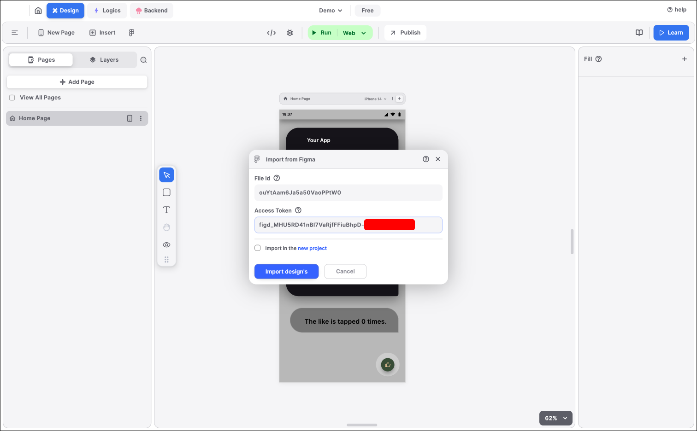

# Import from Figma

There are some steps to bring your Figma file inside Blup.

Import your Figma files directly into Blup with ease! Follow these simple steps to get your designs into Blup in no time. 🚀

### **Step 1: Copy the File ID from the URL**

Open your Figma file in a browser. Look at the URL and find the text after '.../file/' and before the next '/...'. This is your File ID. Copy it! 📋

**Example**: If your URL is `https://www.figma.com/file/abc12345/your-design-file`, you need to copy `abc12345`.

<figure><figcaption>
Copy File FiD
</figcaption></figure>

### Step 2: Paste the File ID

Go to Blup and open the "Import from Figma" dialog box. Paste the File ID you copied in the designated field. It's that easy! 🖱️

<figure><figcaption>
Paste the file-id
</figcaption></figure>

### Step 3: Create a Token from Figma

Now, you need a token to allow Blup to access your Figma file. In Figma, go to your account settings and generate a personal access token. This token is essential for the import process. 🔑

<figure><figcaption>
Create token from figma
</figcaption></figure>

### Step 4 Paste the copied token

Go back to Blup. In the "Import from Figma" dialog box, paste the token you just created. This will authenticate your import request. ✅

<figure><figcaption>
paste the copied token
</figcaption></figure>

### Step 5: Wait & let the magic happen!

Click the "Import Design" button in Blup. Select the frames you want to import from your Figma file. Click on "Import" and watch the magic happen! ✨

1. Click on **Import design's** Button
2. Select the frames you want to import and click on **Import**
3. And the magic happens.

<figure><figcaption>
import design
</figcaption></figure>

You’ll see your Figma designs appear in Blup, ready for you to continue working on. 🎨
