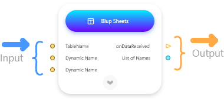
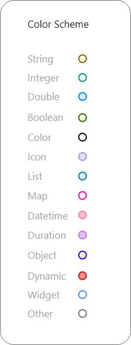

# Blup Lightning (Logics) ⚡








Lofi music




In Blup, the Logics module allows you to create and manage logic for different widgets within your app. To access Logics in BlupStudio, click on the Logics icon located on the top-left side, next to the Design panel, labeled Logics.

## Dashboard

### 1.Logic Button

When click on Logic button it will open a Logic Console at the bottom for implementing your logics accordingly.

### 2.Logic Tab

Each tab corresponds to an individual page and encompasses all the logic associated with that specific page. These tabs can be likened to the tabs in the Chrome browser, where each tab corresponds to a particular website.

### 3.Add Node

Add node allow you to choose which node you want to imply on to your widget either you want apply function to your desgins or want that design to do some mathematical expressions or many more. You can also open that add node by right clicking on logic console.

### 4.Search

On search you can find your widget or Designs that you have applied to your Design Screen.

### 5.Debug

On debug, it will run your design and check if everthing is working as expected or not. It shows you all the errors and print node output that you have placed in your logic.

### 6.Zoomer

It allow your Logic console to zoom out or zoom in for better view if your logic nodes increases or decreases.

### 7.Maximizer

It take the necessary spaces in blup for Logic screen so you can work on your logics clearly.

### 8.Ellipsis

On clicking ellipsis you will see 4 components Refresh Logic, Help in Logic, Mini map, and Debug console.

#### Refresh Logic

It will refresh the logics if something is not working correctly.

#### Help in Logic

It will open a small box with logics on it, for your help how to use logics and which color is situated to what thing.

#### Mini map

It will open a mini map of your Logic console on bottom left, from this map you can go any where in your console just by clicking at that part in map. It will help when u have so many logics and you want to go from one point to another in logic console.

#### Debug console

It will open a debug console next to your Logic console so you can check the errors or the process in real time.

### 9.Logic Console

Its a console where you create and connect all your logics. 

## List Of Nodes Available in Logics \[Cheat Sheet]

## Understanding Node Structure

All the nodes that are present in the Blup Lightning follow the same node structure or pattern. On the top center of each node, is the name of the node, this name signifies multiple things like which category the node belongs to and what is it's intended task.

The left-hand side of each node takes the input and the Right-hand side of each node gives the output. To take input or provide output each node uses a node point.


<mark style="color:blue;">Note: In some of the nodes you can also use the input box located inside the node..</mark>


### What is Node point

Node points are points lying on the outer surface of the node to accept input, provide output or for navigation to another page. In blup data flows from one node point to another. Node points can only connect with node points of the same type.

There are two types of node points:

#### **Circular node point**

These node points as the name suggest are circular in shape and colour coded, according to the type of data being passed through this thereby, if two node points are to be connected, they need to be of the same colour.&#x20;

**For Example -** A string node point can accept node wire from other string node points only.

#### **Function Node Points**

These node points are triangular in shape. Unlike circular node points the function node point doesn’t follow any color schema .&#x20;

Function node points in blup lightning serve two major purposes that are:-&#x20;

#### Run Trigger

Run trigger consist of two function node point one on left-hand side and one on right -hand side of the node, the left-hand side node point act as a starting point for the node and node point on the right-hand side node run the other function node point after the current logic is finished.

#### Function Output Node Points

These node point are present on the right hand side, they are useful for running a logic based on certain triggers.

.png>)

For example, in the above Rectangle Node the logic attached to the on-click function node point only runs when the user clicks on the rectangle in app.

In Some of Cases these output node points also provides you with additional output node point for further flexibility

**For example -** When the on File Picked Function ouput Node point Stretch you can see that new ouput node points are generated that provides you with extra output node point.
