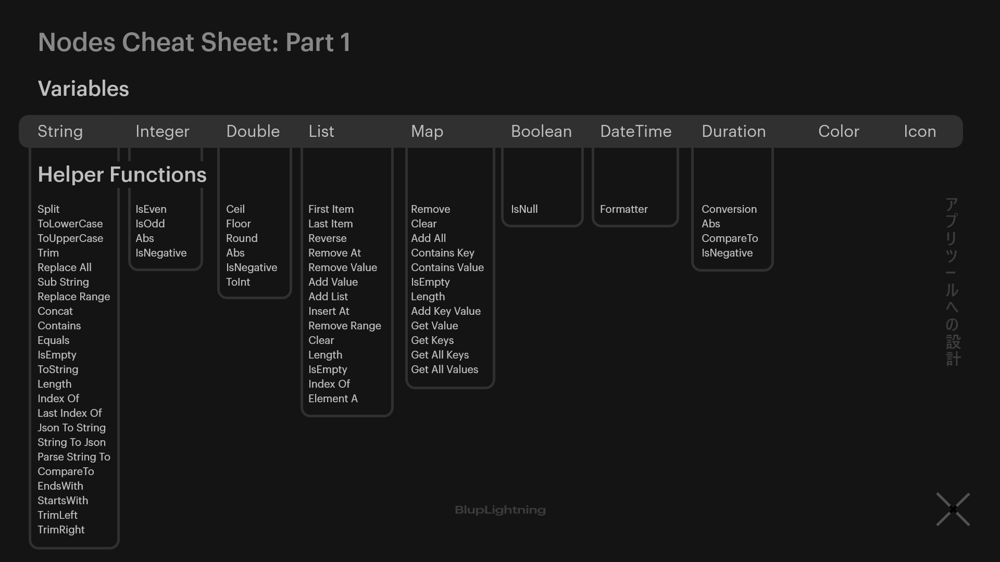

# Blup Lightning (Logics) ⚡








Lofi music




In Blup, the Logics module allows you to create and manage logic for different widgets within your app. To access Logics in BlupStudio, click on the Logics icon located on the top-left side, next to the Design panel, labeled Logics.

.gif>)

### Overview of Logics.

Logics in BlupStudio offers various components, such as a debug console and swap panel, that aid users in seamlessly connecting multiple nodes on a specific page.

<table><thead><tr><th width="124"></th><th></th></tr></thead><tbody><tr><td><strong>Logics Tabs</strong></td><td>Each tab on the BL represents an individual page. Each tab contains all the logic for that particular page. These tabs are comparable to the tabs in the Chrome browser, where each tab contains a website.</td></tr><tr><td><strong>Zoom Slider</strong></td><td>It is used to zoom in and out in BlupLightning. When the number of nodes increases or decreases in a tab you can zoom in or zoom out to get a close-up or clearer view.</td></tr><tr><td><strong>Debug Console</strong></td><td>Here, you can debug your app to check whether everything is working as expected or not. It shows you all the errors and print node output that you have placed in your logic.</td></tr><tr><td> <strong>Swap Panel</strong></td><td>It is used when to switch quickly between  BlueSheets and BlupLightning panels.</td></tr><tr><td> <strong>Arsenal</strong></td><td>
Arsenal is a BlupLightning finder, used to find nodes. In BlupLightning, right-click on the open space to open the arsenal.

Nodes in Arsenal are grouped into sections, with every section including nodes of comparable sorts. For example, in the variable nodes section, you can find literal nodes such as integer, strings, double, Boolean, and so on. Arsenal comes with tiny descriptions when you hover over any node or navigate with the arrow keys. There is also a search box at the top of the Arsenal where you may find nodes by their name. 
</td></tr></tbody></table>

## List Of Nodes Available in BL \[Cheat Sheet]

## Understanding Node Structure

All the nodes that are present in the Blup Lightning follow the same node structure or pattern. On the top center of each node, is the name of the node, this name signifies multiple things like which category the node belongs to and what is it's intended task.

The left-hand side of each node takes the input and the Right-hand side of each node gives the output. To take input or provide output each node uses a node point.


<mark style="color:blue;">Note: In some of the nodes you can also use the input box located inside the node..</mark>


### What is Node point

Node points are points lying on the outer surface of the node to accept input, provide output or for navigation to another page. In blup data flows from one node point to another. Node points can only connect with node points of the same type.

There are two types of node points:

#### **Circular node point**

These node points as the name suggest are circular in shape and colour coded, according to the type of data being passed through this thereby, if two node points are to be connected, they need to be of the same colour.&#x20;

**For Example -** A string node point can accept node wire from other string node points only.

#### **Function Node Points**

These node points are triangular in shape. Unlike circular node points the function node point doesn’t follow any color schema .&#x20;

Function node points in blup lightning serve two major purposes that are:-&#x20;

#### Run Trigger

Run trigger consist of two function node point one on left-hand side and one on right -hand side of the node, the left-hand side node point act as a starting point for the node and node point on the right-hand side node run the other function node point after the current logic is finished.

#### Function Output Node Points

These node point are present on the right hand side, they are useful for running a logic based on certain triggers.

.png>)

For example, in the above Rectangle Node the logic attached to the on-click function node point only runs when the user clicks on the rectangle in app.

In Some of Cases these output node points also provides you with additional output node point for further flexibility

**For example -** When the on File Picked Function ouput Node point Stretch you can see that new ouput node points are generated that provides you with extra output node point.
