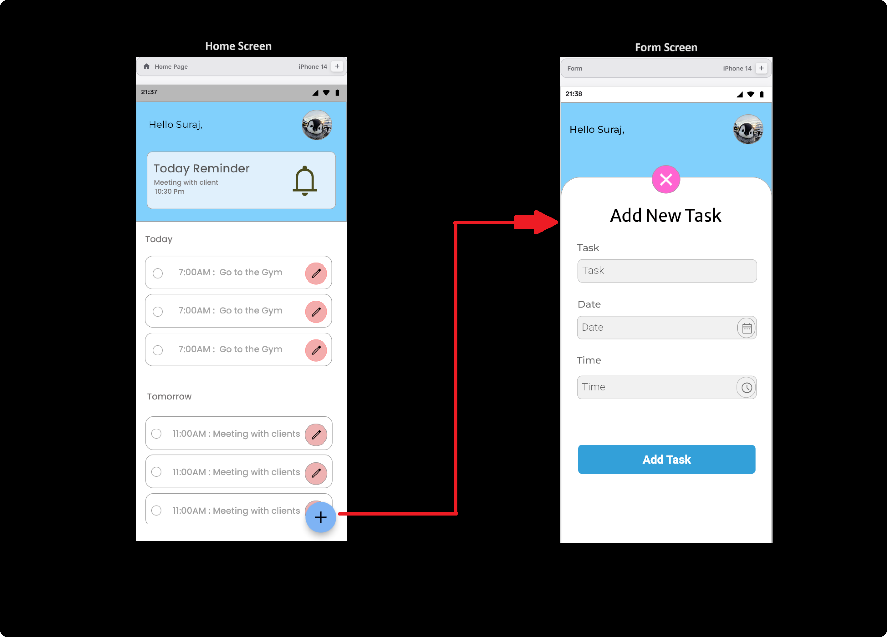
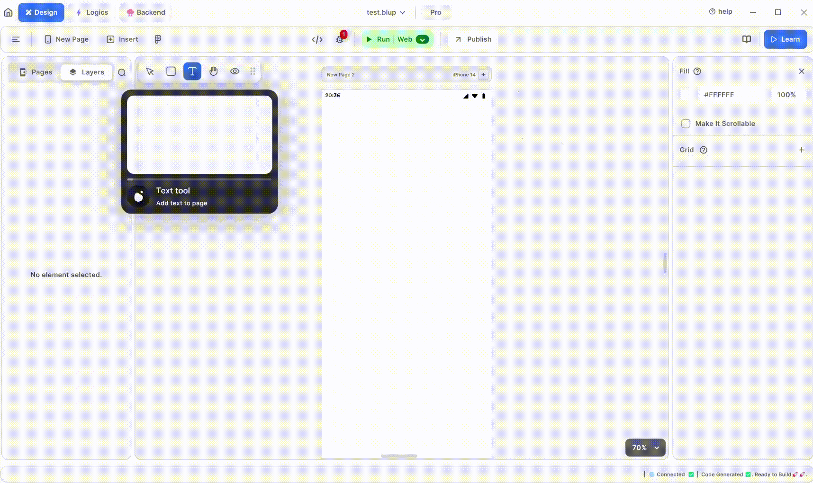
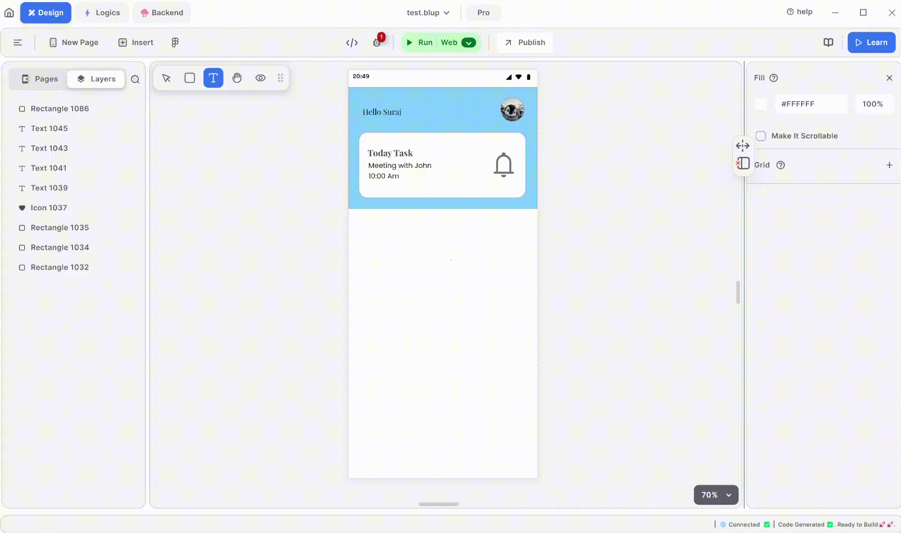
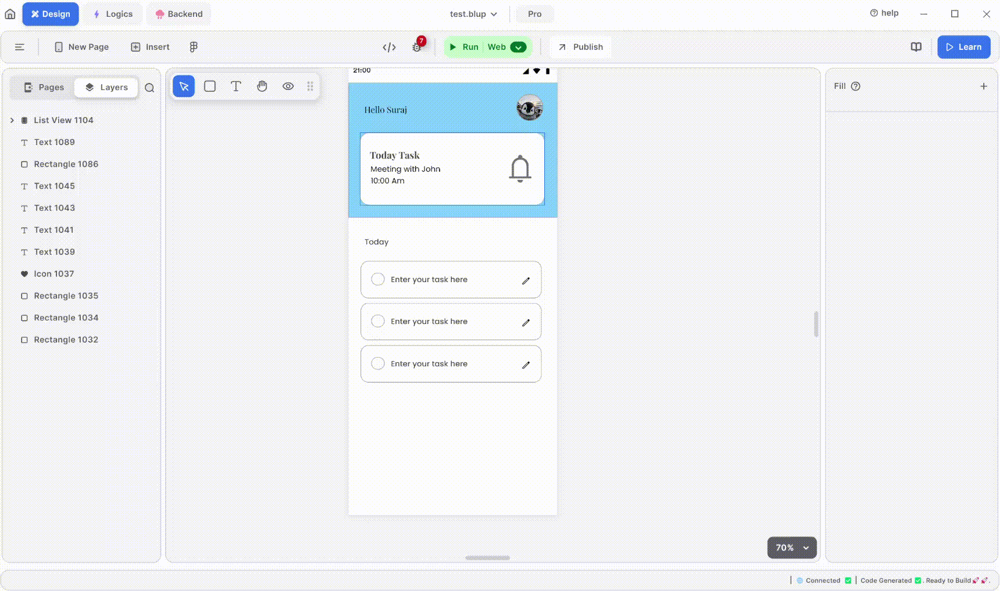
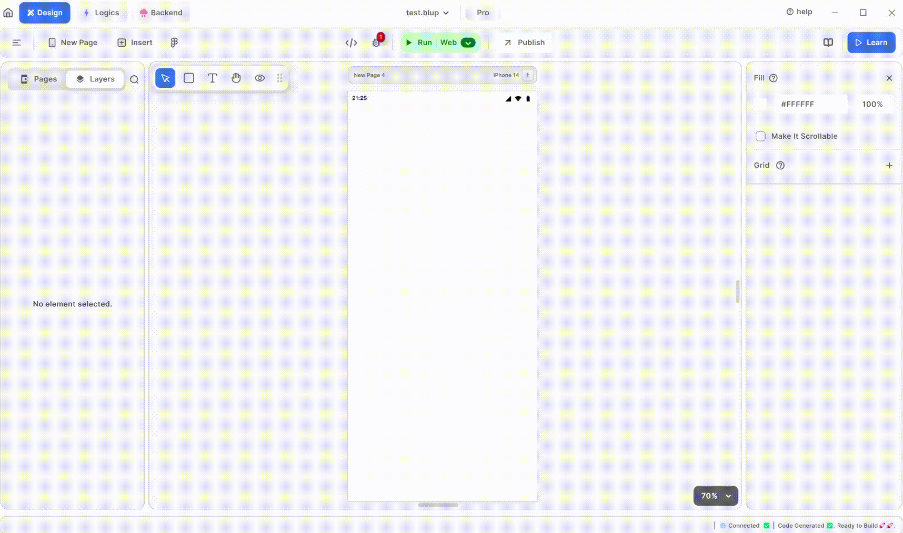
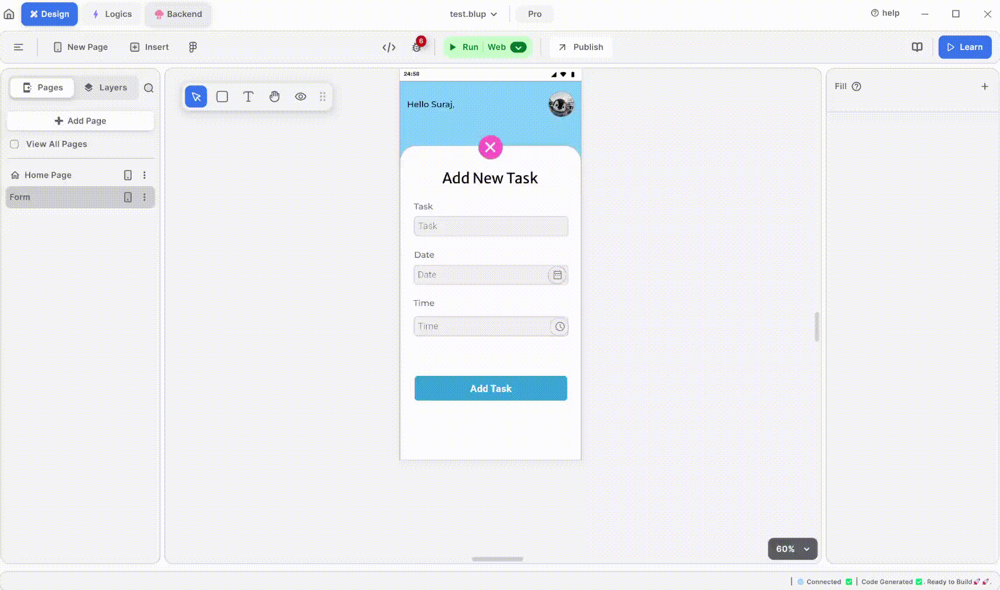
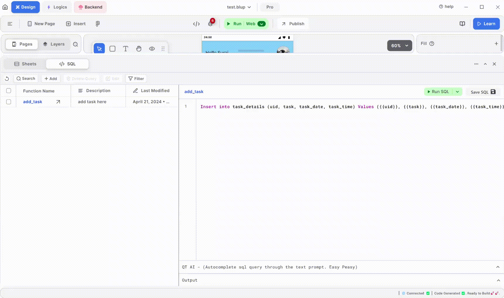

# ToDo App

This tutorial guide you through creating a to-do app, ToDo app is allows users to manage tasks and activities. It typically includes features such as adding tasks, organizing them into categories or lists, setting due dates and priorities, marking tasks as completed, and possibly syncing data across multiple devices.

## Steps to Build ToDo App

The steps to build the app are as follows:

- [1. Design the User Interface](#design-the-user-interface)
- [2. Set Up Data Storage](#set-up-data-storage)
- [3. Implement Logic](#implement-logic)
- [4. Connect Logic and Data](#connect-logic-and-data)
- [5. Test and Run the App](#test-and-run-the-app)

### 1. Design the User Interface {#design-the-user-interface}

In this step, we'll add the UI elements or widgets for the 'Home' and 'Form' screens and the navigation between the two pages.

#### 1.1 Building Home Screen

Here is a simplified approach to creating the UI for a screen that displays all tasks according to their dates in a to-do app:

1. Design the Top Section:

- Use a Container widget to create the topmost section of the UI.

- Add padding and choose a background color for the container to define the top section.

- Add an icon from the Icon widget and customize its size and color as needed.

- Use a CircleAvatar widget to display a circular image, and fill it with an image from your assets.

2.Add Text Elements:

- Add Text widgets to display information such as the date or a title.

- Customize the text style, including font size and font type, to match your design.

3. Create the Task Theme:

- Create a theme for the task list items, such as a specific layout and style for tasks.

- Keep the task theme simple for ease of use and a clean design.

4. Organize Tasks in a ListView:

- Use a ListView widget to display tasks according to their dates.

- Group the elements for each date as a separate list item in the ListView.

- Customize the ListView to show multiple tasks as a scrollable list.

5. Add a Floating Action Button:

- Include a floating action button (FloatingActionButton widget) to allow users to add new tasks.

- When clicked, the button should navigate the user to another screen where they can input and add a new task.

6. Design the Task Input Screen:

- Use a Container widget to create the main layout of the screen.

- Customize the container by setting its background color, padding, and other properties.

7. Add Input Fields and Button:

- Add a TextField widget to take input for the task title or description.

- Customize the TextField by adjusting its width and height as needed.

- Add a Button (e.g., ElevatedButton or FlatButton) to allow the user to submit the new task.

8. Customize Text and Placeholder:

- Add a placeholder text (hint text) to the TextField to guide the user on what to enter.

- Customize the button with appropriate text, such as "Add Task" or "Submit".

### 2. Set Up Data Storage{#set-up-data-storage}

In this section, you will set up data storage by creating a table and writing queries for creating, uploading, reading, and deleting data.

#### 2.1 Creating the Table

- Choose a name for your table, avoiding the use of user or list in the table name.

- Set the table as global if you want it to be accessible from different parts of your app.

- Define the fields you need for your table, such as columns for task names, due dates, and statuses.

#### 2.2 Writing Queries

1. Add data to the table

- You should have basic knowledge of SQL to write queries for data operations.

- Create a query, giving it a name and a description of what it does.

- Write the query in the designated query field.

- Save the query, and use the test option to check if the query is correct.

- To test the query, provide key-value pairs in the test event configuration, and run the query to see the output below.

2. Get data from the table

Just select all(*) from the table to get all the data.

### 3. Implement Logic {#implement-logic}

