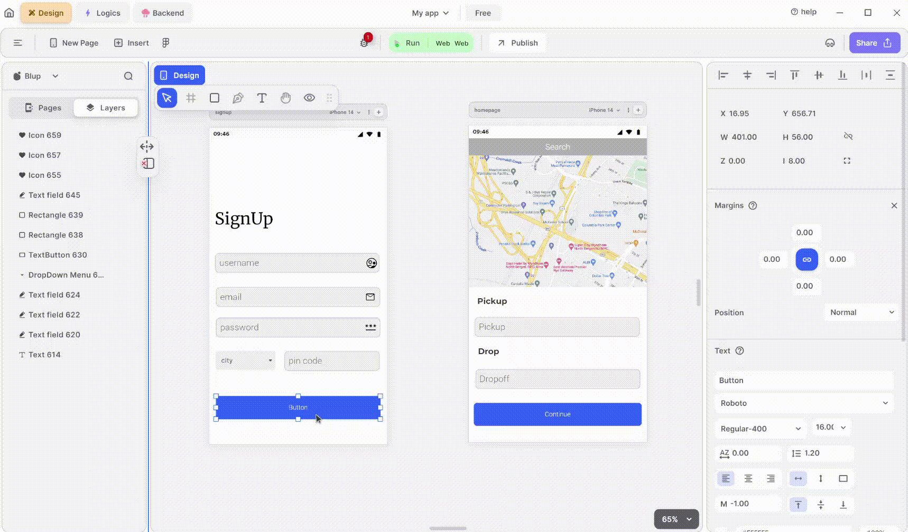

# How to use navigate page in Blup

Navigating between pages efficiently in Blup is essential for creating a seamless user experience. This guide will walk you through the steps to set up navigation in Blup, ensuring your UI is intuitive and user-friendly.

<figure><figcaption>
Navigation to the page
</figcaption></figure>

### Navigation to the Page

To navigate between pages in Blup, follow these steps:

1. **Select the Element for Navigation**
   * Begin by selecting the UI element you want to use for navigation. This could be a button, a link, or any interactive component within your design.
2. **Add Logic to the Element**
   * Right-click on the selected element and choose "Add Logics" from the context menu. This action opens the logic editor where you can define the behavior of the element.
3. **Attach an "On Click" Event**
   * In the logic editor, attach an "On Click" event to the selected element. This event will trigger the navigation action when the user interacts with the element.
4. **Connect to the Page Navigator**
   * Next, connect the "On Click" event to the page navigator. The page navigator is a tool within Blup that manages the transition between different pages in your design.
5. **Choose the Destination Page**
   * Finally, from the dropdown menu in the page navigator, select the destination page you want to navigate to. Ensure that the destination page is correctly linked to provide a smooth transition.

### Advanced Navigation Techniques

Blup also offers advanced navigation techniques for more complex applications:

*   **Dynamic Navigation**

    Set up dynamic navigation to direct users based on specific conditions or user actions. For example, you can navigate users to different pages based on their input or choices made earlier in the application.
*   **Nested Navigation**

    If your application has a hierarchical structure, use nested navigation to allow users to move between parent and child pages seamlessly. This is particularly useful for applications with multiple layers of content.
*   **Custom Animations**

    Enhance the user experience by adding custom animations to page transitions. Blup allows you to define how pages appear and disappear, adding a layer of polish to your application.

**Community and Support**

If you have any ideas to make Blup better, you can share them through our [Discord community channel](https://discord.com/channels/940632966093234176/965313562425823303). Engaging with the community can provide additional tips and best practices from other Blup users.&#x20;

## Music to go with.


Lofi music

