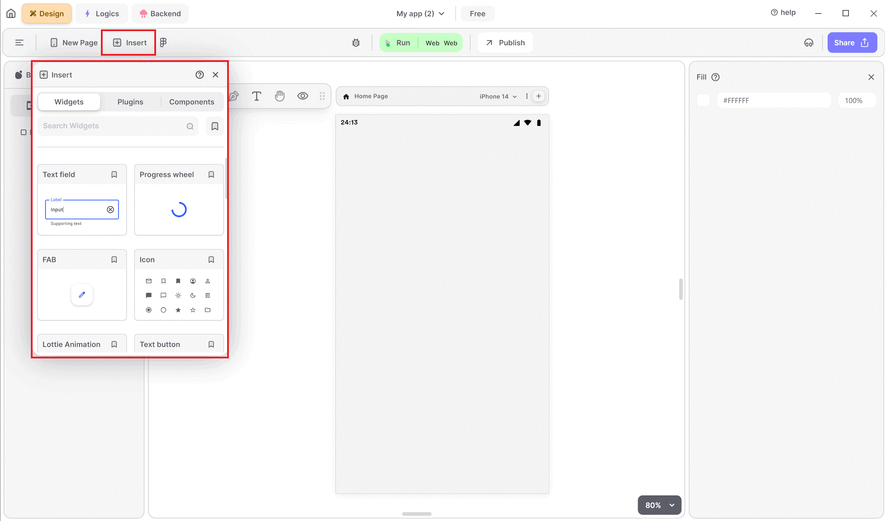

# Insert Panel

<figure><figcaption>
Insert Widgets
</figcaption></figure>

Widgets are tools you can use to improve the appearance and user-friendliness of your UI, making it more attractive and readable.

To enhance your UI, simply select a widget from the options provided, then drag and drop it onto your screen. Customize its components, such as size and color, to tailor it to your needs and preferences.

Now, let's explore the available widgets.

[TextField Widget](textfield-widget.md)

The Textfield widget is crucial for capturing user input. It can be customized with attributes such as placeholder text, input type (e.g., email, password), and validation rules. This widget is vital for forms, search bars, and any feature that requires user text input.

[Alert DialogBox Widget](alert-dialogbox-widget.md)

The Alert Dialog Box widget displays important messages or prompts to the user. It is essential for alerts, confirmations, or any message requiring user acknowledgment.

[AppBar Widget](appbar-widget.md)

The AppBar widget is a staple in app design, providing a consistent navigation experience. It usually includes the title of the screen, action icons, and sometimes menus. Customizations include background color, elevation, and additional leading/trailing widgets.

[CameraView Widget](cameraview-widget.md)

The CameraView widget integrates camera functionality into your app, allowing users to capture photos or videos. It is essential for applications that require media input, such as social media or document-scanning apps.

[CheckBox Widget](checkbox-widget.md)

The Checkbox widget allows users to select multiple options from a list. It is commonly used in forms and surveys. Customization options include altering the appearance of the checkbox and the accompanying text.

[Date Picker Widget](date\_picker-widget.md)

The Date-Picker widget allows users to select dates from a calendar interface. It is essential for applications involving scheduling or date input. Customizable features include the appearance of the calendar and the date format.

[FAB Widget](fab-widget.md)

The FAB widget is a circular button used for primary actions. Commonly placed at the bottom corner of the screen, it is highly visible and encourages user interaction. Use it for actions like adding a new item, composing a message, or starting a task.

[Icon Widget](icon-widget.md)

Icons play a significant role in making an app's interface intuitive and attractive. The Icon widget lets you add various icons, which can be resized and recolored to match your design. Icons help users quickly understand functionalities and navigate the app.

[IOS DatePicker Widget](textfield-widget.md)

The iOS Date-Picker widget provides a familiar interface for iOS users, mimicking the native iOS date picker. It is perfect for apps targeting the iOS platform.

[IOS Timer Widget](ios-timer-widget.md)

The iOS Timer widget provides a timer interface familiar to iOS users, suitable for apps needing countdown or time-tracking features.

[Lottie Widget](lottie-widget.md)

The TextButton widget provides a simple button with a text label. It is versatile, used for actions where a textual label is sufficient. You can customize the text color, font, and background to fit your app’s theme.

[MapView Widget](mapview-widget.md)

The MapView widget integrates map functionalities, providing geographical context to users. It is perfect for applications needing location-based services, such as travel or delivery apps.

[Multi Choice Widget](multi-choice-widget.md)

The Multi-Choice widget is similar to the Checkbox widget but is designed for selecting multiple options from a larger list. It is ideal for forms and surveys requiring multiple selections.

[Progress Bar Widget](progress-bar-widget.md)

The Progress Bar widget provides a linear progress indicator. It is suitable for tasks like loading data or completing a multi-step process. You can customize the progress bar's color, size, and orientation.

[Progress Wheel Widget](progress-wheel-widget.md)

The Progress Wheel widget visually indicates the progress of a task, such as file uploads or data processing. You can customize its color, size, and progress percentage to align with your app's design, ensuring a consistent user experience.

[Radio Widget](radio-widget.md)

The Radio widget allows users to select one option from a set. It is typically used in forms where a single choice is necessary. Customization includes the appearance of the radio button and the accompanying text.

[Slider Widget](slider-widget.md)

The Slider widget is perfect for selecting a value from a defined range, such as volume or brightness settings. Customizable features include the range, appearance of the thumb, and the track’s color.

[Switch Widget](switch-widget.md)

The Switch widget is used for binary choices, offering a more modern alternative to checkboxes. It is ideal for settings where toggling between two states is needed. You can customize its color, size, and interaction behavior.

[TextButton Widget](textbutton-widget.md)

The TextButton widget provides a simple button with a text label. It is versatile, used for actions where a textual label is sufficient. You can customize the text color, font, and background to fit your app’s theme.

[Time Picker Widget](timepicker-widget.md)

The Time-Picker widget complements the Date-Picker by allowing users to select times. It is ideal for scheduling apps or any feature requiring time input.

[Web View Widget](web-view-widget.md)

The WebView widget enables you to embed web content directly into your app. It is useful for displaying web pages, online documents, or any web-based content. Customizations include controlling the appearance and behavior of the embedded content.

By leveraging these widgets, developers can create interactive, user-friendly applications that meet modern standards and user expectations. This comprehensive suite of widgets allows you to build robust, scalable apps efficiently, enhancing both the development process and user experience.

## Music to go with.


Lofi music

