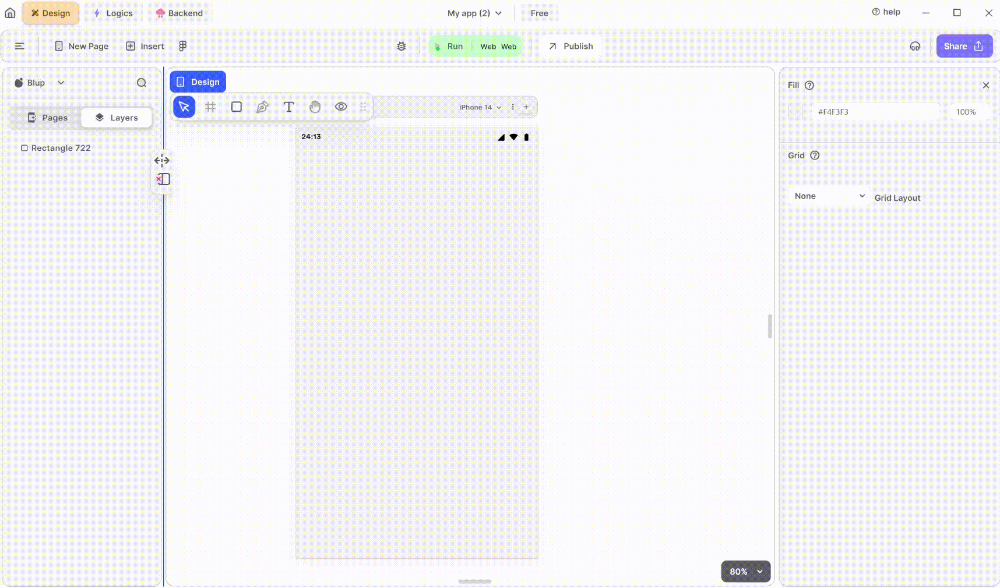

# Appbar Widget

AppBar widget is a fundamental component used to create the top app bar, which typically contains the application's title, navigation icons, action buttons, and other relevant information.

<figure><figcaption>
App Bar
</figcaption></figure>

To utilize an AppBar in your UI, adhere to these steps:

**1.** Drag the AppBar widget from the Insert menu and drop it into top of the desired Page.

**2.** Customize the appearance and behavior of the AppBar by adjusting its properties in the editing section on the right.

**3.** Enhance the AppBar by adding different icons to make your header more visually appealing.

### Components of AppBar Widget

| Component                      | Description                                                                                                                                                                          |
| ------------------------------ | ------------------------------------------------------------------------------------------------------------------------------------------------------------------------------------ |
| **Align Icons**                | Click icons or use shortcut keys to align AppBar Widget. For example, click "Align Left" or use Ctrl+Shift+Left to left-align AppBar Widget.                                         |
| **Postitions**                 | Set AppBar positions on the X and Y axes of the mobile canvas.                                                                                                                       |
| **Appbar Size**                | Specify the width and height of the Appbar widget by providing values for width (W) and height (H).                                                                                  |
| **Z rotation**                 | Rotate the AppBar by specifying a rotation value.                                                                                                                                    |
| **Border Radius**              | Adjust corner curvature by providing a value to create rounded corners. Individual corner adjustments are available by clicking on each corner.                                      |
| **Margin**                     | Provide margin to the Appbar from any of the four directions by specifying the margin value.                                                                                         |
| **Color**                      | This section will give Appbar a selected color.                                                                                                                                      |
| **Shadow Color**               | This section will give Appbar a shadow color.                                                                                                                                        |
| **Elevation**                  | Specify the elevation that you want to give to the AppBar.                                                                                                                           |
| **Title**                      | Specify the title of the AppBar if you want to make the title centre, or specify the spacing by giving the value.                                                                    |
| **Toolbar**                    | Specify the height of the toolbar and opacity by give the value to it.                                                                                                               |
| **Text property**              | Modify AppBar text directly in the provided field, and changes will reflect on the mobile canvas.                                                                                    |
| **Font Type**                  | Choose the preferred font type for selected AppBar text.                                                                                                                             |
| **Font Style**                 | Select font styles from a dropdown menu.                                                                                                                                             |
| **Font Size**                  | Define the font size of the selected AppBar text.                                                                                                                                    |
| **Letter spacing**             | Specify spacing between letters of the selected AppBar text.                                                                                                                         |
| **Line Height**                | Define the height between lines of AppBar text.                                                                                                                                      |
| **Left Align**                 | This option aligns the AppBar text from the left.                                                                                                                                    |
| **Centre Align**               | This option aligns the AppBar text to the centre.                                                                                                                                    |
| **Right Align**                | This option aligns the AppBar text to the right.                                                                                                                                     |
| **Auto Width**                 | The width of the text will be adjusted automatically depending on the size of the container housing the selected AppBar text.                                                        |
| **Auto heiight**               | The height of the text will be adjusted automatically depending on the size of the container housing the selected AppBar text.                                                       |
| **Fixed size**                 | The dimensions of the text will remain fixed regardless of the size of the container housing the selected AppBar text.                                                               |
| **Max Line**                   | This property helps you to define the maximum number of lines the selected text can specify for example, if you define the value as 2 then the AppBar text can only take up 2 lines. |
| **Font color**                 | Change the color of the text using color picker, hex code, or RGB sliders.                                                                                                           |
| **Ellipsis, on text overflow** | Show "..." if AppBar text overflows the specified max line limit.                                                                                                                    |
| **Selectable Text**            | Allow users to select AppBar text for toolbar operations by checking this field.                                                                                                     |
| **Visible**                    | By checking the checkbox the entire selected list will be hidden.                                                                                                                    |

If you have any ideas to make Blup better you can share them through our [Discord community channel](https://discord.com/channels/940632966093234176/965313562425823303)

## Music to go with.


Lofi music

