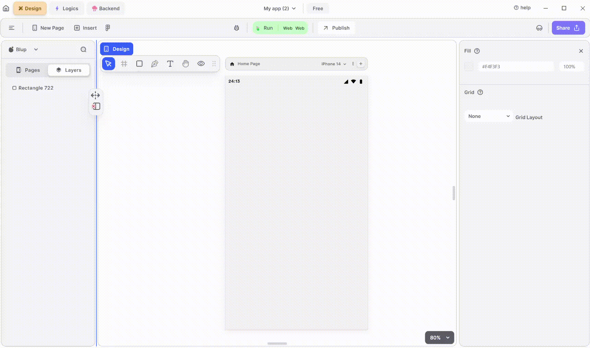

# Checkbox Widget

Checkbox widget is used to represent a toggleable option with two states: checked and unchecked. Users can tap the checkbox to toggle its state.

<figure><figcaption>
Check Box
</figcaption></figure>

To utilize an CheckBox in your UI, adhere to these steps:

**1.** Drag the CheckBox widget from the Insert menu and drop it into your desired location within your UI.

**2.** Customize the appearance and behavior of the CheckBox by adjusting its properties in the editing section on the right.

### Components of CheckBox Widget

| Component                | Description                                                                                                                                                                                          |
| ------------------------ | ---------------------------------------------------------------------------------------------------------------------------------------------------------------------------------------------------- |
| **Align Icons**          | Click icons or use shortcut keys to align CheckBox Widget. For example, click "Align Left" or use Ctrl+Shift+Left to left-align CheckBox Widget.                                                     |
| **Postitions**           | Set CheckBox Widget positions on the X and Y axis of the mobile canvas.                                                                                                                              |
| **CheckBox Widget Size** | Specify the width and height of the CheckBox by providing values for width (w) and height (h).                                                                                                       |
| **Z rotation**           | Rotate the CheckBox Widget by specifying a rotation value.                                                                                                                                           |
| **Border Radius**        | Adjust corner curvature by providing a value to create rounded corners. Individual corner adjustments are available by clicking on each corner.                                                      |
| **Margin**               | Provide margin to the CheckBox Widget from any of the four directions by specifying the margin value.                                                                                                |
| **Checkbox Value**       | On selecting the value you get the tick and on unselecting it will remove the tick.                                                                                                                  |
| **Checkbox Tristate**    | On UnSelecting tristate meaning the checkbox can only be checked or unchecked. However, when checking the tristate, it enables the third state, where the checkbox can be in an indeterminate state. |
| **Icon Color**           | Select the color of the icon that you want to put in check.                                                                                                                                          |
| **Active Color**         | It will give checkbox the color according to your need.                                                                                                                                              |
| **Focus Color**          | It will represents the color that is displayed when a widget gains focus                                                                                                                             |
| **Hover Color**          | It will represent the color that is displayed when a widget is hovered over by the cursor.                                                                                                           |
| **Visible**              | By checking the checkbox the entire selected checkbox widget will be hidden.                                                                                                                         |

If you have any ideas to make Blup better you can share them through our [Discord community channel](https://discord.com/channels/940632966093234176/965313562425823303)

## Music to go with.


Lofi music

