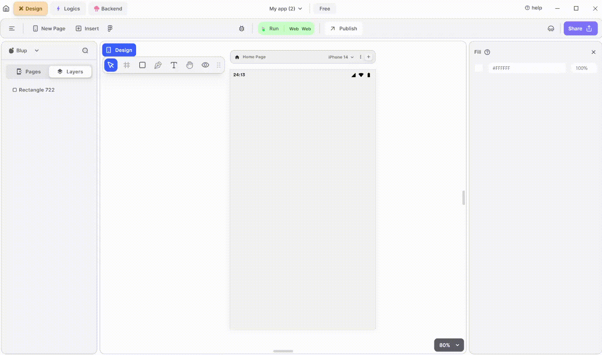

# Date Picker Widget

DatePicker Widget from the Insert is used to display a date picker dialog. This allows users to select a date from a calendar-style interface.

<figure><figcaption>
Date Picker
</figcaption></figure>

Integrating a DatePicker widget into your UI is simple. Follow these steps to make it happen:

**1.** Drag the DatePicker widget from the Insert menu and drop it into your desired location within your UI.

**2.** Customize the appearance and behavior of the Alert dialog by adjusting its properties in the editing section on the right.

**3.** Additionally, you can enhance the DatePicker by specifying properties such as initial date, minimum date, and maximum date. These properties allow you to control the range of dates available for selection and set a default date.

### Components of DatePicker Widget

| Component                   | Description                                                                                                                                                             |
| --------------------------- | ----------------------------------------------------------------------------------------------------------------------------------------------------------------------- |
| **Align Icons**             | Click icons or use shortcut keys to align DatePicker Widget. For example, click "Align Left" or use Ctrl+Shift+Left to left-align DatePicker Widget.                    |
| **Postitions**              | Set DatePicker Widget positions on the X and Y axis of the mobile canvas.                                                                                               |
| **DatePicker Widget Size**  | Specify the width and height of the DatePicker Widget by providing values for width (w) and height (h).                                                                 |
| **Z rotation**              | Rotate the DatePicker Widget by specifying a rotation value.                                                                                                            |
| **Border Radius**           | Adjust corner curvature by providing a value to create rounded corners. Individual corner adjustments are available by clicking on each corner.                         |
| **Margin**                  | Provide margin to the DatePicker Widget from any of the four directions by specifying the margin value.                                                                 |
| **DatePicker Show Preview** | Clicking on it will display the view of the date picker.                                                                                                                |
| **Initial Date**            | Set the initial date for the date picker.                                                                                                                               |
| **First Date**              | Specify the starting date for the calendar, defining the range of selectable dates.                                                                                     |
| **Last Date**               | Specify the ending date for the calendar, defining the range of selectable dates.                                                                                       |
| **Fill**                    | It apply the date picker a color from inside.                                                                                                                           |
| **Border Color**            | Choose a color to set the border color of the DatePicker. Adjust the border color from inside, outside, or center of the DatePicker by selecting it from the drop-down. |
| **Shadow**                  | Apply a shadow effect to the DatePicker by selecting either a normal or inner shadow type.                                                                              |
| **Visible**                 | By checking the checkbox the entire DatePicker will be hidden.                                                                                                          |

If you have any ideas to make Blup better you can share them through our [Discord community channel](https://discord.com/channels/940632966093234176/965313562425823303)

## Music to go with.


Lofi music

