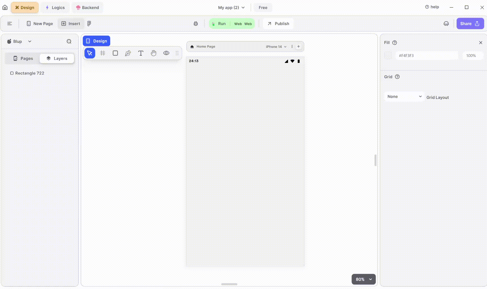

# Dropdown Menu Widget

Dropdown widget is used to display a dropdown menu with a list of selectable options. Users can choose one option from the list by tapping on the dropdown button, and the selected option is displayed as the current value of the dropdown.

<figure><figcaption>
Drop Down
</figcaption></figure>

Integrating a DropDown Menu widget into your UI is straightforward. Follow these steps to make it happen:

**1.** Drag the DropDown widget from the Insert menu and drop it into your desired location within your UI.

**2.** Customize the appearance and behavior of the DropDown dialog by adjusting its properties in the editing section on the right.

**3.** Populate the DropDown Menu with the list of data from the edit section that you want to show. You can provide a list of items to be displayed in the menu, and users can select an item from the list.

### Components of DropDown Menu Widget

| Component                      | Description                                                                                                                                                        |
| ------------------------------ | ------------------------------------------------------------------------------------------------------------------------------------------------------------------ |
| **Align Icons**                | Click icons or use shortcut keys to align DropDown Widget. For example, click "Align Left" or use Ctrl+Shift+Left to left-align DropDown Widget.                   |
| **Postitions**                 | Set DropDown Widget positions on the X and Y axis of the mobile canvas.                                                                                            |
| **DropDown Menu Widget Size**  | Specify the width and height of the DropDown Menu Widget by providing values for width (w) and height (h).                                                         |
| **Z rotation**                 | Rotate the DropDown Widget by specifying a rotation value.                                                                                                         |
| **Border Radius**              | Adjust corner curvature by providing a value to create rounded corners. Individual corner adjustments are available by clicking on each corner.                    |
| **Margin**                     | Provide margin to the DropDown Menu Widget from any of the four directions by specifying the margin value.                                                         |
| **DropDown Menu show preview** | On clicking on it you will get the view of the dropdown menu.                                                                                                      |
| **Value**                      | On giving the value it will corresponds to the currently selected value in the dropdown menu.                                                                      |
| **List of values**             | Here you will specify the options that you want to show in the drop down menu.                                                                                     |
| **Border Radius**              | When giving the border radius it will be displayed in the dropdown menu.                                                                                           |
| **Elevation**                  | Adjust the elevation of drop down menu by passing the value in it.                                                                                                 |
| **Text style**                 | Choose the preferred font type for selected text.                                                                                                                  |
| **Font Style**                 | Select font styles from a dropdown menu.                                                                                                                           |
| **Font Size**                  | Define the font size of the selected text.                                                                                                                         |
| **Letter spacing**             | Specify spacing between letters of the selected text.                                                                                                              |
| **Line Height**                | Define the height between lines of text.                                                                                                                           |
| **DropDown Icon Properties**   | Change the icon color according to the need.                                                                                                                       |
| **DropDown Icon Size**         | Change the size of the icon according to the need.                                                                                                                 |
| **Hint Properties**            | It will give the drop down menu a hint text.                                                                                                                       |
| **Font Style**                 | Select hint text a font styles from a dropdown menu.                                                                                                               |
| **Font Size**                  | Define the hint text a font size of the selected text.                                                                                                             |
| **Letter spacing**             | Specify spacing between letters of the selected text.                                                                                                              |
| **Line Height**                | Define the height between lines of text.                                                                                                                           |
| **Hint Color**                 | It will give color to your hint text.                                                                                                                              |
| **Fill**                       | It will give color to your drop down menu.                                                                                                                         |
| **Border Color**               | Choose a color to set the Dropdown menu border color. Adjust the border color from inside, outside, or center of the container by selecting it from the drop down. |
| **Border Width**               | Adjust the border width by providing a value. Select specific sides for border width by clicking the checkboxes.                                                   |
| **Visible**                    | By checking the checkbox the entire Dropdown menu will be hidden.                                                                                                  |

If you have any ideas to make Blup better you can share them through our [Discord community channel](https://discord.com/channels/940632966093234176/965313562425823303)

## Music to go with.


Lofi music

