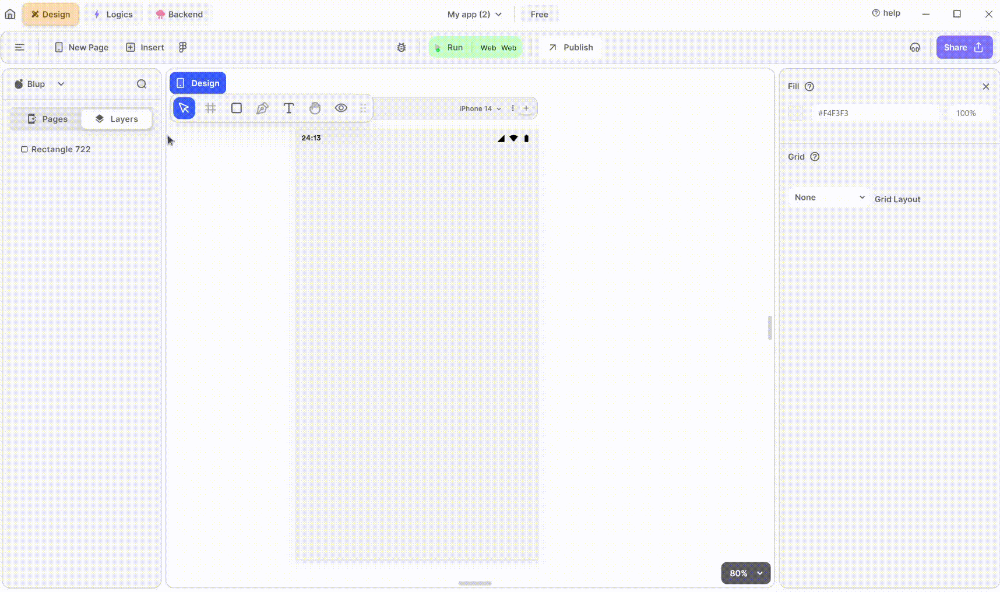

# FAB Widget

<figure><figcaption>
FAB
</figcaption></figure>

To utilize an FAB(FloatingActionButton) in your UI, adhere to these steps:

**1.** Drag the FAB widget from the Insert menu and drop it into your desired location within your UI.

**2.** Customize the appearance and behavior of the FAB by adjusting its properties in the editing section on the right.

If you have any ideas to make Blup better you can share them through our [Discord community channel](https://discord.com/channels/940632966093234176/965313562425823303)

### Components of FAB Widget

| Component               | Description                                                                                                                                                            |
| ----------------------- | ---------------------------------------------------------------------------------------------------------------------------------------------------------------------- |
| **Align Icons**         | Click icons or use shortcut keys to align FAB Widget. For example, click "Align Left" or use Ctrl+Shift+Left to left-align FAB Widget.                                 |
| **Postitions**          | Set FAB positions on the X and Y axis of the mobile canvas.                                                                                                            |
| **FAB Size**            | Specify the width and height of the FAB widget by providing values for width (W) and height (H).                                                                       |
| **Z rotation**          | Rotate the FAB by specifying a rotation value.                                                                                                                         |
| **Border Radius**       | Adjust corner curvature by providing a value to create rounded corners. Individual corner adjustments are available by clicking on each corner.                        |
| **Margin**              | Provide margin to the FAB widget from any of the four directions by specifying the margin value.                                                                       |
| **FAB Button Color**    | This section will give FAB Button a selected color.                                                                                                                    |
| **Splash Color**        | This section will give FAB a splash color. Splash color is the color displayed when the FAB is tapped.                                                                 |
| **Hover Color**         | This section will give FAB a hover color. The hover color is the color displayed when the mouse cursor hovers over the FAB.                                            |
| **Focus Color**         | This section will give FAB a focus color. The focus color is the color displayed when the FAB receives focus, typically via keyboard navigation                        |
| **Tooltip**             | Give it a tooltip according to your usage. A tooltip provides a brief description or hint about the function of a widget when the user long-presses or hovers over it. |
| **Padding**             | Give the padding to the FAB widget from inside.                                                                                                                        |
| **Elevation**           | Give it a required Elevaition by entering a value.                                                                                                                     |
| **Disabled Elevation**  | Give it a required Disabled Elevaition by entering a value.                                                                                                            |
| **Focus Elevation**     | Give it a required Focus Elevaition by entering a value. so that when user focus over it it will get elevated that much.                                               |
| **Hover Elevation**     | Give it a required Hover Elevaition by entering a value. so that when user Hover over it it will get elevated that much.                                               |
| **Highlight Elevation** | Give it a required Highlight Elevaition by entering a value. when the FAB is highlighted it get the elevation.                                                         |
| **Icon**                | Select the Icon according to your need that you want to show on to you FAB widget.                                                                                     |
| **Icon Color**          | Change the icon color according to your need.                                                                                                                          |
| **Icon Size**           | Change the size of icon according to your need.                                                                                                                        |
| **Visible**             | By checking the checkbox the entire selected FAB Widget will be hidden.                                                                                                |

## Music to go with.


Lofi music

