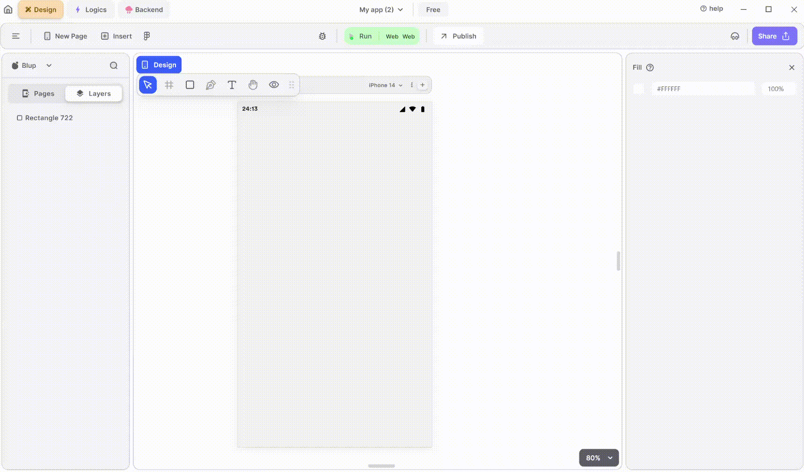

# Icon Widget

<figure><figcaption>
Icons
</figcaption></figure>

To utilize an Icon in your UI, adhere to these steps:

**1.** Drag the Icon widget from the Insert menu and drop it into your desired location within your UI.

**2.** Select the Icon according to your need.

**3.** Customize the appearance and behavior of the Icon by adjusting its properties in the editing section on the right.

### Components of Icon Widget

| Component       | Description                                                                                                                 |
| --------------- | --------------------------------------------------------------------------------------------------------------------------- |
| **Align Icons** | Click icons or use shortcut keys to align Icon. For example, click "Align Left" or use Ctrl+Shift+Left to left-align Icon.  |
| **Postitions**  | Set Icon positions on the X and Y axis of the mobile canvas.                                                                |
| **Margin**      | Adjust Icon margin from top, bottom, left, or right by specifying margin values.                                            |
| **Icon Edit**   | Select the icon of your need from the pop up icons menu there you can get and coustomise icons also according to your need, |
| **Icon color**  | From here you can give icon a color according to your need.                                                                 |
| **Icon Size**   | From here you can give icon size according to your need.                                                                    |
| **Visible**     | By checking the checkbox the entire selected icon widget will be hidden.                                                    |

If you have any ideas to make Blup better you can share them through our [Discord community channel](https://discord.com/channels/940632966093234176/965313562425823303)

## Music to go with.


Lofi music

