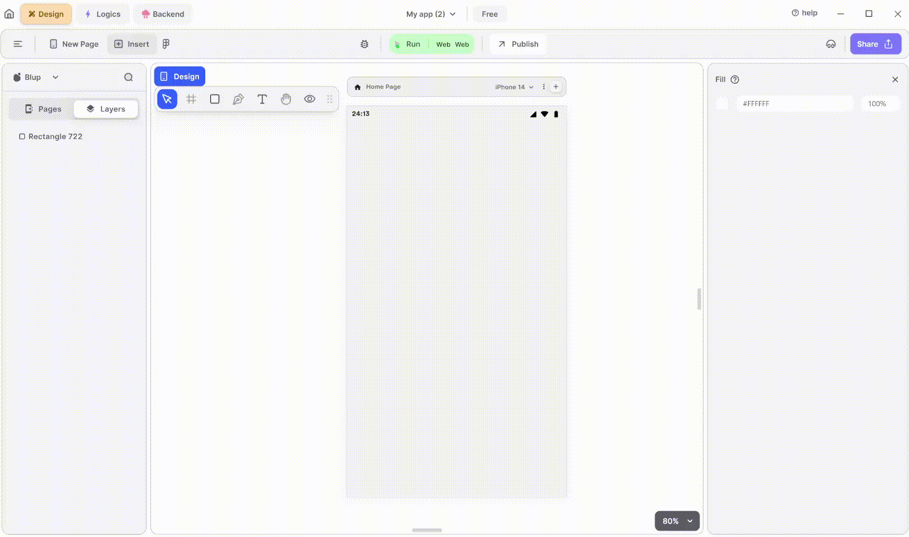

# IOS Date Picker Widget

<figure><figcaption>
IOS DatePicker
</figcaption></figure>

Integrating an iOS-style DatePicker widget into your UI is simple. Follow these steps to make it happen:

**1.** Drag the IOS DatePicker widget from the Insert menu and drop it into your desired location within your UI.

**2.** Customize the appearance and behavior of the IOS DatePicker by adjusting its properties in the editing section on the right.

**3.** Additionally, you can select the mode and theme type of the DatePicker. The mode determines whether the DatePicker displays dates, times, or both, while the theme type controls the visual style of the DatePicker.

If you have any ideas to make Blup better you can share them through our [Discord community channel](https://discord.com/channels/940632966093234176/965313562425823303)

### Components of IOS DatePicker Widget

| Component                      | Description                                                                                                                                                             |
| ------------------------------ | ----------------------------------------------------------------------------------------------------------------------------------------------------------------------- |
| **Align Icons**                | Click icons or use shortcut keys to align IOS DatePicker Widget. For example, click "Align Left" or use Ctrl+Shift+Left to left-align DatePicker Widget.                |
| **Postitions**                 | Set IOS DatePicker Widget positions on the X and Y axis of the mobile canvas.                                                                                           |
| **IOS DatePicker Widget Size** | Specify the width and height of the IOS DatePicker Widget by providing values for width (w) and height (h).                                                             |
| **Z rotation**                 | Rotate the IOS DatePicker Widget by specifying a rotation value.                                                                                                        |
| **Border Radius**              | Adjust corner curvature by providing a value to create rounded corners. Individual corner adjustments are available by clicking on each corner.                         |
| **Margin**                     | Provide margin to the IOS DatePicker Widget from any of the four directions by specifying the margin value.                                                             |
| **DatePicker-IOS format**      | Check the box to allow your widget to use 24-hour format.                                                                                                               |
| **Mode**                       | Select the mode for your date-picker: date only, time only, or both.                                                                                                    |
| **Theme Type**                 | Choose a theme to make your date-picker lighter or darker.                                                                                                              |
| **Fill**                       | It give the date picker a color from inside.                                                                                                                            |
| **Border Color**               | Choose a color to set the border color of the DatePicker. Adjust the border color from inside, outside, or center of the DatePicker by selecting it from the drop-down. |
| **Shadow**                     | Apply a shadow effect to the DatePicker by selecting either a normal or inner shadow type.                                                                              |
| **Visible**                    | By checking the checkbox the entire IOS DatePicker will be hidden.                                                                                                      |

## Music to go with.


Lofi music

