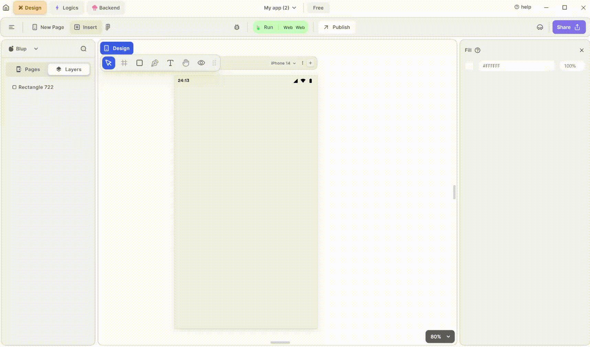

# Lottie Animation Widget

<figure><figcaption>
Lottie
</figcaption></figure>

Integrating a Lottie animation into your UI is straightforward. Follow these steps to make it happen:

**1.** Drag the Lottie widget from the Insert menu and drop it into your desired location within your UI.

\*\*2.\*\*Provide the URL of the Lottie animation file in the URL section of the editing panel. This URL should point to the location of the Lottie animation file.

**3.** Customize the appearance and behavior of the Lottie animation by adjusting its properties in the editing section on the right. You can modify properties such as size, position, Border to match your UI design and requirements.

### Components of Lottie Widget

| Component             | Description                                                                                                                                              |
| --------------------- | -------------------------------------------------------------------------------------------------------------------------------------------------------- |
| **Align Icons**       | Click icons or use shortcut keys to align Lottie Widget. For example, click "Align Left" or use Ctrl+Shift+Left to left-align Lottie Widget.             |
| **Postitions**        | Set Lottie positions on the X and Y axis of the mobile canvas.                                                                                           |
| **Lottie Size**       | Specify the width and height of the Appbar widget by providing values for width (W) and height (H).                                                      |
| **Z rotation**        | Rotate the Lottie by specifying a rotation value.                                                                                                        |
| **Border Radius**     | Adjust corner curvature by providing a value to create rounded corners. Individual corner adjustments are available by clicking on each corner.          |
| **Margin**            | Provide margin to the Lottie from any of the four directions by specifying the margin value.                                                             |
| **Lottie Properites** | Here you provide the Lottie files assets according to your need.                                                                                         |
| **Repeat**            | When checking the repeat option, it will keep on repeating the Lottie animation.                                                                         |
| **Reverse**           | When checking the reverse option, it will reverse the animation.                                                                                         |
| **Fill color**        | By fill color, you can provide the background color to the Lottie widget.                                                                                |
| **Border Color**      | Choose a color to set the widget border color. Adjust the border color from inside, outside, or center of the widget by selecting it from the drop-down. |
| **Border Width**      | Adjust the border width by providing a value. Select specific sides for border width by clicking the checkboxes.                                         |
| **Shadow**            | Apply a shadow effect to the widget by selecting either a normal or inner shadow type.                                                                   |
| **Visible**           | By checking the checkbox the entire selected Lottie widget will be hidden.                                                                               |

If you have any ideas to make Blup better you can share them through our [Discord community channel](https://discord.com/channels/940632966093234176/965313562425823303)

## Music to go with.


Lofi music

