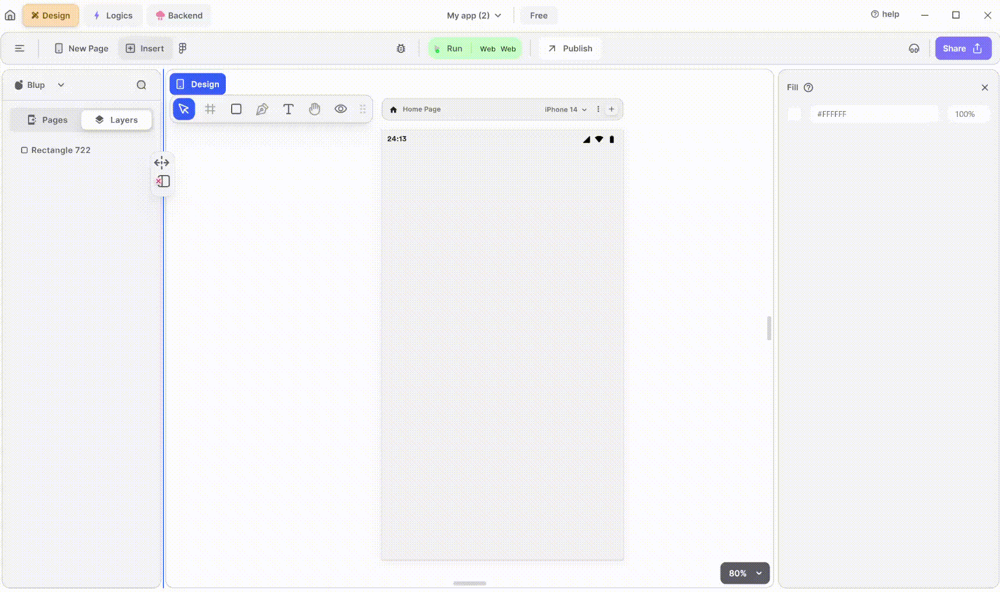

# Map View Widget

<figure><figcaption>
Map View
</figcaption></figure>

Integrating a MapView into your UI is a great way to add interactive maps to your application. Follow these steps to utilize it effectively:

**1.** Drag the MapView widget from the Insert menu and drop it into your desired location within your UI.

**2.** Obtain a Map API key from the Google Maps API and add it to the edit section. This key is necessary for accessing Google Maps services.

**3.** Customize the appearance and behavior of the MapView by adjusting its properties in the editing section on the right. You can enable functionalities such as zoom in, zoom out, and zoom gestures to enhance user interaction with the map.

### Components of MapView Widget

| Component                                   | Description                                                                                                                                                                              |
| ------------------------------------------- | ---------------------------------------------------------------------------------------------------------------------------------------------------------------------------------------- |
| **Align Icons**                             | Click icons or use shortcut keys to align MapView Widget. For example, click "Align Left" or use Ctrl+Shift+Left to left-align MapView Widget.                                           |
| **Postitions**                              | Set MapView positions on the X and Y axis of the mobile canvas.                                                                                                                          |
| **Container Size**                          | Specify the width and height of the MapView widget by providing values for width (W) and height (H).                                                                                     |
| **Z rotation**                              | Rotate the MapView Widget by specifying a rotation value.                                                                                                                                |
| **Border Radius**                           | Adjust corner curvature by providing a value to create rounded corners. Individual corner adjustments are available by clicking on each corner.                                          |
| **Margin**                                  | Provide margin to the MapView Widget from any of the four directions by specifying the margin value.                                                                                     |
| **Initial Location**                        | Provide the initial coordinates of the X-axis and Y-axis so when the map loads it shows that location at the starting.                                                                   |
| **Google Map Properties**                   | Add the key that you get from Google Maps here.                                                                                                                                          |
| **Map Type**                                | Specify which type of map you want to show from the drop-down i.e. Normal, Satellite, Terrain, and Hybrid.                                                                               |
| **Zoom**                                    | Specify the zoom level you want to provide to the map when it loads.                                                                                                                     |
| **Zoom Controls and Zoom Gestures Enabled** | By checking Zoom Controls Enabled, you can allow the user to enable zoom functionality, and by checking Zoom Gestures, it will enable gestures on the map for shifting by hand gestures. |
| **Visible**                                 | By checking the checkbox the entire selected MapView Widget will be hidden.                                                                                                              |

If you have any ideas to make Blup better you can share them through our [Discord community channel](https://discord.com/channels/940632966093234176/965313562425823303)

## Music to go with.


Lofi music

