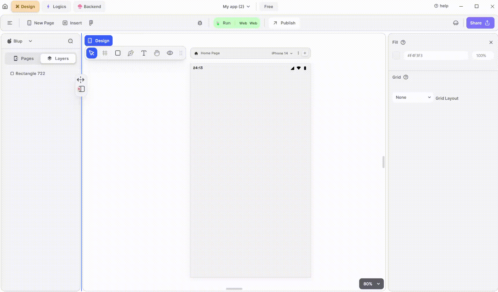

# Multi choice dialog Widget

A multi-choice widget allows users to select multiple options from a list. It enhances user interaction by providing flexibility and efficiency in data input.

<figure><figcaption>
Multi Choice
</figcaption></figure>

Integrating a Multi Choice Dialog into your UI provides users with a convenient way to select multiple options. Follow these steps to utilize it effectively:

**1.** Drag the Multi Choice dialog widget from the Insert menu and drop it into your desired location within your UI.

**2.** Customize the appearance and behavior of the Multi Choice Dialog by adjusting its properties in the editing section on the right.

**3.** Enable users to select multiple options from the dialog box. You can specify the options available for selection and handle the selected options accordingly in your code.

### Components of Multi-Choice Dialog Widget

| Component                           | Description                                                                                                                                                            |
| ----------------------------------- | ---------------------------------------------------------------------------------------------------------------------------------------------------------------------- |
| **Align Icons**                     | Click icons or use shortcut keys to align Multi Choice Dialog Widget. For example, click "Align Left" or use Ctrl+Shift+Left to left-align Multi Choice Dialog Widget. |
| **Postitions**                      | Set Multi Choice Dialog Widget positions on the X and Y axis of the mobile canvas.                                                                                     |
| **Multi-Choice Dialog Widget Size** | Specify the width and height of the Multi Choice Dialog Widget by providing values for width (w) and height (h).                                                       |
| **Z rotation**                      | Rotate the Multi Choice Dialog Widget by specifying a rotation value.                                                                                                  |
| **Border Radius**                   | Adjust corner curvature by providing a value to create rounded corners. Individual corner adjustments are available by clicking on each corner.                        |
| **Margin**                          | Provide margin to the Multi-Choice Dialog Widget from any of the four directions by specifying the margin value.                                                       |
| **Preview**                         | Clicking on preview allows you to see the preview of the Multi-Choice Dialog Box.                                                                                      |
| **Title**                           | Set the title of the Multi-Choice Dialog widget from inside.                                                                                                           |
| **Confirm Text**                    | Enter your own confirmation text here when the user confirms the selected item.                                                                                        |
| **Cencel Text**                     | Provide the cancel text here for closing the dialog box.                                                                                                               |
| **Item Selection**                  | When the user checks the box of "is only one selection allowed," then the user can select only one item from the dialog box.                                           |
| **Fill**                            | Give the Multi-Choice Dialog widget a color of your choice.                                                                                                            |
| **Border Color**                    | Choose a color to set the Dialog widget border color. Adjust the border color from inside, outside, or center of the Dialog widget by selecting it from the drop-down. |
| **Shadow**                          | Apply a shadow effect to the Dialog by selecting either a normal or inner shadow type.                                                                                 |
| **Visible**                         | By checking the checkbox, the entire selected Multi-Choice Dialog widget will be hidden.                                                                               |

If you have any ideas to make Blup better you can share them through our [Discord community channel](https://discord.com/channels/940632966093234176/965313562425823303)

## Music to go with.


Lofi music

