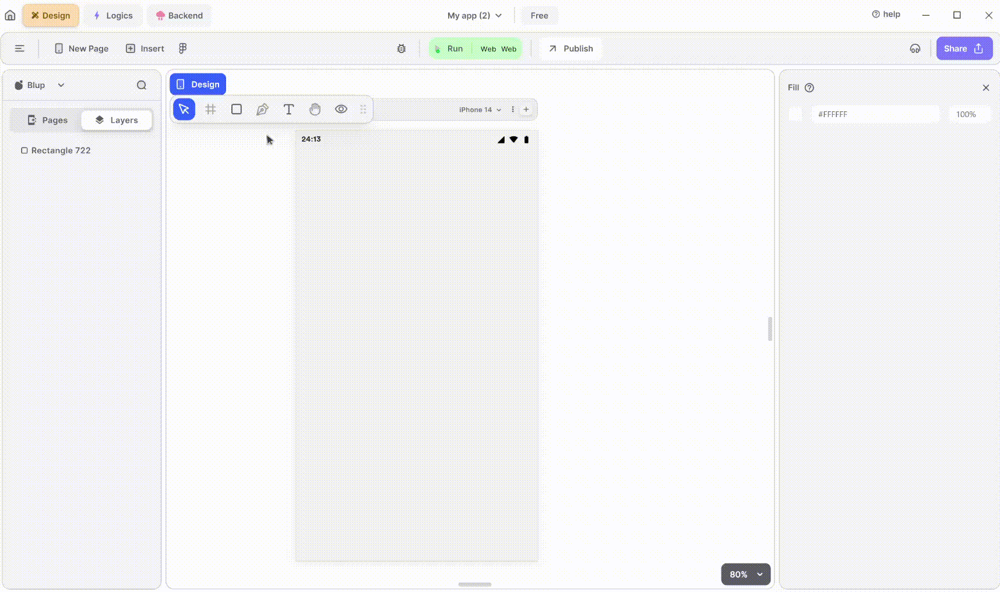

# Progress Widget

Progress widgets are used to display progress indicators that visually represent the progress of a task.

<figure><figcaption>
Progress Wheel
</figcaption></figure>

To utilize an Progress Wheel in your Flutter UI, adhere to these steps:

**1.** Drag the Progress Wheel widget from the Insert menu and drop it into your desired location within your UI.

**2.** Customize the appearance and behavior of the Progress Wheel by adjusting its properties in the editing section on the right.

### Components of Progress Wheel Widget

| Component                      | Description                                                                                                                                    |
| ------------------------------ | ---------------------------------------------------------------------------------------------------------------------------------------------- |
| **Align Icons**                | Click icons or use shortcut keys to align Progress Wheel. For example, click "Align Left" or use Ctrl+Shift+Left to left-align Progress Wheel. |
| **Postitions**                 | Set Progress Wheel positions on the X and Y axis of the mobile canvas.                                                                         |
| **Margin**                     | Adjust the Progress Wheel margin from the top, bottom, left, or right by specifying margin values.                                             |
| **Progress Indicator color**   | Set the color of the progress indicator according to your need.                                                                                |
| **Indicator backgroung color** | Give the indicator a background color.                                                                                                         |
| **Value**                      | Set the value to determine how much progress you want to show in the indicator. If you want the loading progress, set it to -1.                |
| **Stroke Width**               | Define the width of the indicator's stroke according to your need.                                                                             |
| **Visible**                    | By checking the checkbox the entire selected Progress wheel will be hidden.                                                                    |

If you have any ideas to make Blup better you can share them through our [Discord community channel](https://discord.com/channels/940632966093234176/965313562425823303)

## Music to go with.


Lofi music

