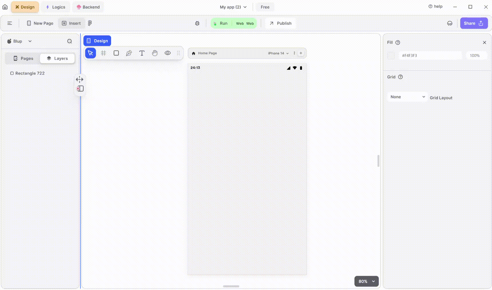

# Radio Widget

Radio widget is used to create radio buttons, which allow users to select one option from a set of mutually exclusive options. Radio buttons are typically used when there are a limited number of choices and only one selection is allowed at a time.

<figure><figcaption>
Radio Button
</figcaption></figure>

To utilize an Radio Widget in your Flutter UI, adhere to these steps:

**1.** Drag the Radio widget from the Insert menu and drop it into your desired location within your UI.

**2.** Customize the appearance and behavior of the Radio Widget by adjusting its properties in the editing section on the right. You can modify properties such as color, size, and shape to match your UI design.

**3.** Implement logic to dynamically control the value of the Radio widget. You can achieve this by binding the value property of the Radio widget to a boolean variable in your code. Based on user interactions or application state changes, update the boolean variable to true or false accordingly. This will dynamically reflect the selected state of the Radio widget.

### Components of Radio Widget

| Component             | Description                                                                                                                                     |
| --------------------- | ----------------------------------------------------------------------------------------------------------------------------------------------- |
| **Align Icons**       | Click icons or use shortcut keys to align Radio Widget. For example, click "Align Left" or use Ctrl+Shift+Left to left-align Radio Widget.      |
| **Postitions**        | Set Radio Widget positions on the X and Y axis of the mobile canvas.                                                                            |
| **Radio Widget Size** | Specify the width and height of the CheckBox by providing values for width (w) and height (h).                                                  |
| **Z rotation**        | Rotate the Radio Widget by specifying a rotation value.                                                                                         |
| **Border Radius**     | Adjust corner curvature by providing a value to create rounded corners. Individual corner adjustments are available by clicking on each corner. |
| **Margin**            | Provide margin to the Radio Widget from any of the four directions by specifying the margin value.                                              |
| **Radio Value**       | Set the value to true to mark the radio widget, and false to unmark it.                                                                         |
| **Radio Group Value** | Here you can track the radio value when it is in group.                                                                                         |
| **Toggleable**        | When checked, combines a Radio with text.                                                                                                       |
| **Appearance**        | Give the radio widget a color according to your needs.                                                                                          |
| **Focus Color**       | Represents the color displayed when a widget gains focus.                                                                                       |
| **Hover Color**       | Represents the color displayed when a widget is hovered over by the cursor.                                                                     |
| **Visible**           | By checking the checkbox, the entire selected radio widget will be hidden.                                                                      |

If you have any ideas to make Blup better you can share them through our [Discord community channel](https://discord.com/channels/940632966093234176/965313562425823303)

## Music to go with.


Lofi music

