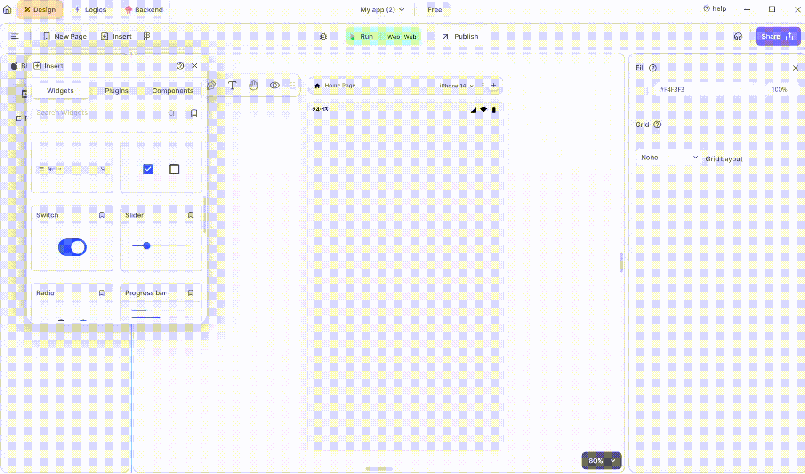

# Slider Widget

Slider widget is used to allow users to select a value from a range by dragging a thumb along a track. It's commonly used for selecting a value within a range, such as volume control or brightness adjustment.

<figure><figcaption>
Slider
</figcaption></figure>

To utilize an Slider in your Flutter UI, adhere to these steps:

**1.** Drag the Slider widget from the Insert menu and drop it into your desired location within your UI.

**2.** Customize the appearance and behavior of the Slider by adjusting its properties in the editing section on the right.

### Components of Progress Slider Widget

| Component                   | Description                                                                                                                                  |
| --------------------------- | -------------------------------------------------------------------------------------------------------------------------------------------- |
| **Align Icons**             | Click icons or use shortcut keys to align Slider Widget. For example, click "Align Left" or use Ctrl+Shift+Left to left-align Slider Widget. |
| **Postitions**              | Set Slider Widget positions on the X and Y axis of the mobile canvas.                                                                        |
| **Margin**                  | Adjust Slider Widget margin from top, bottom, left, or right by specifying margin values.                                                    |
| **Slider value**            | Set the slider value to determine the range shown in the slider according to your needs.                                                     |
| **Label**                   | Assign a label text to the slider according to your needs.                                                                                   |
| **Min & Max**               | Set the minimum and maximum range in the slider to represent your data progress.                                                             |
| **Divisions**               | Set the number of divisions you want to show in your slider.                                                                                 |
| **Slider Color**            | This will give the color to your slider according to your needs.                                                                             |
| **Slider Background Color** | This will give the background color to your slider according to your needs.                                                                  |
| **Visible**                 | By checking the checkbox, the entire selected slider widget will be hidden.                                                                  |

If you have any ideas to make Blup better you can share them through our [Discord community channel](https://discord.com/channels/940632966093234176/965313562425823303)

## Music to go with.


Lofi music

