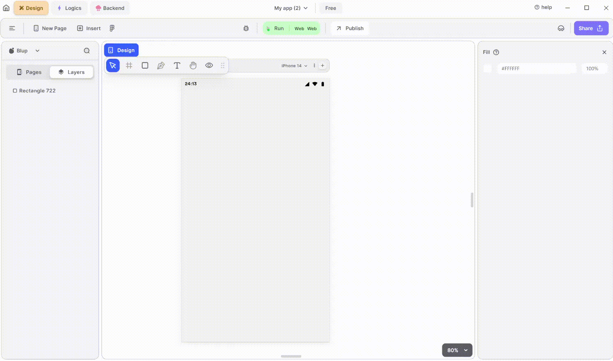

# Text Button Widget

TextButton widget is used to create a text-based button that responds to user taps. It provides a simple, flat button style with text and optional icons.

<figure><figcaption>
Text Button
</figcaption></figure>

To integrate a TextButton Widget into your UI, follow these steps:

**1.** Drag the TextButton widget from the Insert menu and drop it into your desired location within your UI.

**2.** Customize the appearance and behavior of the TextButton by adjusting its properties in the editing section on the right. You can modify properties such as text, style, color, and onPressed callback to define its appearance and behavior.

**3.** Also you can give Ellipsis on over flow of the text, or can add selectable text.

### Components of Text Button Widget

| Component                      | Description                                                                                                                                                      |
| ------------------------------ | ---------------------------------------------------------------------------------------------------------------------------------------------------------------- |
| **Align Icons**                | Click icons or use shortcut keys to align Text Button. For example, click "Align Left" or use Ctrl+Shift+Left to left-align Text Button.                         |
| **Postitions**                 | Set Text Button positions on the X-Position and Y-Position of the mobile canvas.                                                                                 |
| **Margin**                     | Adjust Text Button margin from top, bottom, left, or right by specifying margin values.                                                                          |
| **Text Button property**       | Modify text directly in the provided field, and changes will reflect on the mobile canvas.                                                                       |
| **Font Type**                  | Choose the preferred font type for selected text on Text Button.                                                                                                 |
| **Font Style**                 | Select font styles from a dropdown menu.                                                                                                                         |
| **Font Size**                  | Define the font size of the selected text.                                                                                                                       |
| **Letter spacing**             | Specify spacing between letters of the selected text.                                                                                                            |
| **Line Height**                | Define the height between lines of text.                                                                                                                         |
| **Left Align**                 | This option aligns the text from the left.                                                                                                                       |
| **Centre Align**               | This option aligns the text to the centre.                                                                                                                       |
| **Right Align**                | This option aligns the text to the right.                                                                                                                        |
| **Text Size Adjustment**       | Choose between Auto Width, Auto Height, or Fixed Size to adjust the dimensions of the text.                                                                      |
| **Max Line**                   | Define the maximum number of lines the selected text can take up. for example, if you define the value as 2 then the text can only take up 2 lines.              |
| **Font color**                 | Change the color of the text using color picker, hex code, or RGB sliders.                                                                                       |
| **Fill color**                 | Change the color of the text button using color picker, hex code, or RGB sliders.                                                                                |
| **Border Color**               | Choose a color to set the container's border color. Adjust the border color from inside, outside, or center of the container by selecting it from the drop-down. |
| **Border Width**               | Adjust the border width by providing a value. Select specific sides for border width by clicking the checkboxes.                                                 |
| **Ellipsis, on text overflow** | Show "..." if text overflows the specified max line limit.                                                                                                       |
| **Selectable Text**            | Allow users to select text for toolbar operations by checking this field.                                                                                        |
| **Visible**                    | By checking the checkbox, the entire selected Textbutton widget will be hidden.                                                                                  |

If you have any ideas to make Blup better you can share them through our [Discord community channel](https://discord.com/channels/940632966093234176/965313562425823303)

## Music to go with.


Lofi music

