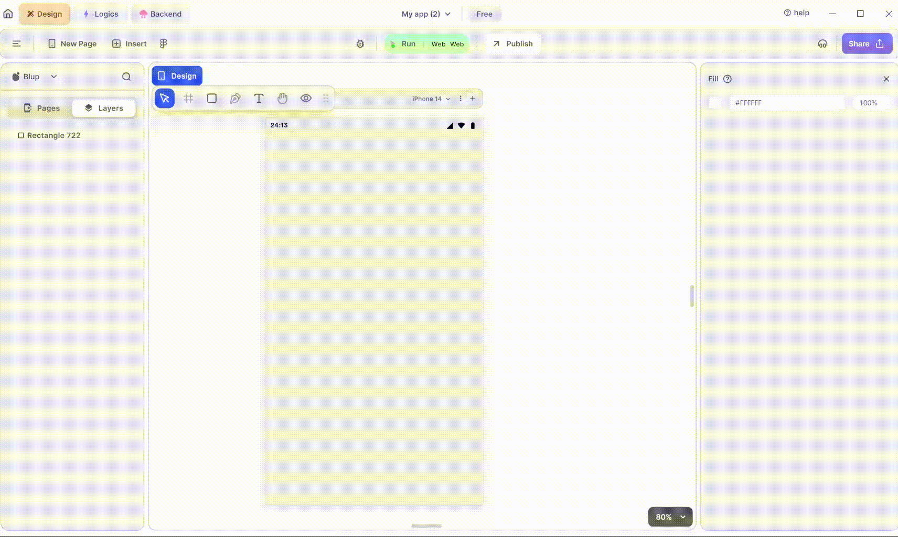

# TextField Widget

TextField Widget is highly customizable and supports various features such as input validation, text formatting, and keyboard types.

<figure><figcaption>
TextField
</figcaption></figure>

To integrate a TextField Widget into your UI, follow these steps:

**1.** Drag the TextField widget from the Insert menu and drop it into your desired location within your UI.

**2.** Customize the appearance and behavior of the TextField by adjusting its properties in the editing section on the right.

**3.** Additionally, you can enhance the TextField by adding error text, specifying the keyboard type, applying text overflow ellipsis, or configuring it as a password field to hide the entered text.

**-** To add error text, you can set the errorText property to display error messages when validation fails.

**-** To specify the keyboard type, you can set the keyboardType property to TextInputType to define the type of keyboard layout.

**-** To apply text overflow ellipsis, you can set the maxLines property to limit the number of lines displayed and set the overflow property to TextOverflow.ellipsis.

**-** To configure it as a password field, you can set the obscureText property to true to hide the entered text.

### Components of TextField Widget

| Component                      | Description                                                                                                                                                                                                                         |
| ------------------------------ | ----------------------------------------------------------------------------------------------------------------------------------------------------------------------------------------------------------------------------------- |
| **Align Icons**                | Click icons or use shortcut keys to align components of the TextField Widget. For example, click "Align Left" or use Ctrl+Shift+Left to left-align TextField Widget.                                                                |
| **Postitions**                 | Set TextField Widget positions on the X-axis and Y-axis of the mobile canvas.                                                                                                                                                       |
| **TextField Widget Size**      | Specify the width and height of the TextField by providing values for width (w) and height (h).                                                                                                                                     |
| **Z rotation**                 | Rotate the TextField Widget by specifying a rotation value.                                                                                                                                                                         |
| **Border Radius**              | Adjust corner curvature by providing a value to create rounded corners. Individual corner adjustments are available by clicking on each corner.                                                                                     |
| **Margin**                     | Provide margin to the TextField Widget from any of the four directions by specifying the margin value.                                                                                                                              |
| **Font Type**                  | Choose the preferred font type for selected text.                                                                                                                                                                                   |
| **Font Style**                 | Select font styles from a dropdown menu.                                                                                                                                                                                            |
| **Font Size**                  | Define the font size of the selected text.                                                                                                                                                                                          |
| **Letter spacing**             | Specify spacing between letters of the selected text.                                                                                                                                                                               |
| **Line Height**                | Define the height between lines of text.                                                                                                                                                                                            |
| **Max Line**                   | Define the maximum number of lines the selected text can specify. For example, if you define the value as 2, then the text can only take up 2 lines.                                                                                |
| **Left Align**                 | This option aligns the text from the left.                                                                                                                                                                                          |
| **Centre Align**               | This option aligns the text to the centre.                                                                                                                                                                                          |
| **Right Align**                | This option aligns the text to the right.                                                                                                                                                                                           |
| **Font color**                 | Change the color of the text using color picker, hex code, or RGB sliders.                                                                                                                                                          |
| **Appearance**                 | Here in appearance you give the color to the textfield according to your need.                                                                                                                                                      |
| **Label Properties**           | Modify Label text directly in the provided field, and changes will reflect on the mobile canvas.                                                                                                                                    |
| **Font Type**                  | Choose the preferred font type for selected text.                                                                                                                                                                                   |
| **Font Style**                 | Select font styles from a dropdown menu.                                                                                                                                                                                            |
| **Font Size**                  | Define the font size of the selected text.                                                                                                                                                                                          |
| **Letter spacing**             | Specify spacing between letters of the selected text.                                                                                                                                                                               |
| **Line Height**                | Define the height between lines of text.                                                                                                                                                                                            |
| **Max Line**                   | This property helps you to define the maximum number of lines the selected text can specify for example, if you define the value as 2 then the text can only take up 2 lines.                                                       |
| **Font color**                 | Change the color of the text using color picker, hex code, or RGB sliders.                                                                                                                                                          |
| **Hint Properties**            | Modify Hint text directly in the provided field, and changes will reflect on the mobile canvas.                                                                                                                                     |
| **Font Type**                  | Choose the preferred font type for selected text.                                                                                                                                                                                   |
| **Font Style**                 | Select font styles from a dropdown menu.                                                                                                                                                                                            |
| **Font Size**                  | Define the font size of the selected text.                                                                                                                                                                                          |
| **Letter spacing**             | Specify spacing between letters of the selected text.                                                                                                                                                                               |
| **Line Height**                | Define the height between lines of text.                                                                                                                                                                                            |
| **Max Line**                   | This property helps you to define the maximum number of lines the selected text can specify for example, if you define the value as 2 then the text can only take up 2 lines.                                                       |
| **Font color**                 | Change the color of the text using color picker, hex code, or RGB sliders.                                                                                                                                                          |
| **Error Properties**           | Modify error text directly in the provided field, and changes will reflect on the mobile canvas. Error text will be displayed when conditions are not met in the text field, and those conditions will be set by Blup Logics.       |
| **Font Type**                  | Choose the preferred font type for selected text.                                                                                                                                                                                   |
| **Font Style**                 | Select font styles from a dropdown menu.                                                                                                                                                                                            |
| **Font Size**                  | Define the font size of the selected text.                                                                                                                                                                                          |
| **Letter spacing**             | Specify spacing between letters of the selected text.                                                                                                                                                                               |
| **Line Height**                | Define the height between lines of text.                                                                                                                                                                                            |
| **Max Line**                   | This property helps you to define the maximum number of lines the selected text can specify for example, if you define the value as 2 then the text can only take up 2 lines.                                                       |
| **Font color**                 | Change the color of the text using color picker, hex code, or RGB sliders.                                                                                                                                                          |
| **Text Padding**               | Here you give the padding to your text inside the textfield according to your need.                                                                                                                                                 |
| **Border when typing text**    | Here you give the textfield border a color which will be refelect when user try to type something on that textfield.                                                                                                                |
| **Border when not focused**    | Here you give the color to the textfield border when user does not select that textfield.                                                                                                                                           |
| **Input Type**                 | Define which value should be filled in that text field, such as number, email, URL, or anything else.                                                                                                                               |
| **Password Field**             | When checking this box, the text field will hide the input from the user. It is basically used for password inputs.                                                                                                                 |
| **Ellipsis, on text overflow** | Show "..." if text overflows the specified max line limit.                                                                                                                                                                          |
| **Adjust With Keyboard**       | When checking this box, it will adjust the keyboard according to the text fields. This allows the content to resize when the keyboard is displayed, ensuring that the TextField remains visible and is not covered by the keyboard. |
| **Paragraph Editor**           | When checking this box, it allows scrolling for longer paragraphs so that you can edit any paragraph easily.                                                                                                                        |
| **Visible**                    | By checking the checkbox the entire Textifield widget will be hidden.                                                                                                                                                               |

If you have any ideas to make Blup better you can share them through our [Discord community channel](https://discord.com/channels/940632966093234176/965313562425823303)

## Music to go with.


Lofi music

