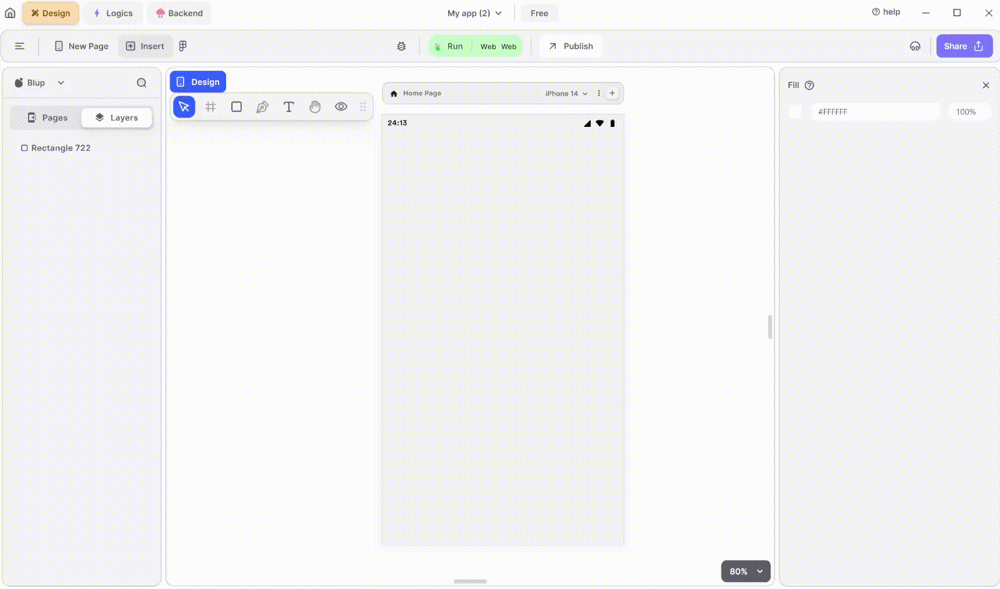

# Time Picker Widget

<figure><figcaption>
TimePicker
</figcaption></figure>

To utilize an Time Picker in your Flutter UI, adhere to these steps:

**1.** Drag the Time Picker widget from the Insert menu and drop it into your desired location within your UI.

**2.** Customize the appearance and behavior of the Time Picker by adjusting its properties in the editing section on the right.

### Components of TimePicker Widget

| Component                   | Description                                                                                                                                              |
| --------------------------- | -------------------------------------------------------------------------------------------------------------------------------------------------------- |
| **Align Icons**             | Click icons or use shortcut keys to align the TimePicker Widget. For example, click "Align Left" or use Ctrl+Shift+Left to left-align TimePicker Widget. |
| **Postitions**              | Set TimePicker Widget positions on the X and Y axis of the mobile canvas.                                                                                |
| **Margin**                  | Adjust TimePicker Widget margin from top, bottom, left, or right by specifying margin values.                                                            |
| **TimePicker Show**         | Show the preview of the clock for selecting the time.                                                                                                    |
| **TimePicker Initial Time** | Set the time that you want to show initially.                                                                                                            |
| **Fill color**              | Give color to the TimePicker widget.                                                                                                                     |
| **Border Color**            | Choose a color to set the widget border color. Adjust the border color from inside, outside, or center of the widget by selecting it from the drop-down. |
| **Border Width**            | Adjust the border width by providing a value. Select specific sides for border width by clicking the checkboxes.                                         |
| **Shadow**                  | Apply a shadow effect to the widget by selecting either a normal or inner shadow type.                                                                   |
| **Visible**                 | By checking the checkbox the entire selected TimePicker Widget will be hidden.                                                                           |

If you have any ideas to make Blup better you can share them through our [Discord community channel](https://discord.com/channels/940632966093234176/965313562425823303)

## Music to go with.


Lofi music

