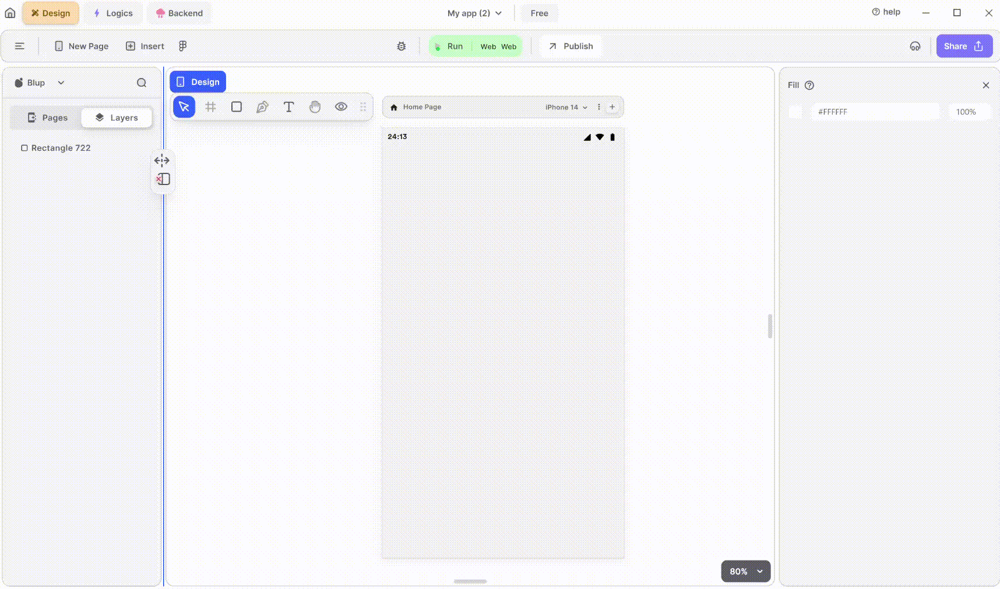

# Web View Widget

<figure><figcaption>
WebView
</figcaption></figure>

To integrate a WebView into your UI, follow these steps:

**1.** Drag the Web View widget from the Insert menu and drop it into your desired location within your UI.

**2.** Customize the appearance and behavior of the Web View by adjusting its properties in the editing section on the right.

**3.** Provide the URL of the web page you want to display in the WebView by setting the initialUrl property in the editing panel.

### Components of WebView Widget

| Component               | Description                                                                                                                                        |
| ----------------------- | -------------------------------------------------------------------------------------------------------------------------------------------------- |
| **Align Icons**         | Click icons or use shortcut keys to align the WebView Widget. For example, click "Align Left" or use Ctrl+Shift+Left to left-align WebView Widget. |
| **Postitions**          | Set WebView Widget positions on the X and Y axes of the mobile canvas.                                                                             |
| **WebView Widget Size** | Specify the width and height of the WebView Widget by providing values for width (w) and height (h).                                               |
| **Z rotation**          | Rotate the WebView Widget by specifying a rotation value.                                                                                          |
| **Border Radius**       | Adjust corner curvature by providing a value to create rounded corners. Individual corner adjustments are available by clicking on each corner.    |
| **Margin**              | Provide margin to the WebView Widget from any of the four directions by specifying the margin value.                                               |
| **Web view link**       | Give it a custom Url for the webview.                                                                                                              |
| **Visible**             | By checking the checkbox the entire WebView will be hidden.                                                                                        |

If you have any ideas to make Blup better you can share them through our [Discord community channel](https://discord.com/channels/940632966093234176/965313562425823303)

## Music to go with.


Lofi music

