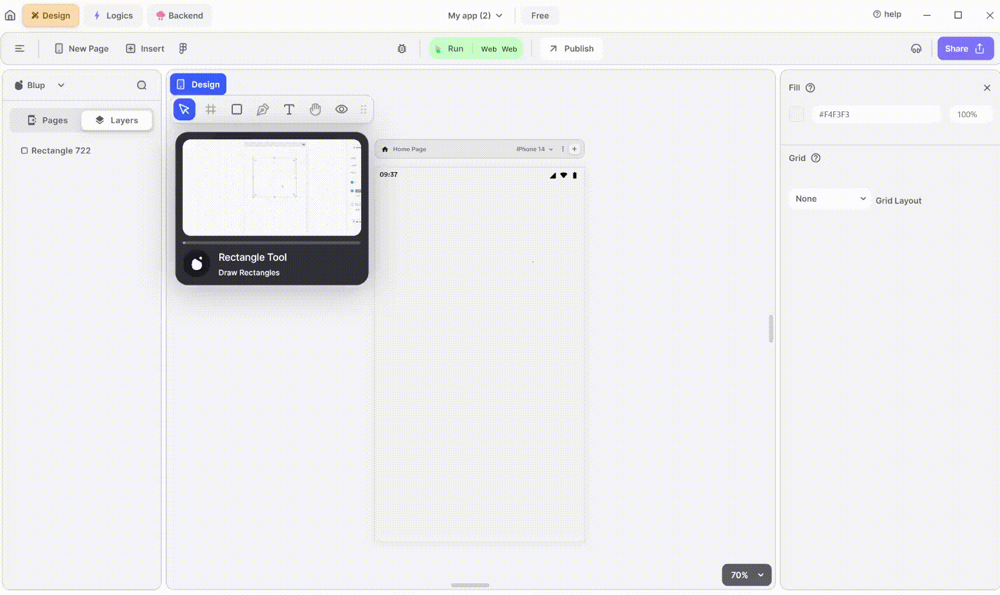

# List Properties

<figure><figcaption>
List UI
</figcaption></figure>

| Component                  | Description                                                                                                                                                                 |
| -------------------------- | --------------------------------------------------------------------------------------------------------------------------------------------------------------------------- |
| **Align Icons**            | Click icons or use shortcut keys to align text. For example, click "Align Left" or use Ctrl+Shift+Left to left-align text.                                                  |
| **Postitions**             | Set List positions on the X and Y axis of the mobile canvas.                                                                                                                |
| **List Size**              | Specify the width and height of the List by providing values for width (W) and height (H).                                                                                  |
| **Margin**                 | Provide margin to the List view from any of the four directions by specifying the margin value.                                                                             |
| **List Type**              | Select the layout of the list: simple list, wheel list, or one item list.                                                                                                   |
| **Scroll Physics**         | Adjust the scrollable effect: always scrollable, bouncing, clamping, or never scrollable scroll physics.                                                                    |
| **Internal Scroll Margin** | Adjust the margin of the list from inside. Provide a fixed margin for all sides or set individual margins by clicking on the icon.                                          |
| **Space Between Items**    | Adjust the spacing between the items inside the list. Set item spacing to adjust space between items or grid space for equal horizontal and vertical spacing between items. |
| **Visible**                | By checking the checkbox the entire selected list will be hidden.                                                                                                           |
| **Horizontal Scroll**      | Check the checkbox to hide horizontal scroll and show only one item.                                                                                                        |

If you have any ideas to make Blup better you can share them through our [Discord community channel](https://discord.com/channels/940632966093234176/965313562425823303)

## Music to go with.


Lofi music

