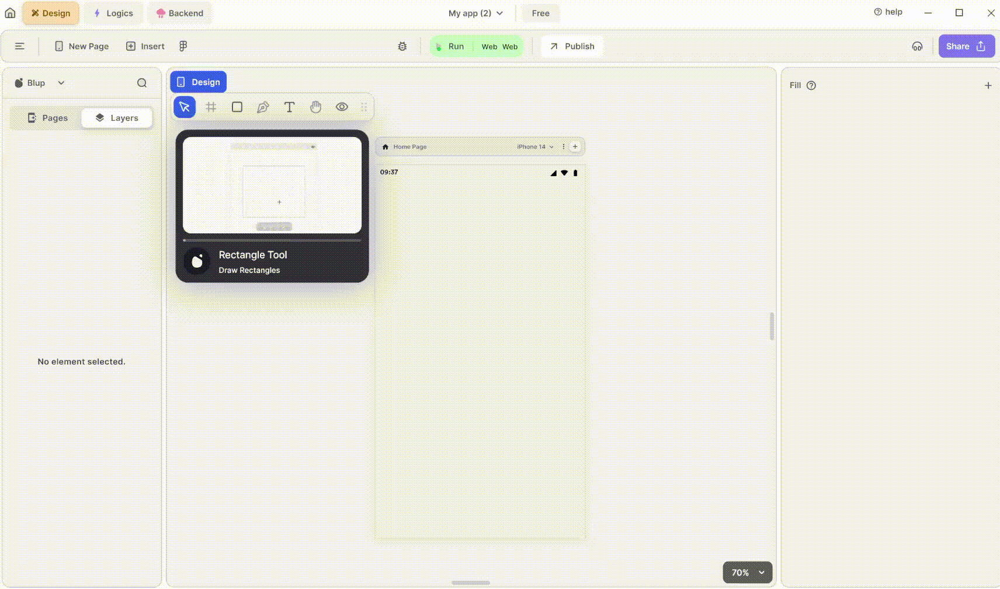

# Rectangle Properties

<figure><figcaption>
Rectangle UI
</figcaption></figure>

### Components of Text UI

| Component          | Description                                                                                                                                                      |
| ------------------ | ---------------------------------------------------------------------------------------------------------------------------------------------------------------- |
| **Align Icons**    | Click icons or use shortcut keys to align text. For example, click "Align Left" or use Ctrl+Shift+Left to left-align text.                                       |
| **Positions**      | Set Container positions on the X and Y axis of the mobile canvas.                                                                                                |
| **Container Size** | Specify the width and height of the container by providing values for width (w) and height (h).                                                                  |
| **Z rotation**     | Rotate the container by specifying a rotation value.                                                                                                             |
| **Border Radius**  | Adjust corner curvature by providing a value to create rounded corners. Individual corner adjustments are available by clicking on each corner.                  |
| **Margin**         | Provide margin to the container from any of the four directions by specifying the margin value.                                                                  |
| **Fill Color**     | Choose a color to fill the container's interior.                                                                                                                 |
| **Border Color**   | Choose a color to set the container's border color. Adjust the border color from inside, outside, or center of the container by selecting it from the drop down. |
| **Border Width**   | Adjust the border width by providing a value. Select specific sides for border width by clicking the checkboxes.                                                 |
| **Shadow**         | Apply a shadow effect to the container by selecting either a normal or inner shadow type.                                                                        |
| **Visible**        | By checking the checkbox the entire selected list will be hidden.                                                                                                |

If you have any ideas to make Blup better you can share them through our [Discord community channel](https://discord.com/channels/940632966093234176/965313562425823303)

## Music to go with.


Lofi music

