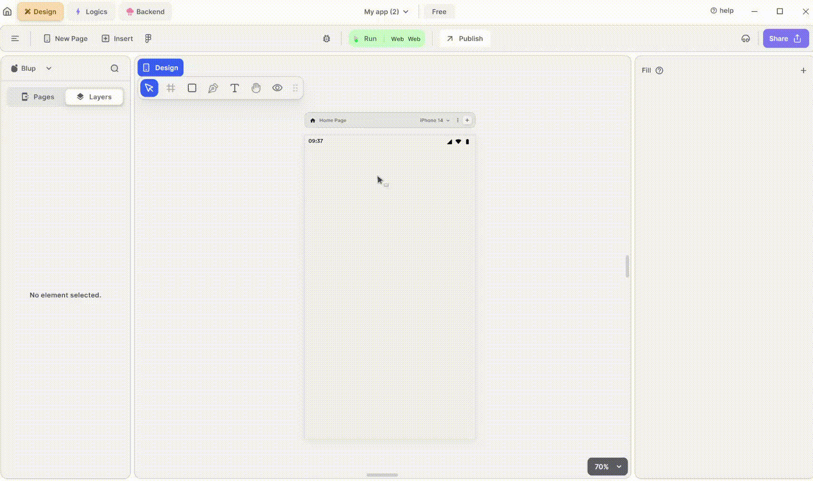

# Text Properties

<figure><figcaption>
Text UI
</figcaption></figure>

### Components of Text UI

| Component                      | Description                                                                                                                                                                     |
| ------------------------------ | ------------------------------------------------------------------------------------------------------------------------------------------------------------------------------- |
| **Align Icons**                | Click icons or use shortcut keys to align text. For example, click "Align Left" or use Ctrl+Shift+Left to left-align text.                                                      |
| **Postitions**                 | Set Text positions on the X and Y axis of the mobile canvas.                                                                                                                    |
| **Margin**                     | Adjust text margin from top, bottom, left, or right by specifying margin values.                                                                                                |
| **Text property**              | Modify text directly in the provided field, and changes will reflect on the mobile canvas.                                                                                      |
| **Font Type**                  | Choose the preferred font type for selected text.                                                                                                                               |
| **Font Style**                 | Select font styles from a dropdown menu.                                                                                                                                        |
| **Font Size**                  | Define the font size of the selected text.                                                                                                                                      |
| **Letter spacing**             | Specify spacing between letters of the selected text.                                                                                                                           |
| **Line Height**                | Define the height between lines of text.                                                                                                                                        |
| **Left Align**                 | This option aligns the text from the left.                                                                                                                                      |
| **Centre Align**               | This option aligns the text to the centre.                                                                                                                                      |
| **Right Align**                | This option aligns the text to the right.                                                                                                                                       |
| **Auto Width**                 | The width of the text will be adjusted automatically depending on the size of the container housing the selected text.                                                          |
| **Auto height**                | The height of the text will be adjusted automatically depending on the size of the container housing the selected text.                                                         |
| **Fixed size**                 | The dimensions of the text will remain fixed regardless of the size of the container housing the selected text.                                                                 |
| **Max Line**                   | This property helps you to define the maximum number of lines the selected text can specify. For example, if you define the value as 2, then the text can only take up 2 lines. |
| **Font color**                 | Change the color of the text using the color picker, hex code, or RGB sliders.                                                                                                  |
| **Ellipsis, on text overflow** | Show "..." if text overflows the specified max line limit.                                                                                                                      |
| **Selectable Text**            | Allow users to select text for toolbar operations by checking this field.                                                                                                       |
| **Visible**                    | By checking the checkbox the entire selected list will be hidden.                                                                                                               |

If you have any ideas to make Blup better you can share them through our [Discord community channel](https://discord.com/channels/940632966093234176/965313562425823303)

## Music to go with.


Lofi music

