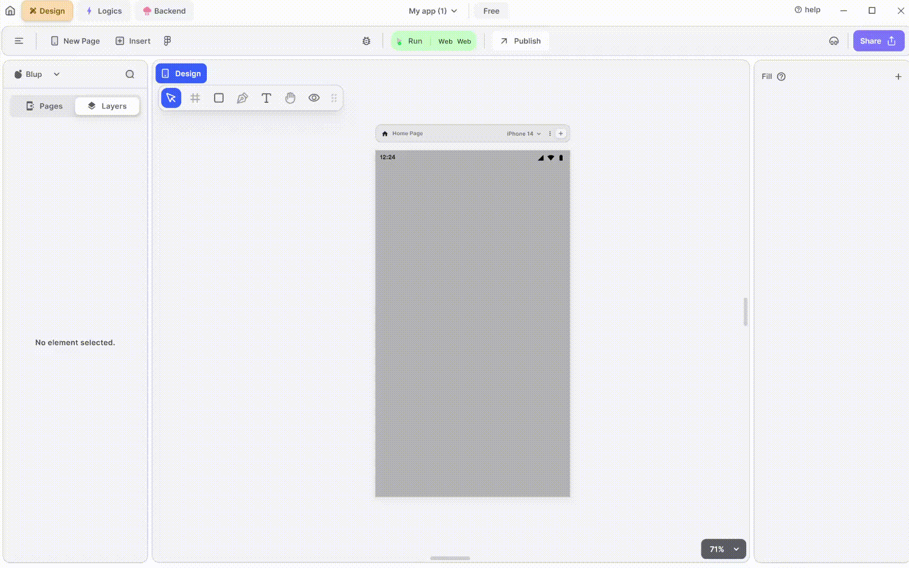
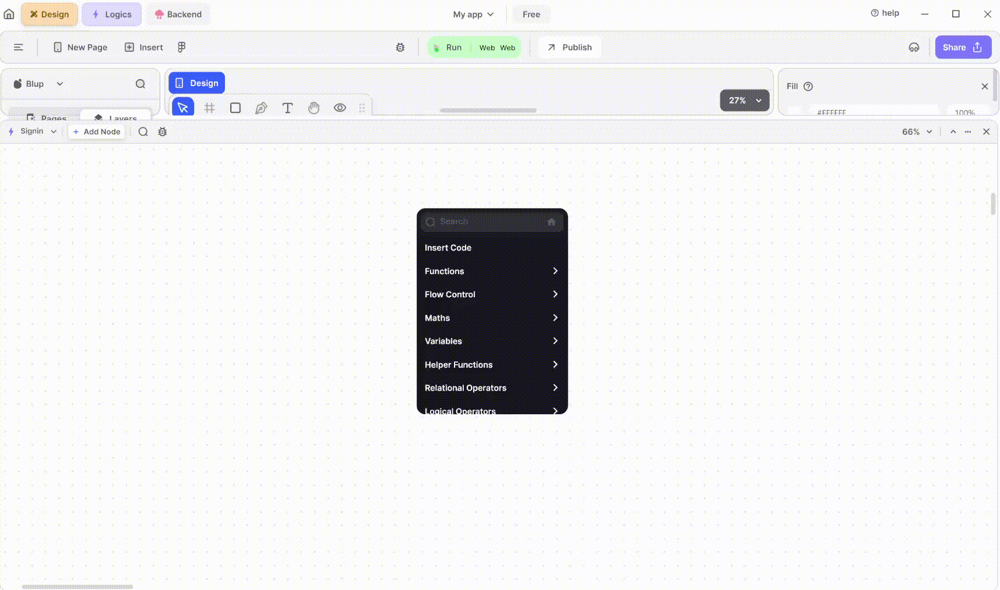

# Logics ⚡








Lofi music




In Blup, the Logics module allows you to create and manage logic for different widgets within your app. To access Logics in Blup, click on the Logics icon located on the top-left side, next to the Design panel, labeled Logics.

## Dashboard

### 1. Logic Button

When click on the Logic button it will open a Logic Console at the bottom for implementing your logics accordingly.

### 2. Logic Tab

Each tab corresponds to an individual page and encompasses all the logic associated with that specific page. These pages correspond to every app page in an application.

### 3. Add Node

Add node allows you to choose which node you want to apply to your widget either you want to apply function to your designs or want that design to do some mathematical expressions or many more.


You can also open that add node by right-clicking on the logic console.


### 4. Search

On search, you can find your node that is added on the Logics App Page.


You can select any node by clicking on the Panel opened by Search and the Logics App Page will be zoomed to that node.


### 5. Debug Console

In the debug console, When the app is running, it will log all the details of the app logs to check if everything is working as expected or not.

It shows you all the errors and print node output that you have placed in your logic.

### 6. Logics Zoomer

It allows your Logic app page to zoom out or zoom in for a better view of your logic nodes.

### 7. Logics Maximizer

It takes the necessary spaces in blup for the Logic screen so you can work on your logic.

### 8. Logics Menu

In the Logics Menu, there are 4 options - **Refresh Logic**, **Help in Logic**, **Hide/Show** **Minimap**, and **Hide/Show Debug console**.

* **Refresh Logic -** It will refresh all the logic nodes if something is not working correctly.
* **Help in Logics -** It will open a small box with logic on it, for your help how to use logic and which color is situated to what type.
* **Hide/Show** **Minimap-** It will hide or show a mini-map of your Logic console on the bottom left, from this map you can go anywhere in your Logics App Page just by clicking on that part in the map. It will help to have a view of so many logics and you want to go from one point to another in Logics App Page.
* **Hide/Show Debug console -** It will open a debug console next to your Logic console so you can check the errors or the prints in real time.

### 9. Logics App Page

The Logics App Page is where all logics are created by connecting or adding nodes.


This is the backbone of Blup for Logics Creation.


## List Of Nodes Available in Logics

## Understanding Node Structure

All the nodes that are present in the Blup Lightning follow the same node structure or pattern. On the top center of each node, is the name of the node, this name signifies multiple things like which category the node belongs to and what is it's intended task.

The left-hand side of each node takes the input and the right-hand side of each node gives the output. To take input or provide output each node uses a node point.


<mark style="color:blue;">Note: In some of the nodes you can also use the input box located inside the node..</mark>


### What is Node point

Node points are points lying on the outer surface of the node to accept input, provide output or for navigation to another page. In blup data flows from one node point to another. Node points can only connect with node points of the same type.

There are two types of node points:

#### **Circular node point**

These node points as the name suggests are circular in shape and color-coded, according to the type of data being passed through them thereby, if two node points are to be connected, they need to be of the same color.

**For Example -** A string node point can accept node wire from other string node points only.

Certainly! Let’s delve into the details of **Function Node Points** in **Logics**:

1. **Function Node Points**: These node points take on a triangular shape, unlike the circular node points. Unlike the color-coded circular nodes, function node points don’t adhere to any specific color schema.
2. **Run Trigger**: The function node points serve two primary purposes. First, we have the **Run Trigger**. It consists of two function node points—one on the left-hand side and another on the right-hand side of the node. Here’s how it works:
   * The left-hand side node point acts as the **starting point** for the node.
   * The right-hand side node point triggers the execution of another function node point **after the current logic is finished**. In other words, it allows you to sequence actions or steps within your logic.
3. **Function Output Node Points**: These node points are located on the right-hand side of the node. They play a crucial role in running logic based on specific triggers. When certain conditions are met, these output node points execute additional actions or processes.

Feel free to explore these function node points further, and if you have any specific questions or need more details, feel free to ask! 😊

For example, in the above Rectangle Node, the logic attached to the on-click function node point only runs when the user clicks on the rectangle in the app.

In Some of Cases, these output node points also provide you with additional output node points for further flexibility

**For example -** When the on File Picked Function output Node point Stretch you can see that new output node points are generated that provide you with extra output node points.

If you have any ideas to make Blup better you can share them through our [Discord community channel](https://discord.com/channels/940632966093234176/965313562425823303)

## Music to go with.


Lofi music

