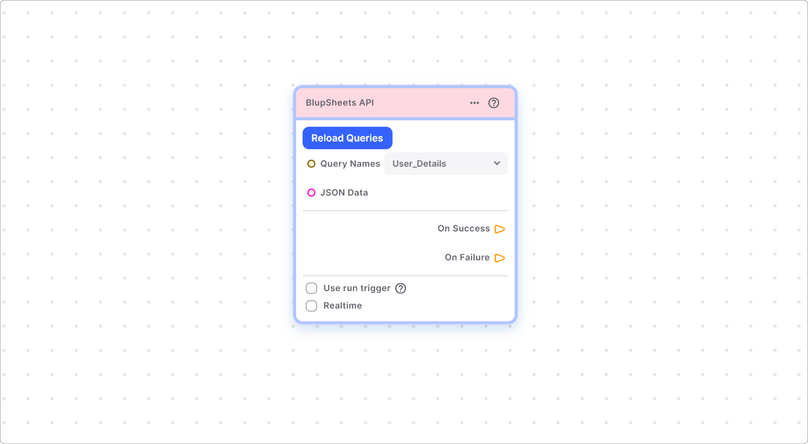
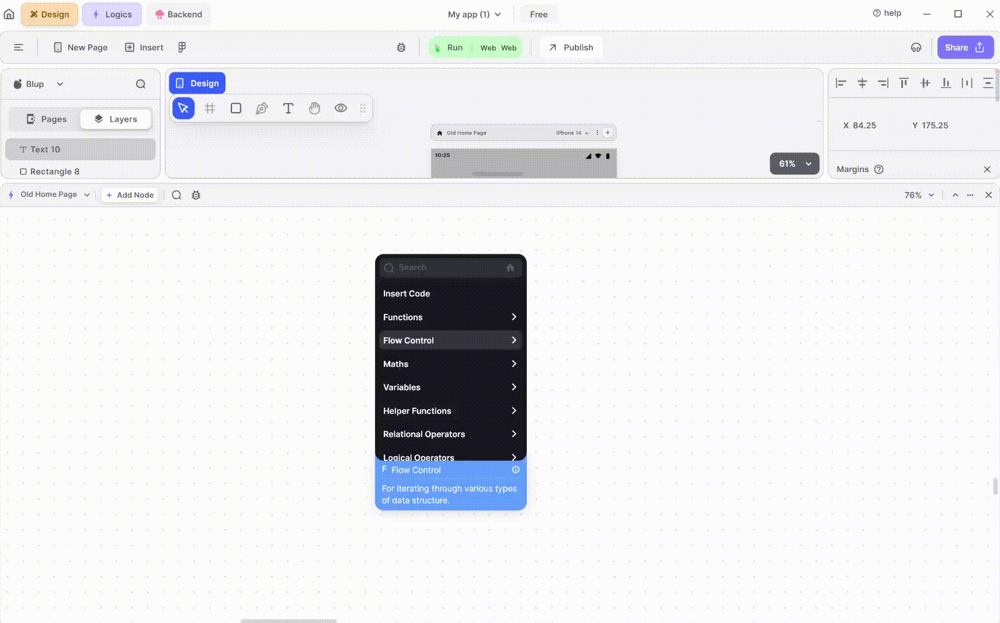

# Blup Sheet API Node Section

The Blup Sheet API facilitates seamless integration between your backend and user interface (UI) components. By developing your UI and employing logical operations within Blup Logics, you can establish connections with your backend effortlessly.

## Components of Blup Sheet APIs Node.

| Component           | Description                                                                                                                 |
| ------------------- | --------------------------------------------------------------------------------------------------------------------------- |
| **Reload Queries**  | Refreshes available queries in real-time for selection.                                                                     |
| **Queries Names**   | Displays a dropdown of available queries' names.                                                                            |
| **JSON Data**       | Allows integration of external JSON data into your application.                                                             |
| **On Success**      | This option allows users to proceed to the next node upon successful getting the data from JSON or Blup backend by queries. |
| **On Failure**      | If the Data loading fails, users will not be able to progress to the next node until the issue is resolved.                 |
| **Use run trigger** | Users can utilize this checkbox to add a run trigger to the node, enhancing its functionality.                              |
| **Realtime**        | Visualizes data execution in real-time.                                                                                     |

## How to Use Blup Sheet APIs Node

**Step1:** Verify the existence of queries within your Blup Backend.

**Step2:** After checking the queries navigate to the Blup Logics console and open Blup Sheets API.

**Step3:** Locate and access the Blup Sheets API module.

**Step4:** Reload queries if necessary, then choose the desired query from the dropdown list. Utilize this query within your application as needed.

If you have any ideas to make Blup better you can share them through our [Discord community channel](https://discord.com/channels/940632966093234176/965313562425823303)

## Music to go with.


Lofi music

