# Function Node Section

All the nodes that help you achieve some functionality are present under this section for example upload files, authentication, payments etc.

Now, Let's go over each node in this section.

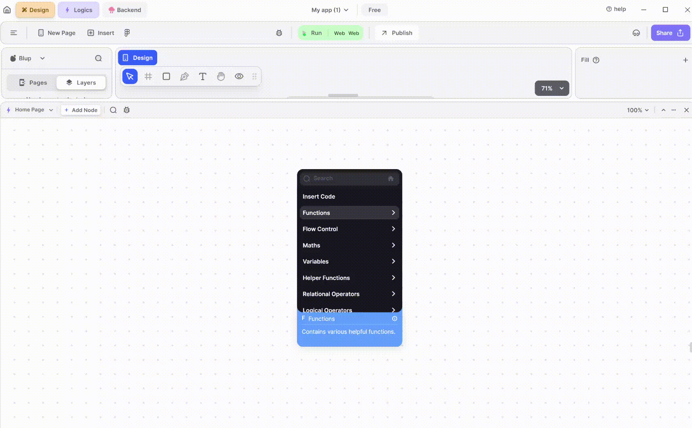

## Function Node

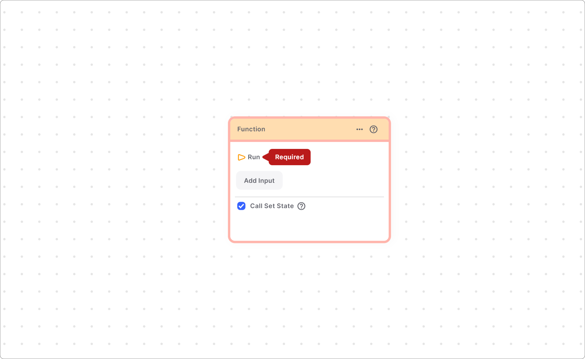

This function node generator allows you to create custom functions with dynamic input arguments. You can add input parameters by clicking the "Add Input" button, which creates input nodes. These input nodes represent the arguments that the function takes.

Once you've added input nodes, you can use them within the function's body. This tool is particularly useful when combined with other function nodes, allowing you to create versatile and tailored functions for various purposes.

While the node itself may seem basic, its power lies in its ability to create flexible and customizable functions tailored to specific requirements or tasks.

## File Picker Node

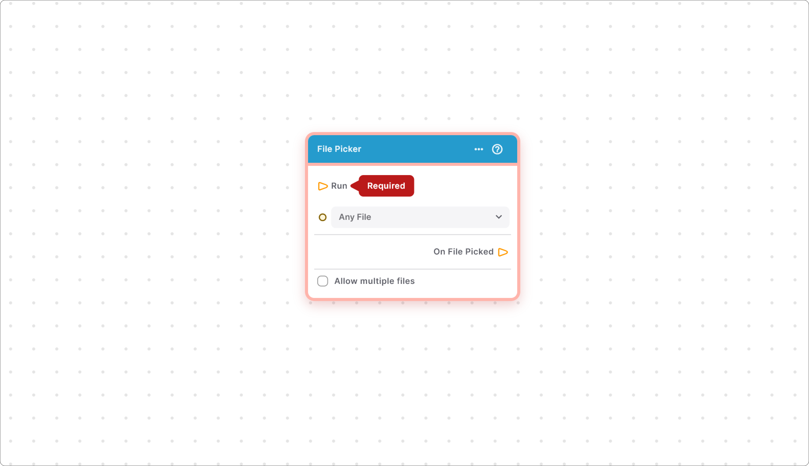

This node facilitates the selection of files from your device. For instance, if you want to choose an image from your phone's gallery, this node allows you to do so effortlessly.

You can specify the type of file you want to pick from your device. Additionally, if you need to select multiple files simultaneously, you can enable the "Allow multiple files" option located at the bottom of the node.

### How to Use File Picker Node

**Step1:** In Blup Logics, navigate to the arsenal and select the "File Picker" node.

**Step2:** Choose the type of file you wish to select. For example, if you're selecting images, pick the "Images Only" option from the dropdown list.

**Step3**: To obtain the desired output, such as file path or file name, click on the "OnFilePicked" output node and stretch it. Upon releasing, a function node will be generated containing output nodes like file type, file name, and file path.

To trigger the file picker node when a button is clicked, simply connect the "OnClick" node to the appropriate input node for running the process.


<mark style="color:blue;">Note: If you want to allow users to select multiple files, check the "Allow multiple files" checkbox located at the bottom of the node.</mark>


## File Uploader To BSS Node

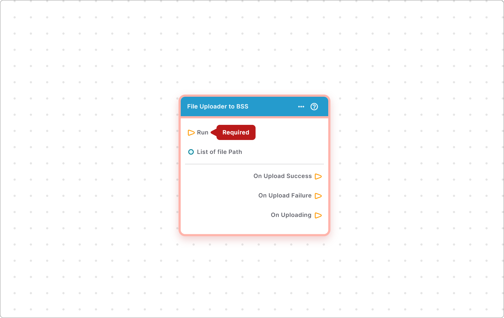

This node facilitates the exclusive uploading of files (of any type) to the Blupsheets database. If you need to upload files to servers, consider using the TUS file uploader node instead.

Typically, this node is paired with the file picker node. First, use the file picker node to select the desired file from your device storage. Then, click the upload button to transfer the selected file to the Blupsheets database.

This workflow provides a straightforward method for uploading files to the Blupsheets database, allowing seamless integration with other nodes for various tasks.

### Components Of Node

| Component                | Description                                                           |
| ------------------------ | --------------------------------------------------------------------- |
| **Run input node point** | Starting point for the node's functionality.                          |
| **List of File paths**   | Takes a list of file paths to be uploaded to the Blupsheets database. |
| **OnUploadSuccess()**    | Executes logic upon successful file upload.                           |
| **OnUploadingFailuire**  | Executes logic if the file upload fails.                              |
| **OnUploading**          | Executes logic while the file is being uploaded to the database.      |


<mark style="color:blue;">Note: To get an additional output node point it needs to be stretched.</mark>


### How to Use File Uploader To BSS Node

**Step 1:** Get the file uploader BSS node from the arsenal panel in blup logics.

**Step 2:** Provide the run trigger from where you want to run the node functionality in your case that can be on click of a button or we can bind this node with the file picker node.

**Step 3:** Provide the second input which is a list of file paths for which, if you directly know the file paths you can provide the list of file paths or you can use the file picker node for this.

**Step 4:** To get the download URL of the file uploaded you need to stretch the onUploadsucces output node point, as soon as you do it you can see a new function node is generated which consist of a list of download URL.


**Note: If you want to perform some functionality if uploads fail can use the OnUploadFailure output node point**


Similarly, if you require logic execution while the file is being uploaded, use the OnUploading output node, which also provides additional node points like progress or current index.

## TUS File Uploader Node

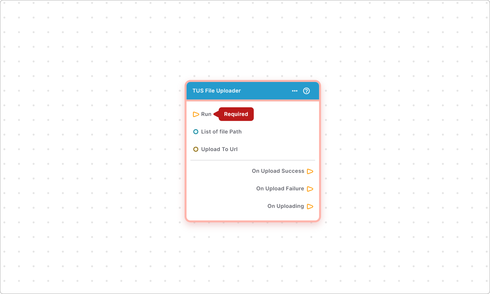

The functionality of this node is similar to the File Uploader BSS node, with the key difference being that it allows you to upload files to any location, such as your own server.

### Components of file Uploader node to BSS

| Component                 | Description                                                                                                                                     |
| ------------------------- | ----------------------------------------------------------------------------------------------------------------------------------------------- |
| **Run input node point**  | It initiates the node's functionality.                                                                                                          |
| **List of File paths**    | Takes a list of file paths to be uploaded.                                                                                                      |
| **Upload to Url**         | Provides the URL where you want to upload your file, such as the endpoint to your server.                                                       |
| **OnUploadSuccess()**     | Executes logic when the upload is successfully completed. Stretching this node generates additional output nodes, like download URLs for files. |
| **OnUploadingFailuire()** | Executes logic if the upload fails. Stretching this node generates additional output nodes.                                                     |
| **OnUploading()**         | Executes logic while the data is being uploaded. Stretching this node generates additional output nodes.                                        |

## Shared Preferences Sub-Section

This sub-section provides nodes for storing data (key-value pairs) in system memory. Data stored through these nodes persists even if the user closes your app.

### SPF| Store Data node

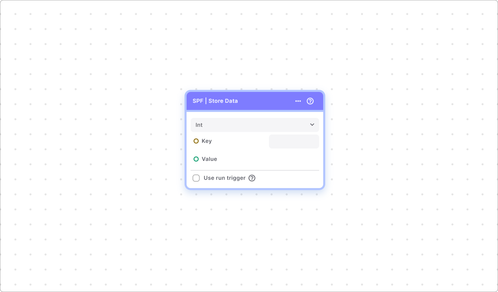

This node allows you to store key-value pairs in system memory, ensuring preservation even if the user closes or removes the app from the background.

#### Components of Node.

| Component                    | Description                                                                                                                                                                          |
| ---------------------------- | ------------------------------------------------------------------------------------------------------------------------------------------------------------------------------------ |
| **Dropdown Menu**            | Used to define the type of values to be stored with the key. For instance, selecting "Strings" from the dropdown indicates that strings will be stored as values along with the key. |
| **Key node point**           | Provides the key, acting as a unique identifier for storing values. The key must be unique and can accept unique strings.                                                            |
| **Values Node Point**        | Allows you to provide the value associated with the key.                                                                                                                             |
| **Use run trigger Checkbox** | Enables adding a run trigger to the node.                                                                                                                                            |

### SPF| Get Data Node

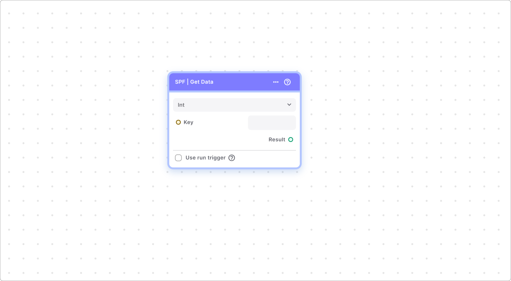

This node, as the name suggests, retrieves the data (key-value pairs) stored in system memory using the SPF | Store Data node.

#### Components of Node.

| Component                    | Description                                                                                                                                                                 |
| ---------------------------- | --------------------------------------------------------------------------------------------------------------------------------------------------------------------------- |
| **Dropdown Menu**            | Used to specify the type of values stored along with the key. For instance, selecting "Strings" from the dropdown indicates that strings are stored as values with the key. |
| **Key node point**           | Provides the key, acting as a unique identifier for the stored values. The key must be unique.                                                                              |
| **Use run trigger Checkbox** | Allows adding a run trigger to the node.                                                                                                                                    |

These components facilitate the retrieval of stored data, allowing you to access key-value pairs stored in system memory with ease.

## Audio Player Sub-Section

### Audio Player | Init Node

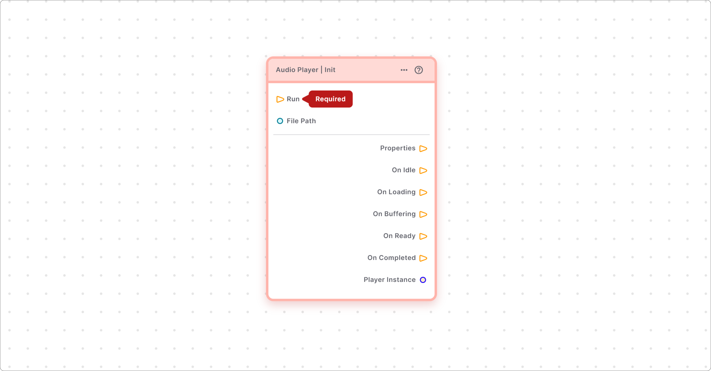

This node offers an audio player functionality, enabling you to add audio songs or any audio files to your device. You can then process these audio files to the screen based on your specific functionality requirements.

| Component                | Description                                                                             |
| ------------------------ | --------------------------------------------------------------------------------------- |
| **Run input node point** | It initiates the node's functionality.                                                  |
| **File path**            | Here you provide the file path from another node like file picker or file uploder, etc. |
| **Properties**           | It will show the properties of the audio.                                               |
| **On loading**           | What it will show on loading                                                            |
| **On Buffering**         | Show the buffering.                                                                     |
| **On Ready**             | When audio is ready.                                                                    |
| **On Completed**         | On complition of the audio.                                                             |

### Audio Player | Props

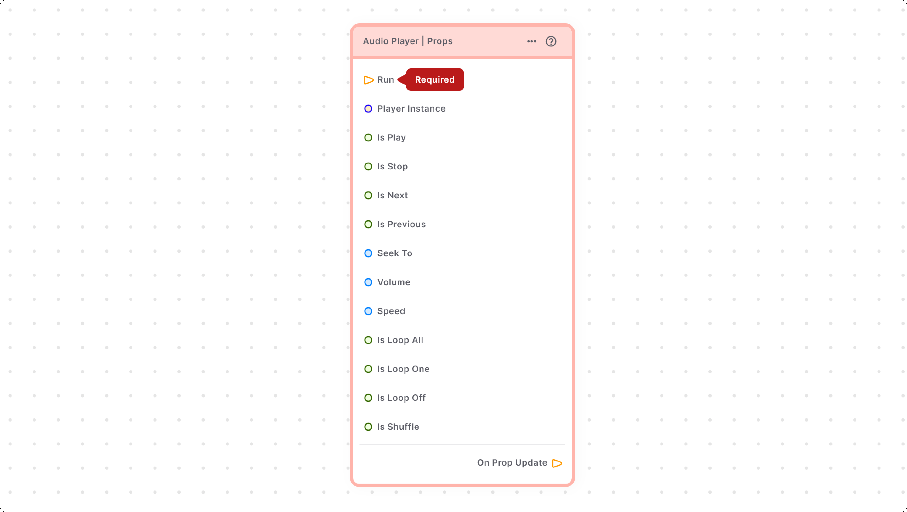

## Social Sub-Section

### Social Login

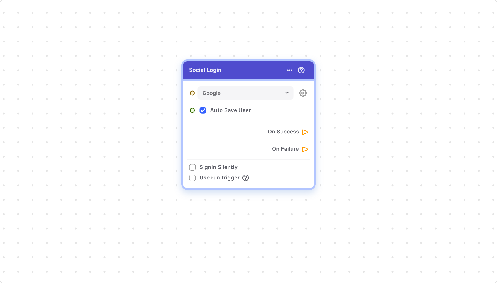

This node provides multiple login options, allowing you to choose between logging in with Google, Facebook, or Twitter. Additionally, users can opt to save their login details for future use by enabling the "Auto Save User" feature.

| Component                    | Description                                                                                                                                                                                                 |
| ---------------------------- | ----------------------------------------------------------------------------------------------------------------------------------------------------------------------------------------------------------- |
| **Dropdown Menu**            | This component enables users to select the social media platform they wish to use for login. Upon selection, the chosen social media functionality will be integrated into the application's login process. |
| **Auto Save User**           | Enabling this option will automatically save the user's login details for future use, streamlining the login process.                                                                                       |
| **On Success**               | This option allows users to proceed to the next node upon successful login.                                                                                                                                 |
| **On Failure**               | If the login attempt fails, users will not be able to progress to the next node until the issue is resolved.                                                                                                |
| **Use run trigger Checkbox** | Users can utilize this checkbox to add a run trigger to the node, enhancing its functionality.                                                                                                              |

### Social Logout

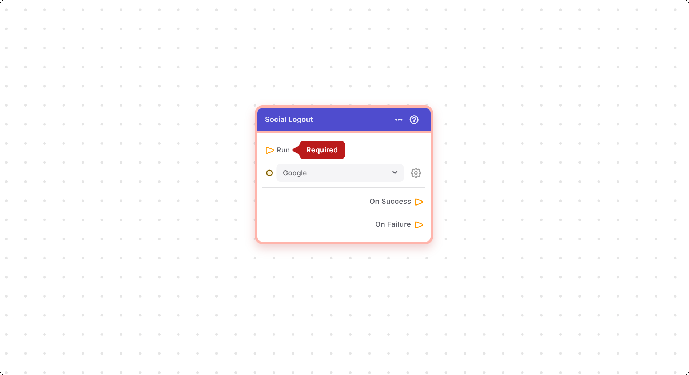

This node provides the logout feature for your social media from the device.

| Component                | Description                                                                                                  |
| ------------------------ | ------------------------------------------------------------------------------------------------------------ |
| **Run input node point** | It initiates the node's functionality.                                                                       |
| **Drop down menu**       | Select the social media that you want to logout from.                                                        |
| **On Success**           | This option allows users to proceed to the next node upon successful login.                                  |
| **On Failure**           | If the login attempt fails, users will not be able to progress to the next node until the issue is resolved. |

## Page Navigator

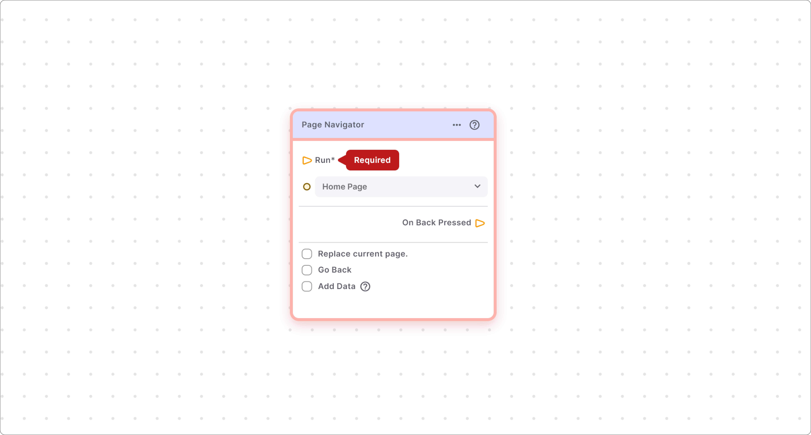

This node facilitates navigation between pages in your app, enabling seamless transitions from one page to another and providing functionality to return to the previous page.

### Components of Page Navigator

| Component                         | Description                                                                                                                                                                                                                                 |
| --------------------------------- | ------------------------------------------------------------------------------------------------------------------------------------------------------------------------------------------------------------------------------------------- |
| **Run**                           | Input node point initiating the node's functionality.                                                                                                                                                                                       |
| **Navigate to Dropdown Menu**     | Dropdown list containing all pages in your project. Select the desired page to navigate to it. Alternatively, you can provide the page name through a node point, ensuring it exactly matches the page name.                                |
| **Replace Current Page Checkbox** | When unchecked, navigating to another page places it on top of the current page, allowing back navigation to return to the previous page. Checking this box replaces the current page with the new page, altering back navigation behavior. |
| **Add Data Checkbox**             | Enables sending data when navigating between pages. Checking this box generates an "Add Data" node point, allowing attachment of any desired data to be sent to the next page.                                                              |
| **Go Back Checkbox**              | Navigates back to the previous page. Can only navigate back to one page.                                                                                                                                                                    |
| **Go Back Until Checkbox**        | Allows navigating back multiple pages at once. Checking this box generates a dropdown menu listing all pages in the application. Select the desired page to navigate back to it.                                                            |

## Data From Page

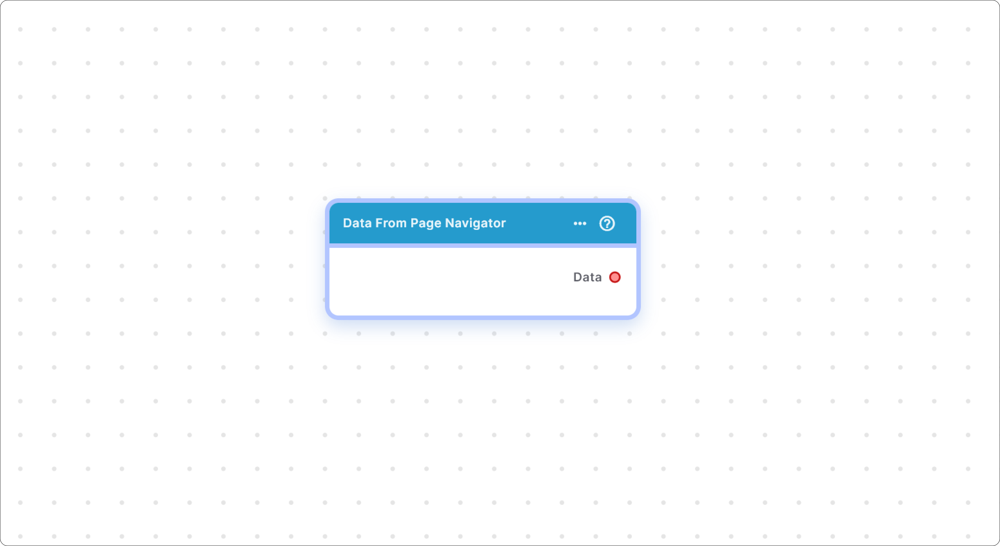

## Simple HTTP Node

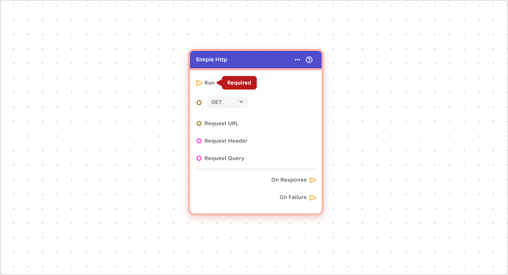

This node facilitates communication with your server/API, allowing you to perform various operations such as reading, updating, or adding data.

This node is very helpful in case you are managing your servers/backend.

### Components of Simple Http

| Component                | Description                                                                                                                                                                                                                                      |
| ------------------------ | ------------------------------------------------------------------------------------------------------------------------------------------------------------------------------------------------------------------------------------------------ |
| **Run**                  | Input node point initiating the node's functionality.                                                                                                                                                                                            |
| **HTTP Method Dropdown** | Dropdown menu enabling selection of the operation type to perform on your server/API.                                                                                                                                                            |
| **Request URL**          | Node point for providing the endpoint URL to connect with the backend service.                                                                                                                                                                   |
| **Request Header**       | Input node point for providing headers for the API call. Headers contain metadata associated with each API request.                                                                                                                              |
| **Request Query**        | Node point that changes based on the selected dropdown value: - GET - Request Query: Passes arguments to fetch specific data. - POST - Request Body: Sends data to add to the database. - PUT - Request Body: Sends data to update the database. |
| **On Response**          | Output node point performing logic once the response is received from the backend.                                                                                                                                                               |
| **On Failure**           | Output node point executing logic if the request fails.                                                                                                                                                                                          |


<mark style="color:blue;">Note: If you want an additional node point to stretch the OnResponse node point further, you can use the function node generated which consists of an additional node point.</mark>


## URI Encode Node

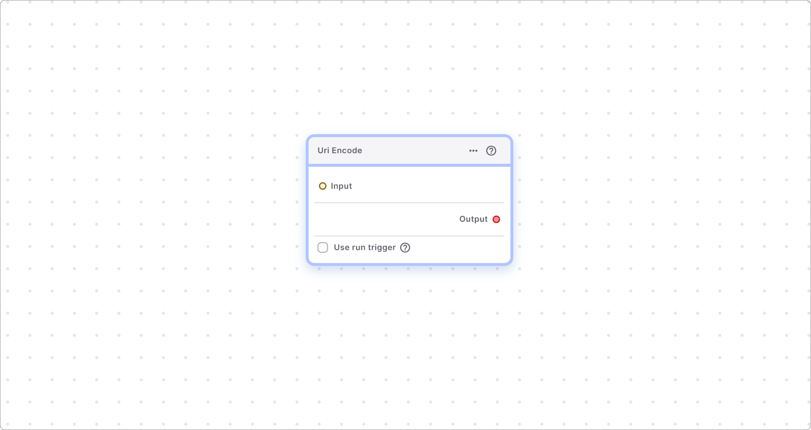

This node is utilized to encode a URI. By passing the URI you wish to encode, you'll receive the encoded URI from the result output node.

**Why we encode URI** - when your URL consists of some spaces or special characters it can lead to a problem while executing the API. To avoid any such problems we use an encoding.

### Components Of Node

| Component                    | Description                                                                          |
| ---------------------------- | ------------------------------------------------------------------------------------ |
| **Input**                    | This node point accepts the URI you want to encode.                                  |
| **Use Run Trigger Checkbox** | Check this box to add a run trigger to the node.                                     |
| **Output**                   | Provides the result of the encoded URI that was passed through the input node point. |

## Firebase

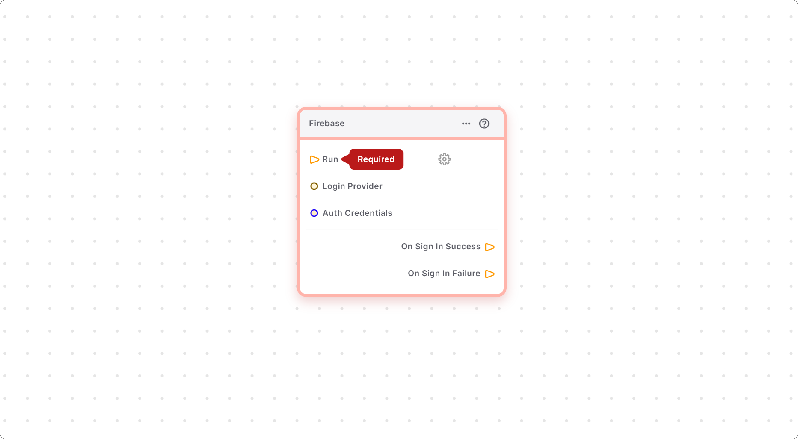

This Firebase node allow you to connect with firebase for login, so that you can login trough firebase.

| Component                | Description                                                                                                    |
| ------------------------ | -------------------------------------------------------------------------------------------------------------- |
| **Run input node point** | It initiates the node's functionality.                                                                         |
| **Login provider**       | Here you need to provide the login service.                                                                    |
| **Auth Credentials**     | Add Credentials of the firebase trough this point.                                                             |
| **On Sign In Success**   | This option allows users to proceed to the next node upon successful Sign In.                                  |
| **On Sign In Failure**   | If the Sign In attempt fails, users will not be able to progress to the next node until the issue is resolved. |

## Firebase Sign Up

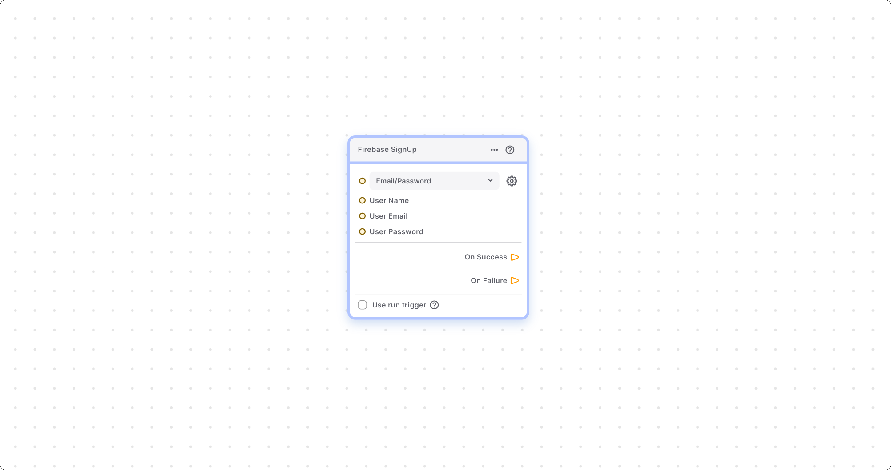

This Firebase Signup node allows you to connect with Firebase for authentication, enabling users to sign up with Firebase.

| Component                | Description                                                             |
| ------------------------ | ----------------------------------------------------------------------- |
| **DropDown Menu**        | Select the signup method from dropdown: Email/Password or Phone Number. |
| **Setting Icon**         | Click on setting icon to upload the google-service.json file.           |
| **Username**             | Take Input field for the username.                                      |
| **User Email**           | Take Input field for the user email.                                    |
| **User Password**        | Take Input field for the user password.                                 |
| **On Success**           | Proceed to the next step if signup is successful.                       |
| **On Failure**           | Remain on the current step if signup fails until the issue is resolved. |
| **Run Trigger Checkbox** | Enable to add a run trigger to the node.                                |


<mark style="color:blue;">Note: To learn about google-service.json and how to obtain it,</mark> [<mark style="color:blue;">Click here</mark>](https://firebase.google.com/docs/android/setup) <mark style="color:blue;">.</mark>


## Firebase Verify

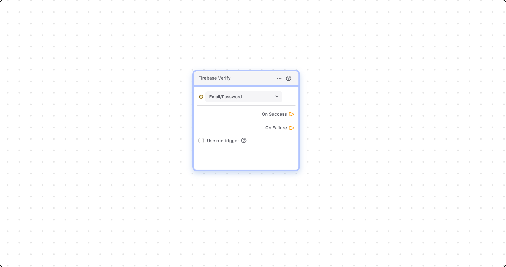

This Firebase Verify node allows you to connect with Firebase for authentication.

| Component                | Description                                                             |
| ------------------------ | ----------------------------------------------------------------------- |
| **DropDown Menu**        | Select the verify method from dropdown: Email/Password or Phone Number. |
| **On Success**           | Proceed to the next step if verify is successful.                       |
| **On Failure**           | Remain on the current step if verify fails until the issue is resolved. |
| **Run Trigger Checkbox** | Enable to add a run trigger to the node.                                |

## Firebase Sign In

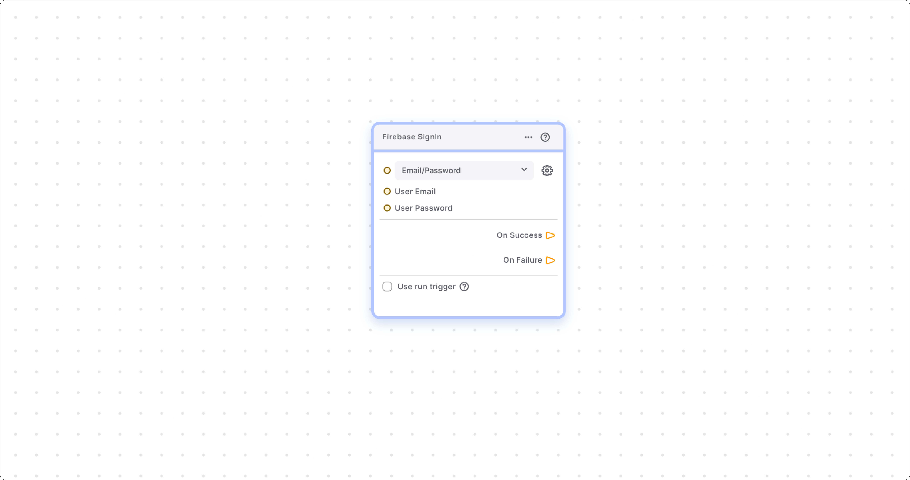

This Firebase SignIn node allows you to connect with Firebase for authentication and sign in using Firebase.

| Component                | Description                                                             |
| ------------------------ | ----------------------------------------------------------------------- |
| **DropDown Menu**        | Select the signin method from dropdown: Email/Password.                 |
| **Setting Icon**         | Click on setting icon to upload the google-service.json file.           |
| **User Email**           | Take Input field for the user email.                                    |
| **User Password**        | Take Input field for the user password.                                 |
| **On Success**           | Proceed to the next step if SignIn is successful.                       |
| **On Failure**           | Remain on the current step if SignIn fails until the issue is resolved. |
| **Run Trigger Checkbox** | Enable to add a run trigger to the node.                                |

## Firebase Sign Out

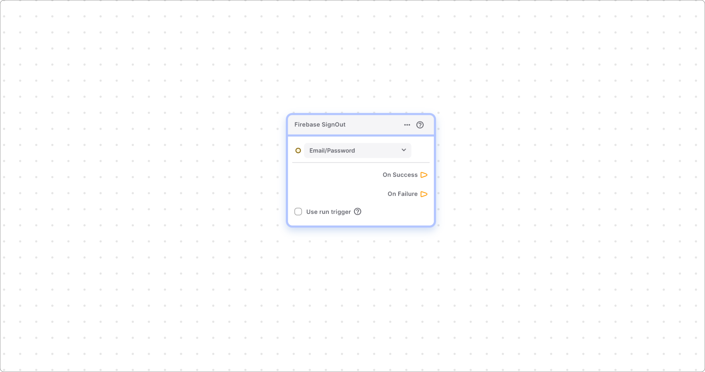

This Firebase Sign Out node enables you to sign out using Firebase Service.

| Component                | Description                                                               |
| ------------------------ | ------------------------------------------------------------------------- |
| **DropDown Menu**        | Select the Sign Out method from dropdown: Email/Password or Phone Number. |
| **On Success**           | Proceed to the next step if Sign Out is successful.                       |
| **On Failure**           | Remain on the current step if Sign Out fails until the issue is resolved. |
| **Run Trigger Checkbox** | Enable to add a run trigger to the node.                                  |

## Firebase Current User

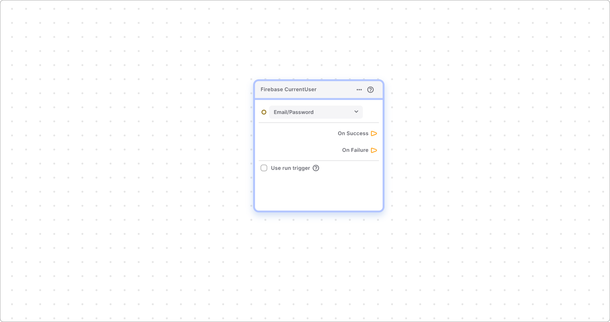

Firebase current user node will refers to the authenticated user who is currently signed in to your application.

| Component                | Description                                                                   |
| ------------------------ | ----------------------------------------------------------------------------- |
| **DropDown Menu**        | Select the Sign Out method from dropdown: Email/Password.                     |
| **On Success**           | Proceed to the next step if it get current user is successful.                |
| **On Failure**           | Remain on the current step if current user fails until the issue is resolved. |
| **Run Trigger Checkbox** | Enable to add a run trigger to the node.                                      |

## Payments

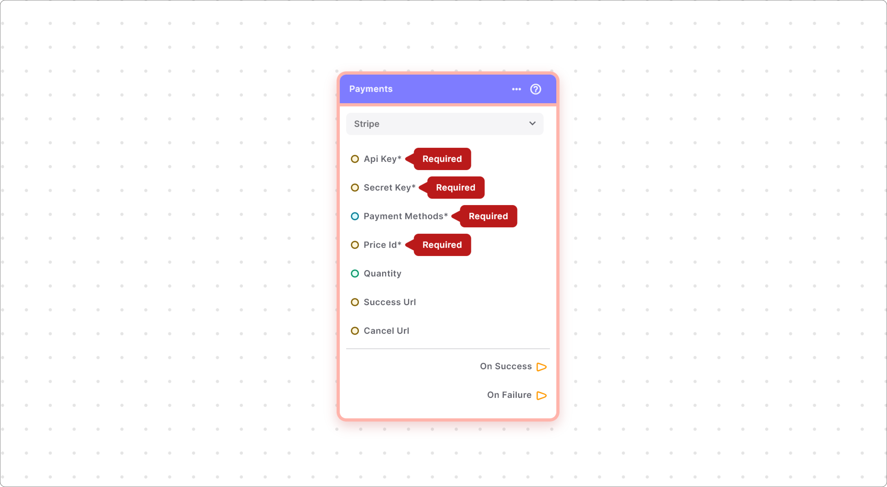

This node allow you to use the payment functionality through it So that you can accept the payments on your device.

| Component           | Description                                                                                                    |
| ------------------- | -------------------------------------------------------------------------------------------------------------- |
| **Dropdown Menu**   | Select which payment service you want to use for your application                                              |
| **Api Key**         | Add the Api key that you get from that payment service.                                                        |
| **Secret Key**      | Add Secret key so for the security.                                                                            |
| **Payment Methods** | Use payment that you want to use in your application like, online paymetn, Upi or something else.              |
| **On Success**      | This option allows users to proceed to the next node upon successful Payment.                                  |
| **On Failure**      | If the Payment attempt fails, users will not be able to progress to the next node until the issue is resolved. |

## Share Node

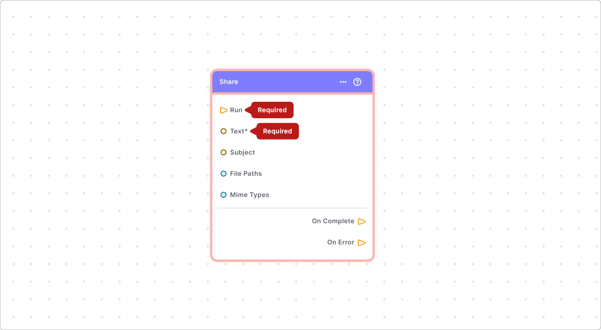

This node is used to share files with other apps.

| Component                | Description                                                                     |
| ------------------------ | ------------------------------------------------------------------------------- |
| **Run input node point** | It initiates the node's functionality.                                          |
| **Text**                 | Put the text you want to display.                                               |
| **File paths**           | Show you the path of the file.                                                  |
| **Mime Types**           | It indicates the nature and format of a document, file, or assortment of bytes. |

## Comment Node

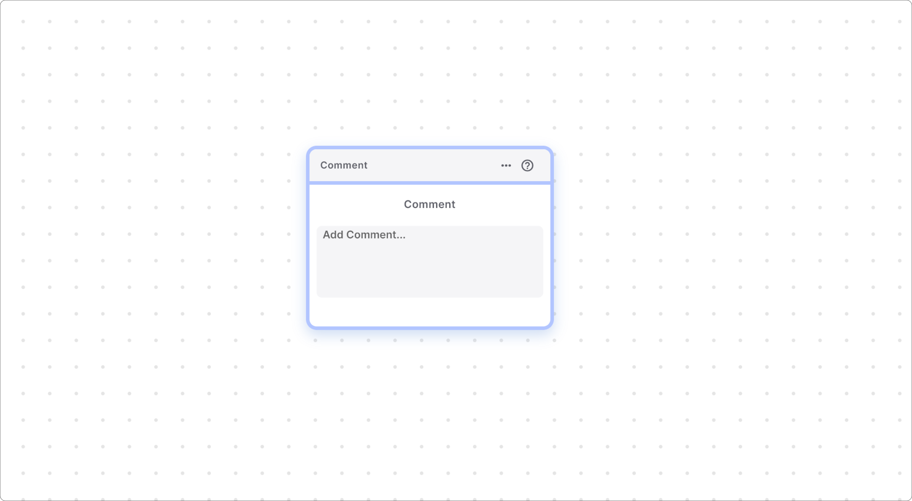

This node is used for putting any short note or a simple piece of information. To put a note in the node just use the Input box provided in the node and drag anywhere in the blup lightning.

If you have any ideas to make Blup better you can share them through our [Discord community channel](https://discord.com/channels/940632966093234176/965313562425823303)

## Music to go with.


Lofi music

