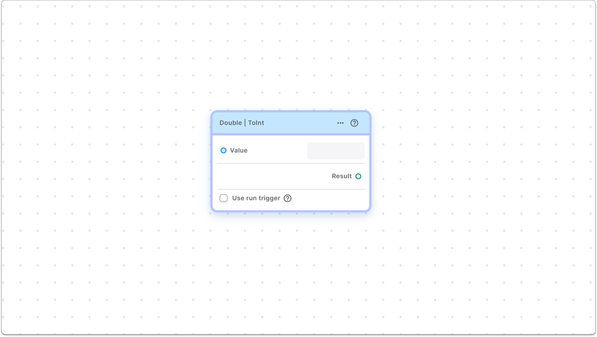
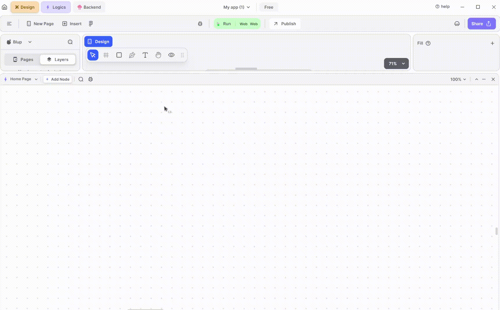
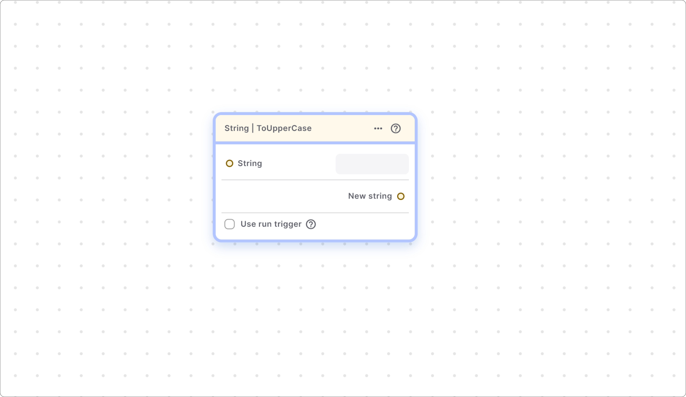
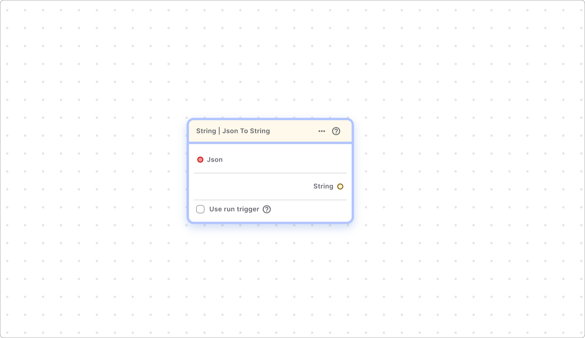
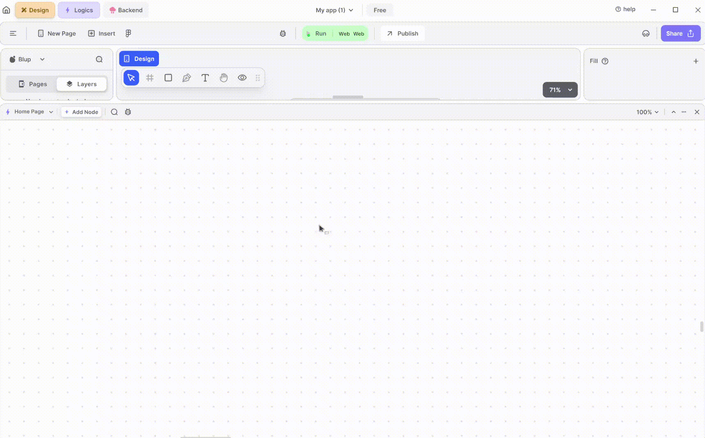
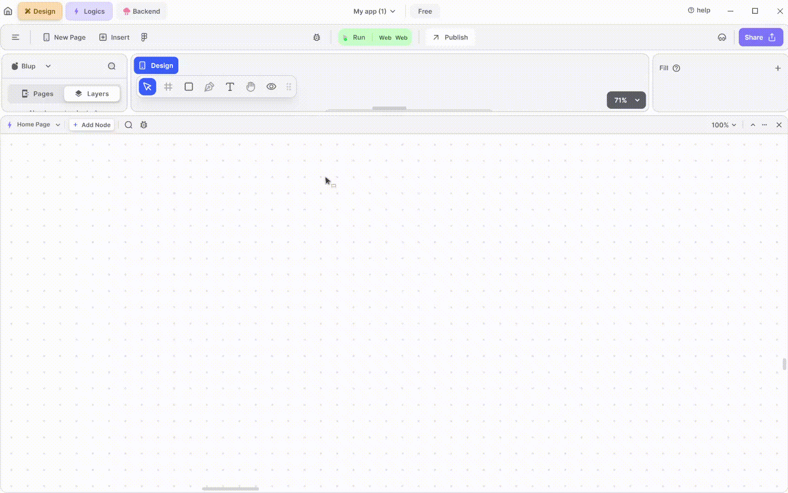

# Helper Function Section

## Cheat Sheet For Helper Function


## Helper Function Section

This section provides helper functions for variables, assisting in performing specific actions on variable nodes.

## Integer Helper Function&#x20;


This subsection includes helper function nodes related to integers.

### Integer | Is Even Node


This node checks if the given integer number is even.

#### Components Of Node

1\. **Value** – Input node to provide the integer number to be checked. You can directly input the number into the box.

2\.   **Result** –  Output node that returns true if the input integer is even; otherwise, it returns false.

### Integer | Is Odd Node


This node helps you to check the given integer number is odd or not.

#### Components of Node

1\. **Value** – Input node to provide the integer number to be checked for odd. You can directly input the number into the box.&#x20;

2\.   **Result** – Output node that returns true if the input integer is odd; otherwise, it returns false.

### Integer | Abs Node


This node converts a number to its absolute form, meaning negative numbers are converted to positive, while positive numbers remain the same.

#### Components of Node

1\. **Value** – Input node providing the integer number to be converted to its absolute form. You can also directly input the value into the box.

2\. **Result** – Output node providing the positive number as output, regardless of whether the input number was negative or positive.

### Integer | IsNegative Node


This node checks whether the provided number is negative or not.

#### Components Of Node

1\. **Value** – Input node providing the integer number to be checked. You can also directly input the number into the box.

2\.   **Result** – Output node returning true if the provided number is negative; otherwise, it returns false.

## Double Helper Function Sub-Section


### Double | Floor Node


This node returns the largest integer that is smaller than or equal to the input double number (i.e., rounds down to the nearest integer). For example, if the input number is 2.31, the result is 2.

#### Components of Node

1\. **Value** – Input node providing the double number to apply the floor operation on. You can also directly input the number into the box.&#x20;

2\. **Result** – Output node returning the integer number after applying the floor operation on the double number.

### Double | Ceil Node


This node returns the smallest integer that is greater than or equal to the input number (i.e., rounds up to the nearest integer). For example, if the input number is 2.31, the result is 3.

Components of Node

1\. **Value** – Input node providing the double number to apply the ceil operation on. You can also directly input the number into the box.

2\.   **Result** –  Output node returning the integer number after applying the ceil operation on the double number.

### Double | Round Node


This node applies rounding to decimal numbers, simplifying them while keeping their value close to the original. For example, if the input number is 12.3124, the output is 12, and if the input is 12.5123, the output is 13.

#### Components of Node

1\. **Value** – Input node providing the double number to apply the rounding operation on. You can also directly input the number into the box.

2\. **Result** – Output node returning the double number after applying the rounding operation.

### Double | Abs Node


This node converts double (decimal point numbers) to their absolute form, ensuring that negative numbers are converted to positive.

For example, if the input number is -12.5123, the output is 12.5123.&#x20;

#### Components of Node

1\. **Value** –   Input node providing the double number to convert to its absolute form (positive). You can also directly input the number into the box.

2\. **Result** – Output node returning the positive number after applying the absolute value operation.


### Double | Is Negative Node


This node helps you to check whether the provided number \[decimal number] is negative or not.

#### Components of Node

1\. **Value** – This input node provides the double number that you want to check for negativity. You can either connect another node to provide the number or directly enter the number in the input box.

2\.   **Result** – This output node gives true if the provided number is negative, otherwise it returns false.

### Double|To Int Node



This node converts a decimal number into an integer. For example, if the input number is '1.253', this node returns 1 as the result.

#### Components of Node

1\. **Value** – This input node provides the double number that you want to convert to an integer. You can either connect another node to provide the number or directly enter the number in the input box.

2\.   **Result** – This output node gives the integer number after the conversion.

## String Helper Function Sub-Section



This sub-section consists of all the helper functions related to strings.

### String | Split


This node splits the string at matches of a pattern and returns a list of substrings. It finds all the matches of the pattern in the string and returns the list of substrings between the matches.&#x20;

For example If the value in string node is = "Hello world!" and Pattern value = “ ” Then it returns the list consisting of \['Hello', 'world!'];

### String | ToLowerCase


This node converts all characters in the string to lowercase.&#x20;

### String | ToUpperCase



This node converts all characters in the string to uppercase.

### String | Trim


This node returns the string without any leading and trailing whitespace. It removes leading and trailing whitespace from the string.

For example, if the string provided is “ Dart is fun ” this node return “Dart is fun”.

### String | Replace All


This node replaces all substrings that match a specified pattern with a replacement string.

For example, if the string provided is “resume” and the pattern is “e” and replaces it with is “E” then it returns “rEsumE” as result.

### String | SubString


This node helps you get a portion of the provided string by specifying start and end indices.

Note Indexing in a string starts from 0 instead of 1.

For example, strings “hello World” and you wanted to get only “hello” from the string you can pass start index is 0 and end index is 5 \[instead of 4 because end index is not included].

### String | Replace Range


This node replaces a portion of the string with a new provided string, specified by start and end indices.


<mark style="color:blue;">Note: Indexing in a string starts from 0 instead of 1.</mark>


For example, you have a string Hello World” and you wanted to replace it with “Hey World” so you can pass start index is 0 and end index is 5 \[instead of 4 because end index is not included], and replace String is “Hey”, then this node return “Hey World”.

### String | Concat


This node combines two strings into a single string.

For example, string1 is ”Hello” and String2 is “World”, then it returns “HelloWorld”,

To give space between both of the pass string 2 as ” World” \[with space] in beginning], then it returns “Hello world”.

### String | Contains


This node checks whether a given word or substring is present in the string and returns 'true' if it exists, otherwise 'false'.

### String | Equal


This node checks whether two strings are equal or not and returns 'true' if they are equal, otherwise 'false'.

For example, string1 = "hello" and string2 = "hello" ,it return true.

### String | IsEmpty


This node checks whether the provided string is empty (including blank spaces) and returns 'true' if it is empty, otherwise 'false'.

For example, if provided string ="", this node will return true.


<mark style="color:blue;">Note: This node returns true even if the provided string only contains blank space with out any character.</mark>


### String | ToString


This node converts other variables and collections like lists or maps into a string.

### String | Length


This node returns the length of the provided string, indicating how many characters it contains.

For example, the string is “Hello” – length is 5.

### String | Index Of


This node helps you find out the index of a character or substring present in the provided string. It returns the index of the first occurrence of that character or substring.


<mark style="color:blue;">Note - index starts from 0 in string.</mark>


For example, String = “resume” and character = “e”, node will return 1 \[index of first “e” in the string].

### String | Last Index Of


This node helps you find out the index of the last character or substring present in the provided string. If the string consists of multiple occurrences of the same character or substring, it returns the index of the last occurrence.

If no matching character is present in the provided string the node return -1.

If the string consists of only a single character then this node works like the index of node and return the index of the first occurrence of character.

For example, string = “resume” pattern is “e” Result = 5 \[index of last “e” is 5].

### String | Json to String



This node converts the JSON \[Javascript Object Notion] into the string.

This node is mostly used when you are dealing with JSON responses from any web server, in such cases, you need to convert the JSON into a string.

### String | String to JSON


This node helps to convert the string into JSON \[Javascript object notion], similar to the above node, this node is also used when you are dealing with responses from web servers, so in such scenarios, you need to convert the JSON into the string.

### String | Parse String To


This node converts variables like integers, doubles, or Booleans values back to strings.

For example, integer = 10 is convert into string = “10”, or Boolean = true is converted into “true”.

### String | Compare To


This node returns an integer representing the relationship between two strings:

0 − if the strings are equal.&#x20;

1 − if the first string is greater than the second&#x20;

\-1 − if the first string is smaller than the second

### String | Ends With


This node returns 'true' if the provided string ends with a particular substring, otherwise 'false'.

for example 1. string = “hello” pattern = “llo” , result = true; 2. string “hello” pattern =”e” , result = false.

### String | Starts With


This node returns 'true' if the provided string starts with a particular substring, otherwise 'false'.

for example&#x20;

&#x20;string = “hello” pattern = “hel” , result = true.

&#x20;string “hello” pattern =”yo” , result = false.

### String | Trim Left


This node returns the string without any leading whitespace on the left.&#x20;

For example&#x20;

1\. Input =” Hello” Output = “Hello”.

2\. Input =” Resume ”, Output = “Resume ”.

### String | Trim Right


This node returns the string without any trailing whitespace on the right.&#x20;

For example&#x20;

1\. Input =”Hello ” Output = “Hello”.

2\. Input =” Resume ”, Output = “ Resume”.

## Boolean Helper Function Sub-Section


This sub-section provides helper functions related to boolean values.

### Boolean | Is Null


This node checks whether the provided boolean value is null or not. A variable is considered null if there is no value present in it.

## List Helper Function Sub-Section

This sub-section provides helper functions related to lists.


### List | First Item


This node returns the first element of the provided list \[the first element is the element which is stored at 0 index in list].

For example – list = \[1,2,3,4,5] then this node return result = 1.

### List | Last Item


This node returns the last element of the provided list.

For example, list = \[1,2,3,4,5] then this node return result = 5.

### List | Reverse


This node reverses the provided list.

For example, list = \[1,2,3,4,5] , node result = \[5,4,3,2,1].

### List | Remove At


This node removes the element at the provided index from the list.

The provided index should be between 0 <= index < list Length.

For example, list = \[1,2,3,4,5], index = 1 result list = \[1,3,4,5];


<mark style="color:blue;">Note: Indexing in list starts from zero.</mark>


### List | Remove Value


This node removes the first occurrence of the given value from the list.

For example, list = \[1,2,3,4,5,1], and value = 1, so this node will return: \[2,3,4,5,1].

### List | Add Value


This node adds a value to the end of the list, extending the length by one.

For example, list = \[1,2,3,4,5] and value = 6, so the node return = \[1,2,3,4,5,6].

### List | Add List


This node combines two lists into a single list. The length of the resultant list is the sum of the length of the first and second lists.

For example, Input list1 = \[1,2,3] and Input list2 = \[4,5,6] and the Output list: \[1,2,3,4,5,6].

### List | Insert At


This node helps you to insert at a particular position or index in the list, inserting an item into the list can cause the increase in the length of the list by one and shifts all objects at or after the index towards the end of the list.

For example, Input list: [1, 2, 3, 4], index: 2, element: 10 Output list: [1, 2, 10, 3, 4].

### List | Remove Range


This node helps you to remove multiple sets of consecutive elements from the list at once.

Removes the elements with positions greater than or equal to start and less than the end, from the list. This reduces the list's length by the end - start.

For example, Input list = \[1,2,3,4,5,6] , start index: 0, end index:  2 and the Output list: \[3,4,5,6] because end is not included.

### List | Clear


This node helps you to Removes all objects from this list; the length of the list becomes zero.

This node returns the empty list which can be used again for adding items or elements.

For example Input list: \[1,2,3,4,5], Output list: \[].

### List | Length


This node calculates the length of the list, indicating how many elements are present.

For example, Input list: \[1,2,3,4,5], Output length: 5 total 5 elements are present.

### List | Is Empty


This node helps you to check whether the provided list is empty or not, if the provided list is empty then the node returns True else it returns false.

For example, Input list: \[1,2,3,4], Output: false, if Input list: \[], Output: true.

### List | Index Of


This node finds the index of a particular element in the list. It returns the index of the first occurrence of the element.

For example, Input list: \[1,2,3,4], element: 3, then node Output index: 2.&#x20;


<mark style="color:blue;">Note: The index in the list starts from zero.</mark>


### List | Element At


This node helps you to get the element at a particular index. This node returns the value of the item or element present at the given index.

For example, list = \[1,2,3,4,5,6] , index =2, then the node return 3, as indexing in list starts from zero.

## Map Helper Function Sub-Section



This section consists of all the helper function nodes of map.

### Map | Remove


This node removes the key and its associated value from the map, if present. If the key is not found, no changes are made to the map.

For example, map {“athul”: “chaudhary”}, key = “atul”, so node removes the key-value pairs that have key matching with the provided key. In this case, the node returns an empty map because there is only one value in the map.

### Map | Clear


This node removes all the values that are present in the provided map, and then it returns the empty map.

For example, map = {“atul” : “chaudhary”}, this node return the map ={} which is the empty map.

### Map | Add All


This node helps you to Add all key/value pairs of others to this map. And If a key of other is already in the provided map, its value is overwritten \[make sure that both map have unique keys].

For example, map = {“CSE”:”atul”}, other map = {“IT”: “ashutosh”}, then the node return new map = {“CSE”: “atul”, “IT”: “ashutosh”}.

### Map | Contains Key


This node checks if the provided key is present in the map.

For example, map = {“CSE”: “atul”}, key = “CSE”, then the node return true. If the key = “IT”, then the node return false.

### Map | Contains Value


This node checks if the provided value is present in the map.

For example,
Input map: {"CSE": "atul"}, value: "atul"
Output: true

Input map: {"CSE": "atul"}, value: "ashutosh"
Output: false

### Map | Is Empty


This node checks if the provided map is empty or not if empty then it return true, if not then it returns false.

For example,Input map: {}
Output: true
Input map: {"CSE": "atul"}
Output: false \[because map consists of some value ].

### Map | Length


This node calculates the number of key-value pairs in the map.

For example,Input map: {"CSE": "atul", "IT": "ashutosh"}
Output length: 2 \[because two key-values pairs are present].

### Map | Add Key Value


This node adds a new key-value pair to the map to the existing map.

For example,Input map: {"CSE": "atul"}, key: "IT", value: "ashutosh"
Output map: {"CSE": "atul", "IT": "ashutosh"}

### Map | Add Multiple Key Value

This node helps you to add multiple key-value pairs in a single go, this node returns the updated mao with all the newly added key-value pairs.

For example, Input map: {"atul": "chaudhary"}, keys: "sahaj", "ashutosh", values: "rana", "agarwal"
Output map: {"atul": "chaudhary", "sahaj": "rana", "ashutosh": "agarwal"}

### Map | Get Value


This node retrieves the value associated with a specified key from the map.

For example, Input map: {"CSE": "atul"}, key: "CSE"
Output value: "atul"

### Map | Get All Keys


This node retrieves all the keys present in the map.

For example, Input map: {"CSE": "atul", "IT": "ashutosh"}
Output keys: ["CSE", "IT"]

### Map | Get All Values


This node retrieves all the values present in the map.

For example, Input map: {"CSE": "atul", "IT": "ashutosh"}
Output values: ["atul", "ashutosh"]

## Json Helper Functions

### JSON | Get Value
This node retrieves values from JSON data based on a specified filter.

Parameters

**Input:** JSON data (e.g., from the Response Body field of a Simple Http's On Success function).\
\
_Var Type_: String, Map, List.\
\
e.g.:&#x20;

```dart
{
  "store": {
    "book": [
      {
        "category": "reference",
        "author": "Nigel Rees",
        "title": "Sayings of the Century",
        "price": 8.95
      },
      {
        "category": "fiction",
        "author": "Evelyn Waugh",
        "title": "Sword of Honour",
        "price": 12.99
      },
    ],
    "bicycle": {
      "color": "red",
      "price": 19.95
    }
  }
}  
```

**Filter:** Requires a string input to filter the input parameter.

_Var Type_: String.

e.g: \
`store.book[0].title`  or  `store.book[*].title`

\------------------------------

**Note: **_**No** need to add `$.`_ _at the start. (as it adds that itself.)_

_------------------------------_\
**For more,**&#x20;

Detailed filters, please visit: \
[https://cburgmer.github.io/json-path-comparison/](https://cburgmer.github.io/json-path-comparison/)     or\
[https://ietf-wg-jsonpath.github.io/draft-ietf-jsonpath-base/draft-ietf-jsonpath-base.html](https://ietf-wg-jsonpath.github.io/draft-ietf-jsonpath-base/draft-ietf-jsonpath-base.html).

Online evaluator, please visit: [https://jsonpath.com/](https://jsonpath.com/)

\------------------------------

## DateTime Helper Function Sub-Section



This section helps you to get helper nodes related to date and time.

### DateTime | Formatter


\
This node converts a DateTime into a specific format.

Example
For instance, if you want to display only the hours and minutes from a DateTime, you can choose the 'Hours_minutes' option from the dropdown. If you want to display only the date in the format of day/month/year, you can choose the 'year_month_day' option from the dropdown.

## Duration Helper Function Sub-Section


### Duration | Abs


This node returns a Duration that has the same length as the provided one but is always positive. If the duration is negative, this node converts it to a positive duration.

### Duration | Compare To


This node compares two durations and returns:

This node returns -&#x20;

1\. Zero if both durations are the same.&#x20;

2\. A negative integer if the first duration is shorter than the second.&#x20;

3\. A positive integer if the first duration is greater than the second.


<mark style="color:blue;">Note - A negative Duration is always considered shorter than a positive one.</mark>


### Duration | Is Negative


This node returns true if the duration provided is negative. If the duration is negative then this node returns true, if the duration is not negative then this node returns false.

### Duration | Conversion


This node helps you to convert the duration into the required format for example, hours into minutes.&#x20;

<div class="container">
  
  
  Lofi music
  
  
  
</div>