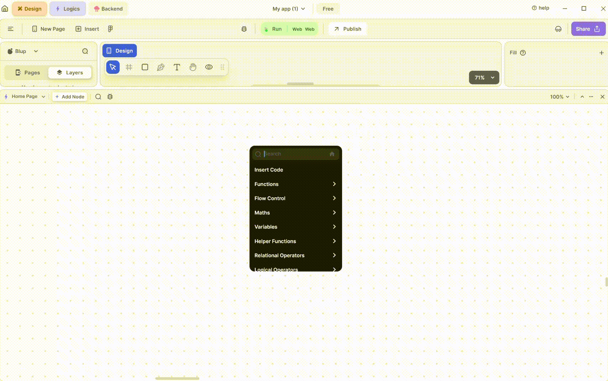
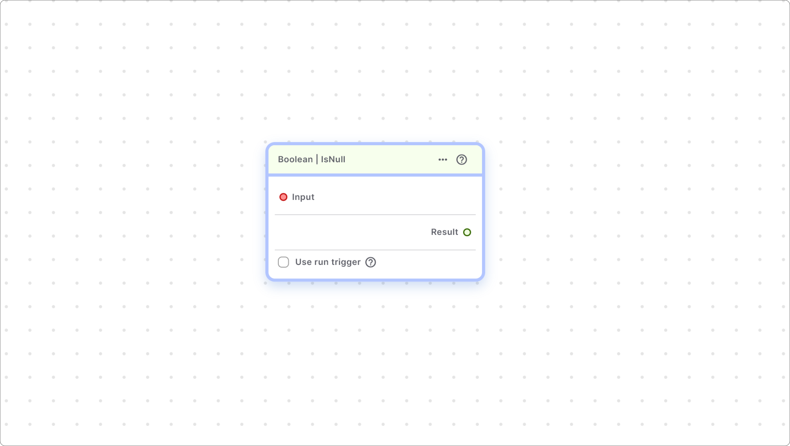

# Boolean Nodes

Implementing boolean logic nodes in Blup allows for effective conditional operations within your application. This section covers the essential helper functions related to boolean values, enabling you to optimize the logic and functionality of your projects.

### Overview of Boolean Nodes

Boolean nodes are fundamental in creating logical conditions and making decisions based on boolean values (true or false). In Blup, these nodes help streamline complex operations, making your application more efficient and responsive.

This sub-section provides helper functions related to boolean values.

### Key Boolean Helper Functions

**1. Boolean | Is Null**

The "Is Null" node checks whether the provided boolean value is null. A variable is considered null if it lacks a value, indicating the absence of any boolean state. This function is crucial for validating data and ensuring the integrity of your application's logic.

**Example Use Case:**

Consider a scenario where you need to verify if a user's input has been provided or if it remains unset. The "Is Null" node helps you identify such cases and handle them appropriately, preventing errors and improving user experience.

This node checks whether the provided boolean value is null or not. A variable is considered null if there is no value present in it.

### How to use Boolean Nodes in Blup

1. **Adding a Boolean Node:**
   * Navigate to the nodes library within Blup.
   * Select the "Boolean" category.
   * Drag and drop the desired boolean node into your workflow.
2. **Configuring the Node:**
   * Define the input variables and set any required parameters.
   * Connect the boolean node to other nodes to establish the desired logical flow.
3. **Testing and Debugging:**
   * Run your application and monitor the boolean node's behavior.
   * Use Blup's debugging tools to trace and resolve any issues.

#### Benefits of Using Boolean Nodes

* **Enhanced Logic Control:** Boolean nodes provide precise control over conditional operations, ensuring your application behaves as intended.
* **Improved Data Validation:** By checking for null values, you can prevent unexpected behavior and enhance the reliability of your application.
* **Streamlined Workflow:** Simplify complex logical operations with clear and concise boolean nodes.

If you have any ideas to make Blup better you can share them through our [Discord community channel](https://discord.com/channels/940632966093234176/965313562425823303)

## Music to go with.


Lofi music

