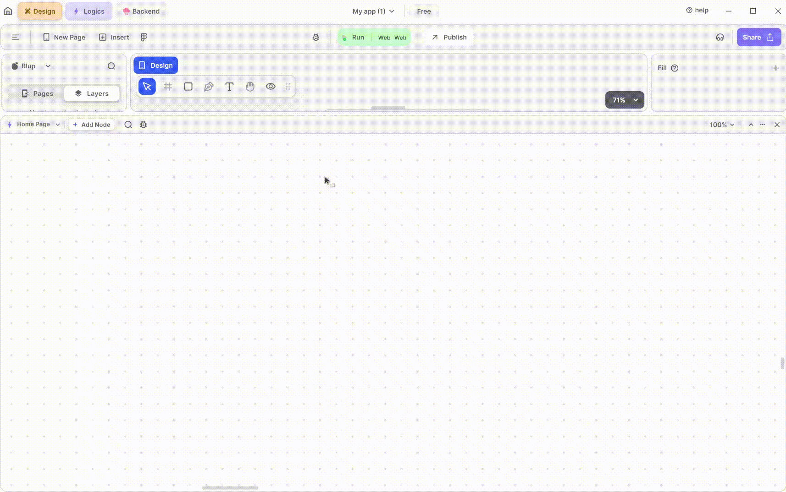
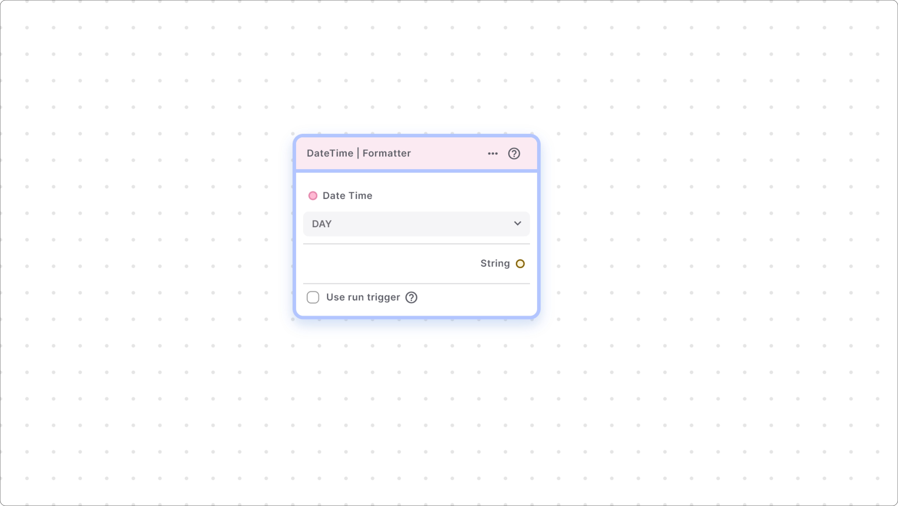

# Date Time Nodes

Date and time nodes are essential components in Blup that enable scheduling and time-based features in your app. These nodes offer various functionalities to help you manage and format date and time data efficiently.

### Overview of Date and Time Nodes

The date and time nodes in Blup provide a range of helper nodes designed to handle different aspects of date and time management. These nodes can be used to perform various operations such as formatting, calculating differences, and scheduling tasks based on specific times or dates.

This section helps you to get helper nodes related to date and time.

### DateTime | Formatter

One of the primary date and time nodes available in Blup is the **DateTime Formatter** node. This node allows you to convert a DateTime object into a specific format, making it easier to display date and time information in a user-friendly manner.

This node converts a DateTime into a specific format.

Example For instance, if you want to display only the hours and minutes from a DateTime, you can choose the 'Hours\_minutes' option from the dropdown. If you want to display only the date in the format of day/month/year, you can choose the 'year\_month\_day' option from the dropdown.

### **How to Use the DateTime Formatter Node**

The DateTime Formatter node provides several formatting options that you can select from a dropdown menu. Here are some examples of how you can use this node:

* **Hours and Minutes:** If you only want to display the hours and minutes from a DateTime object, you can choose the 'Hours\_minutes' option from the dropdown. This is useful for applications where you need to show time without the date.
* **Day/Month/Year:** To display the date in the format of day/month/year, select the 'year\_month\_day' option from the dropdown. This format is commonly used in various applications to show full-date information in a specific order.

By using the DateTime Formatter node, you can ensure that your app presents date and time information in a clear and consistent format, enhancing the overall user experience.

If you have any ideas to make Blup better you can share them through our [Discord community channel](https://discord.com/channels/940632966093234176/965313562425823303)

## Music to go with.


Lofi music

