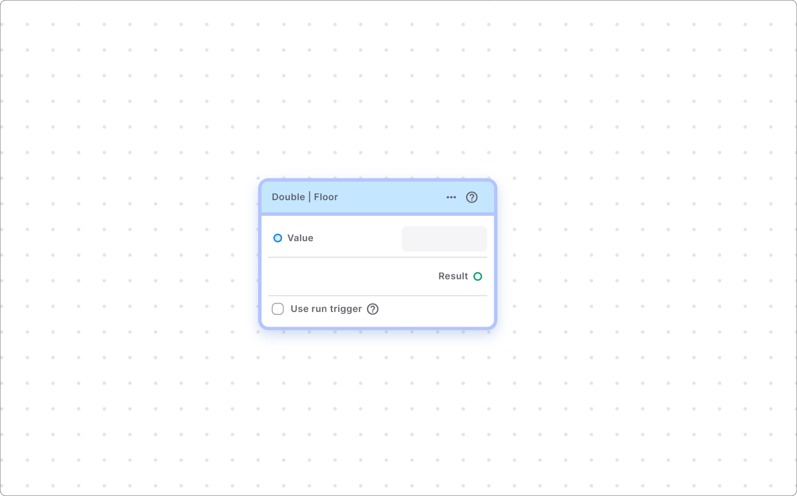

# Double Helper Function Sub-Section

### Double | Floor Node

This node returns the largest integer that is smaller than or equal to the input double number (i.e., rounds down to the nearest integer). For example, if the input number is 2.31, the result is 2.

#### Components of Node

1\. **Value** – Input node providing the double number to apply the floor operation on. You can also directly input the number into the box.&#x20;

2\. **Result** – Output node returning the integer number after applying the floor operation on the double number.

### Double | Ceil Node

This node returns the smallest integer that is greater than or equal to the input number (i.e., rounds up to the nearest integer). For example, if the input number is 2.31, the result is 3.

Components of Node

1\. **Value** – Input node providing the double number to apply the ceil operation on. You can also directly input the number into the box.

2\.   **Result** –  Output node returning the integer number after applying the ceil operation on the double number.

### Double | Round Node

This node applies rounding to decimal numbers, simplifying them while keeping their value close to the original. For example, if the input number is 12.3124, the output is 12, and if the input is 12.5123, the output is 13.

#### Components of Node

1\. **Value** – Input node providing the double number to apply the rounding operation on. You can also directly input the number into the box.

2\. **Result** – Output node returning the double number after applying the rounding operation.

### Double | Abs Node

This node converts double (decimal point numbers) to their absolute form, ensuring that negative numbers are converted to positive.

For example, if the input number is -12.5123, the output is 12.5123.&#x20;

#### Components of Node

1\. **Value** –   Input node providing the double number to convert to its absolute form (positive). You can also directly input the number into the box.

2\. **Result** – Output node returning the positive number after applying the absolute value operation.

### Double | Is Negative Node

This node helps you to check whether the provided number \[decimal number] is negative or not.

#### Components of Node

1\. **Value** – This input node provides the double number that you want to check for negativity. You can either connect another node to provide the number or directly enter the number in the input box.

2\.   **Result** – This output node gives true if the provided number is negative, otherwise it returns false.

### Double|To Int Node

This node converts a decimal number into an integer. For example, if the input number is '1.253', this node returns 1 as the result.

#### Components of Node

1\. **Value** – This input node provides the double number that you want to convert to an integer. You can either connect another node to provide the number or directly enter the number in the input box.

2\.   **Result** – This output node gives the integer number after the conversion.

If you have any ideas to make Blup better you can share them through our [Discord community channel ](https://discord.com/channels/940632966093234176/965313562425823303)

## Music to go with.
 

  
  
  Lofi music
  
  
  

