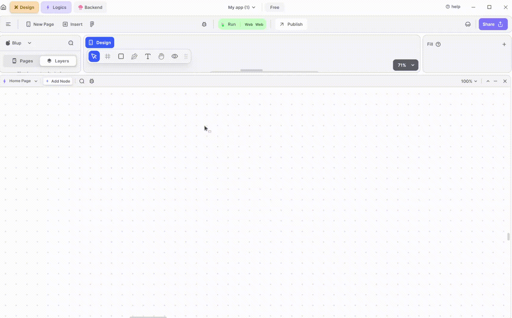
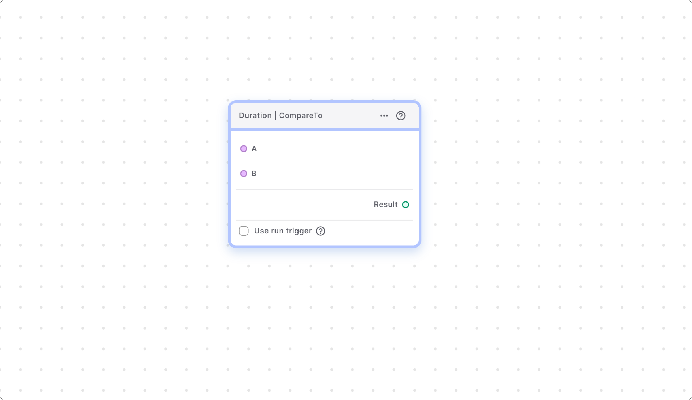
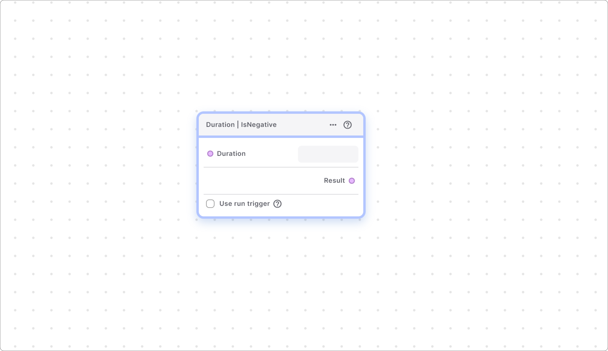

# Duration Nodes

Duration Nodes in Blup allow for precise time interval calculations within your application. These nodes are essential for managing and manipulating time data effectively. Below, we explore the various types of Duration Nodes available and how they can be utilized.

### Duration | Abs

The Duration | Abs node returns a Duration that maintains the same length as the provided one but is always positive. This is particularly useful in scenarios where you need to ensure that the duration values are non-negative, such as calculating time intervals where only positive values make sense.

**Example Use Case:** Imagine you are developing a timer application that tracks exercise sessions. You might receive time data that is accidentally recorded as negative. Using the Duration | Abs node, you can convert these negative durations into positive ones, ensuring the integrity of your data.

This node returns a Duration that has the same length as the provided one but is always positive. If the duration is negative, this node converts it to a positive duration.

### Duration | Compare To

This node compares two durations and returns:

This node returns -

1\. Zero if both durations are the same.

2\. A negative integer if the first duration is shorter than the second.

3\. A positive integer if the first duration is greater than the second.


<mark style="color:blue;">Note - A negative Duration is always considered shorter than a positive one.</mark>


### Duration | Is Negative

The Duration | Is Negative node returns a boolean value indicating whether the provided duration is negative. This is useful for conditional logic where actions depend on whether a duration is positive or negative.

**Example Use Case:** Consider a countdown timer that triggers alerts when time runs out. By using the Duration | Is Negative node, you can check if the remaining time has dipped below zero, prompting the application to notify the user that time is up.

This node returns true if the duration provided is negative. If the duration is negative then this node returns true, if the duration is not negative then this node returns false.

### Duration | Conversion

The Duration | Conversion node allows you to convert durations into different units, such as converting hours into minutes or seconds. This node is essential for applications that require flexible time data representation.

**Example Use Case:** In a travel app, users might enter travel times in various units (hours, minutes). Using the Duration | Conversion node, you can standardize these inputs into a single unit (e.g., minutes) for easier comparison and calculation of total travel time.

This node helps you to convert the duration into the required format, for example, hours into minutes.

If you have any ideas to make Blup better you can share them through our [Discord community channel](https://discord.com/channels/940632966093234176/965313562425823303)

## Music to go with.


Lofi music

