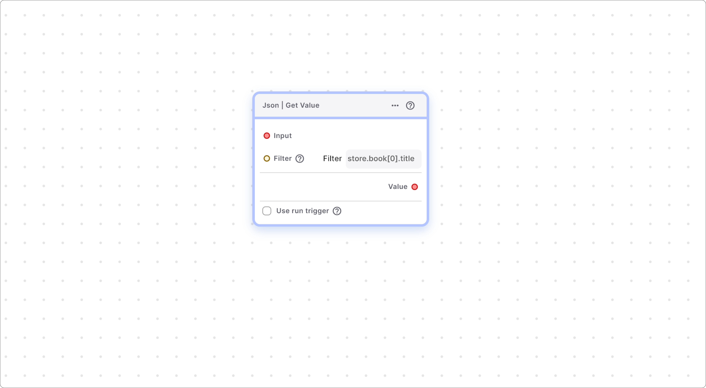

# Json Nodes

Blup offers powerful JSON nodes that streamline data handling and API interactions within your app. Understanding how to use these nodes effectively can enhance the efficiency and functionality of your applications.

### JSON | Get Value

The **JSON | Get Value** node is designed to retrieve values from JSON data based on specified filters. This capability is particularly useful when dealing with complex data structures returned from API calls or other sources.



This node retrieves values from JSON data based on a specified filter.

#### Parameters

**Input**

* **JSON Data**: This is the primary input, typically obtained from the Response Body field of a Simple HTTP’s On Success function.
* **Var Type**: The type of variable expected, which can be a String, Map, or List.

For example, consider the following JSON structure:

```dart
{
  "store": {
    "book": [
      {
        "category": "reference",
        "author": "Nigel Rees",
        "title": "Sayings of the Century",
        "price": 8.95
      },
      {
        "category": "fiction",
        "author": "Evelyn Waugh",
        "title": "Sword of Honour",
        "price": 12.99
      },
    ],
    "bicycle": {
      "color": "red",
      "price": 19.95
    }
  }
}  
```

Filter

To extract specific data, you need to provide a filter. This filter requires a string input that specifies the path to the desired value within the JSON structure.

* **Var Type**: The type of variable is String.

Example filters include:

* `store.book[0].title` to get the title of the first book.
* `store.book[*].title` to get the titles of all books.

#### Important Note

When using filters, there is no need to add `$.` at the beginning of the filter string as the system automatically includes it.

For more complex filter expressions, you can refer to resources such as:

* [JSON Path Comparison](https://cburgmer.github.io/json-path-comparison/)
* [IETF JSONPath Draft](https://ietf-wg-jsonpath.github.io/draft-ietf-jsonpath-base/draft-ietf-jsonpath-base.html)

Additionally, to test and evaluate your JSON paths, you can use the online tool available at [JSONPath.com](https://jsonpath.com/).

\
**For more,**

For detailed filters, please visit:\
[https://cburgmer.github.io/json-path-comparison/](https://cburgmer.github.io/json-path-comparison/) or\
[https://ietf-wg-jsonpath.github.io/draft-ietf-jsonpath-base/draft-ietf-jsonpath-base.html](https://ietf-wg-jsonpath.github.io/draft-ietf-jsonpath-base/draft-ietf-jsonpath-base.html).

Online evaluator, please visit: [https://jsonpath.com/](https://jsonpath.com/)

\------------------------------

If you have any ideas to make Blup better you can share them through our [Discord community channel](https://discord.com/channels/940632966093234176/965313562425823303)

## Music to go with.


Lofi music

