# Relational Operators Section

## Relational Operator Section

Relational operator nodes exist for three types of variable nodes:

**1.** **Integer relational operators.**

**2.** **Double relational operators.**

**3.** **Duration relational operators.**

## Integer Relational Operator Sub-Section

In this sub-section, nodes facilitating relational comparison between integer numbers are presented.

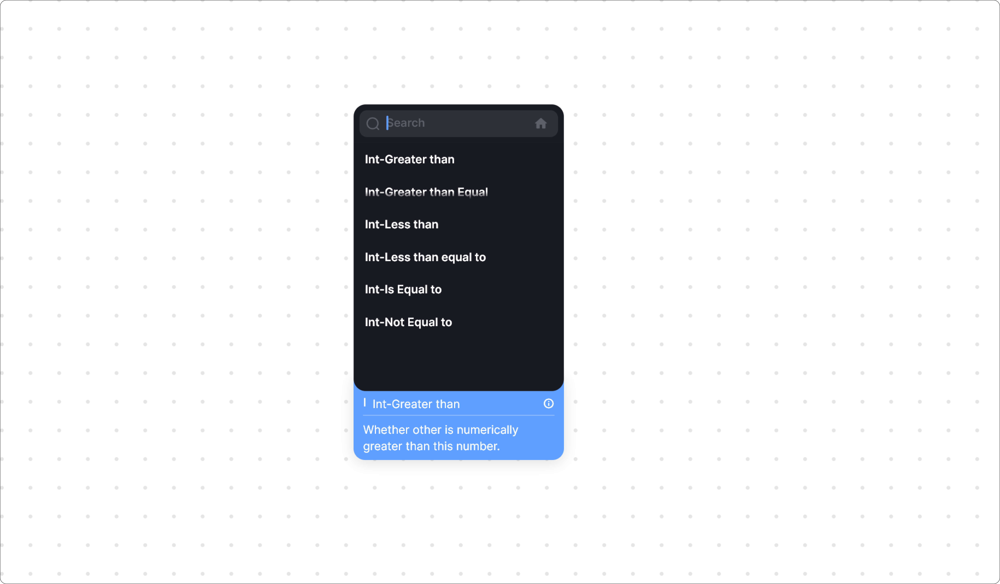

### Int | Greater than

This node compares two integer numbers and returns true if the first number (A) is greater than the second number (B).

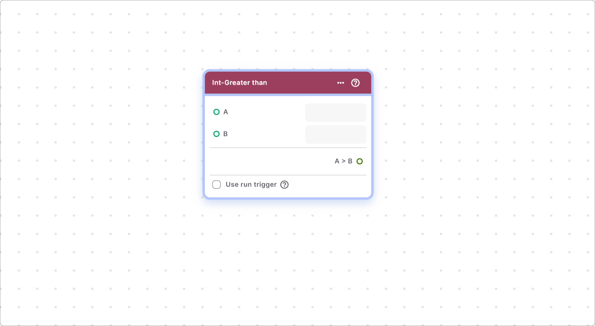

#### Components of Greater than

| Component           | Description                                                    |
| ------------------- | -------------------------------------------------------------- |
| **A**               | Input node providing the first integer number (A).             |
| **B**               | Input node providing the second integer number (B).            |
| **Use Run Trigger** | Checkbox to generate a run trigger in the node.                |
| **A > B**           | Output node providing the result of the comparison in Boolean. |

### Int | Greater than or Equal To

This node performs a greater than or equal to comparison between two integer numbers (A & B).

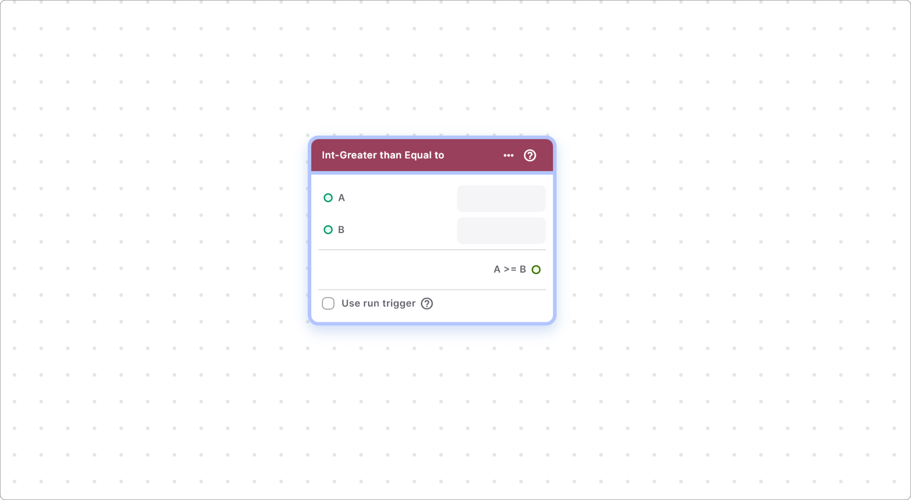

#### Components of Greater than or Equal To

| Component           | Description                                                    |
| ------------------- | -------------------------------------------------------------- |
| **A**               | Input node providing the first integer number (A).             |
| **B**               | Input node providing the second integer number (B).            |
| **Use Run Trigger** | Checkbox to generate a run trigger in the node.                |
| **A >= B**          | Output node providing the result of the comparison in Boolean. |

### Int | Less than

This node compares two integer numbers and returns true if the first number (A) is less than the second number (B).

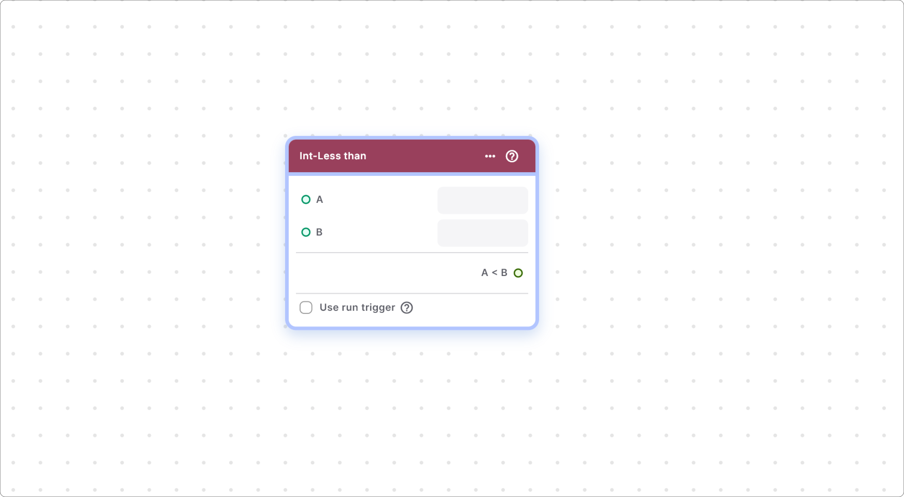

#### Components of Less Than

| Component           | Description                                                    |
| ------------------- | -------------------------------------------------------------- |
| **A**               | Input node providing the first integer number (A).             |
| **B**               | Input node providing the second integer number (B).            |
| **Use Run Trigger** | Checkbox to generate a run trigger in the node.                |
| **A < B**           | Output node providing the result of the comparison in Boolean. |

### Int | Less than or Equal To

This node performs a less than or equal to comparison between two integer numbers (A & B).

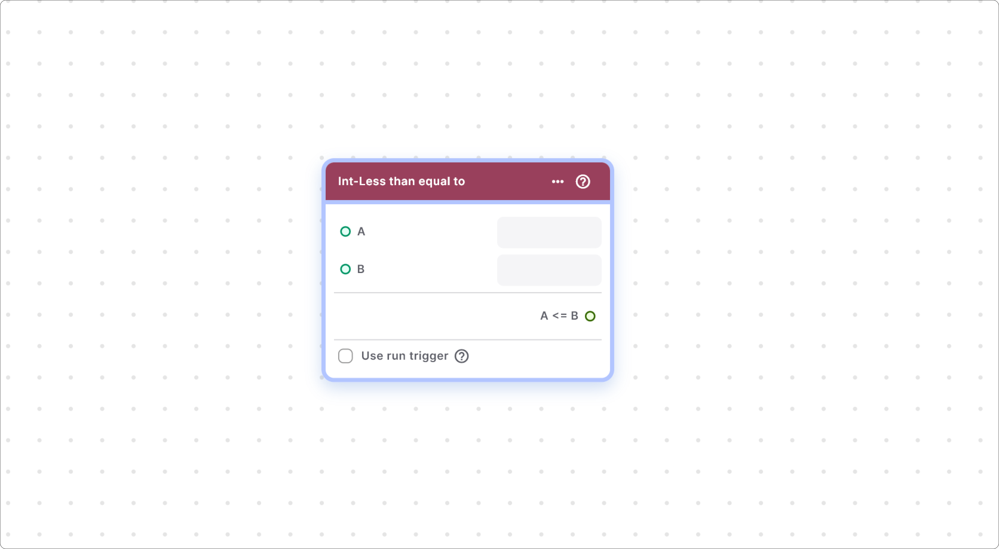

#### Components of Less than or Equal To

| Component           | Description                                                    |
| ------------------- | -------------------------------------------------------------- |
| **A**               | Input node providing the first integer number (A).             |
| **B**               | Input node providing the second integer number (B).            |
| **Use Run Trigger** | Checkbox to generate a run trigger in the node.                |
| **A <= B**          | Output node providing the result of the comparison in Boolean. |

### Int | Is Equal To

This node checks whether two integer numbers (A & B) are equal.

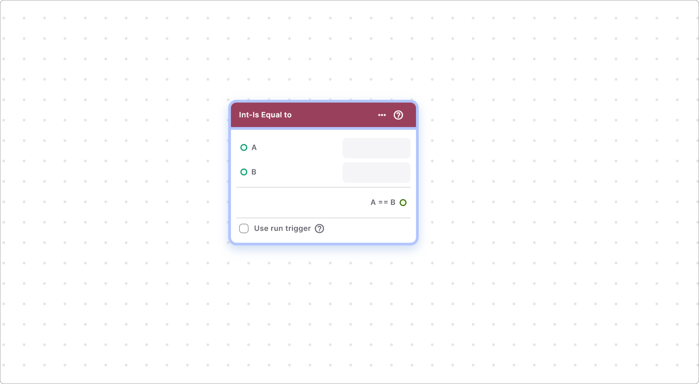

#### Components of Is Equal To

| Component           | Description                                                    |
| ------------------- | -------------------------------------------------------------- |
| **A**               | Input node providing the first integer number (A).             |
| **B**               | Input node providing the second integer number (B).            |
| **Use Run Trigger** | Checkbox to generate a run trigger in the node.                |
| **A == B**          | Output node providing the result of the comparison in Boolean. |

### Int | Not Equal To

This node checks whether two integer numbers (A & B) are not equal.

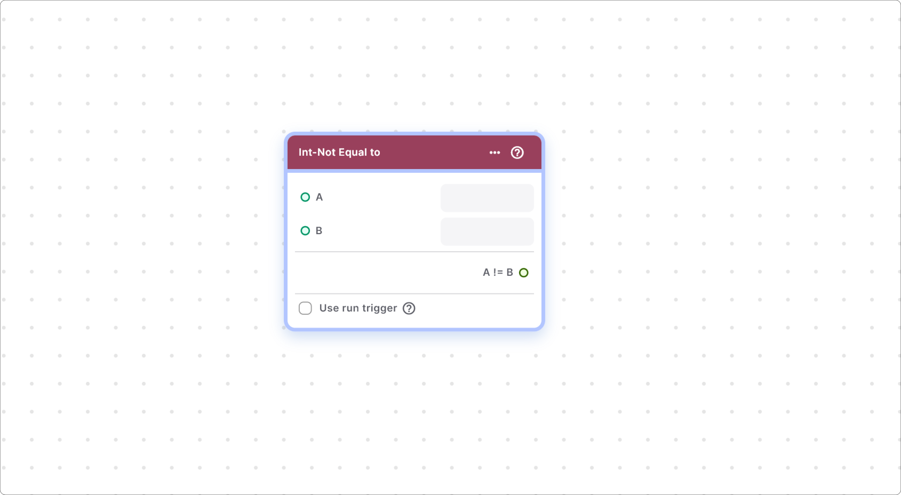

#### Components of Not Equal To

| Component           | Description                                                    |
| ------------------- | -------------------------------------------------------------- |
| **A**               | Input node providing the first integer number (A).             |
| **B**               | Input node providing the second integer number (B).            |
| **Use Run Trigger** | Checkbox to generate a run trigger in the node.                |
| **A != B**          | Output node providing the result of the comparison in Boolean. |

## Double Relational Operator Sub-Section

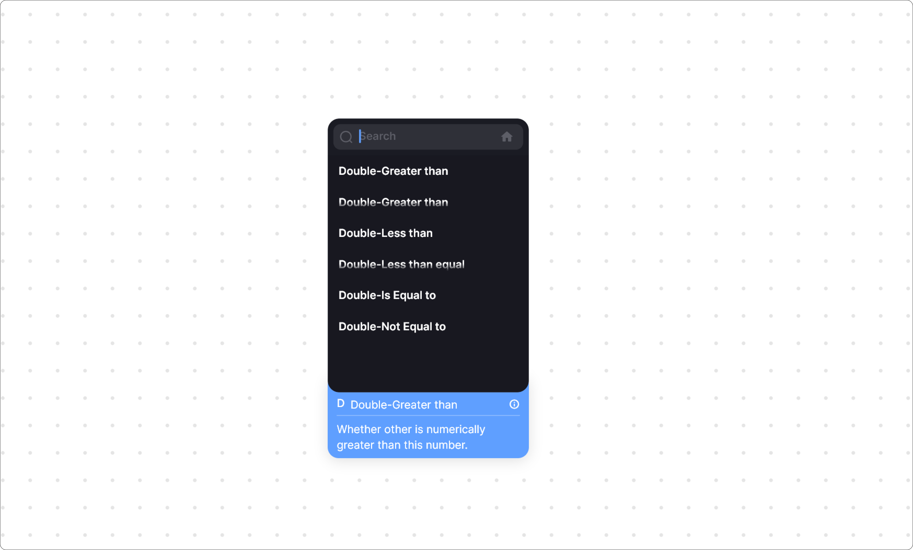

### Double | Greater than

This node compares two decimal numbers and returns true if the first number (A) is greater than the second number (B).

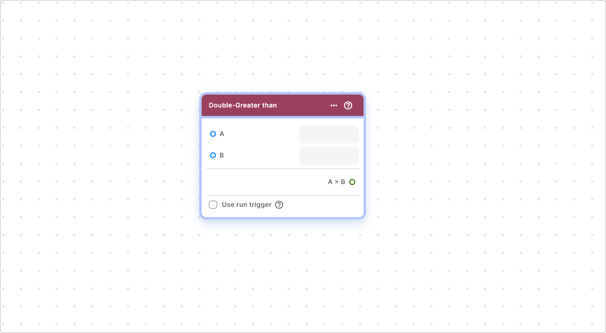

#### Components of Greater than

| Component           | Description                                                    |
| ------------------- | -------------------------------------------------------------- |
| **A**               | Input node providing the first decimal number (A).             |
| **B**               | Input node providing the second decimal number (B).            |
| **Use Run Trigger** | Checkbox to generate a run trigger in the node.                |
| **A > B**           | Output node providing the result of the comparison in Boolean. |

### Double | Greater than or Equal To

This node performs a greater than or equal to comparison between two decimal numbers (A & B).

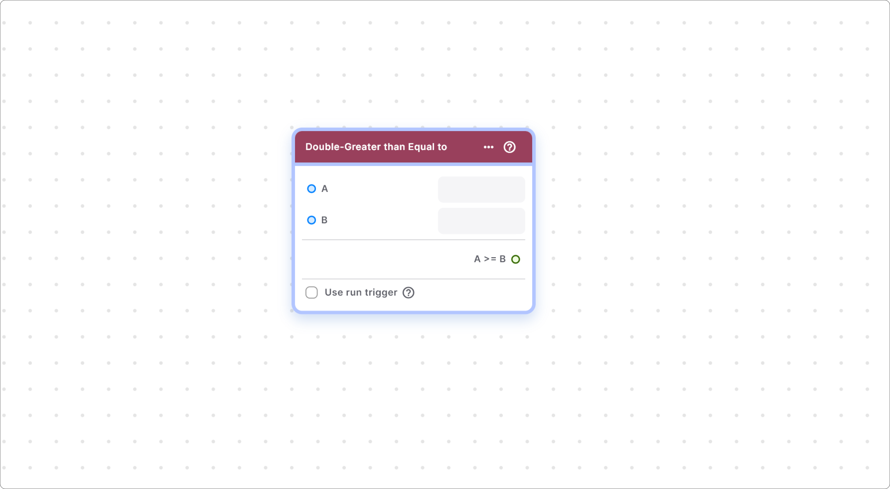

#### Components of Greater than or Equal To

| Component           | Description                                                    |
| ------------------- | -------------------------------------------------------------- |
| **A**               | Input node providing the first decimal number (A).             |
| **B**               | Input node providing the second decimal number (B).            |
| **Use Run Trigger** | Checkbox to generate a run trigger in the node.                |
| **A >= B**          | Output node providing the result of the comparison in Boolean. |

### Double | Less than

This node compares two decimal numbers and returns true if the first number (A) is less than the second number (B).

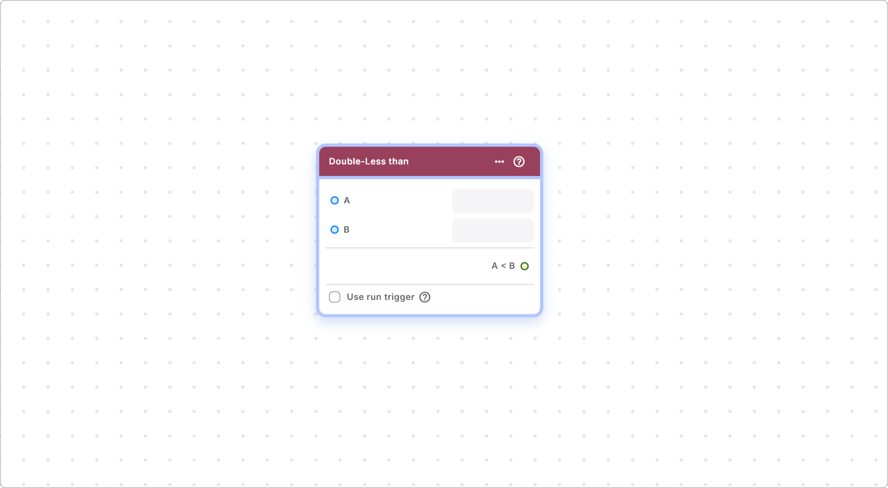

#### Components of Less Than

| Component           | Description                                                    |
| ------------------- | -------------------------------------------------------------- |
| **A**               | Input node providing the first decimal number (A).             |
| **B**               | Input node providing the second decimal number (B).            |
| **Use Run Trigger** | Checkbox to generate a run trigger in the node.                |
| **A < B**           | Output node providing the result of the comparison in Boolean. |

### Double | Less than or Equal To

This node performs a less than or equal to comparison between two decimal numbers (A & B).

#### Components of Less than or Equal To

| Component           | Description                                                    |
| ------------------- | -------------------------------------------------------------- |
| **A**               | Input node providing the first decimal number (A).             |
| **B**               | Input node providing the second decimal number (B).            |
| **Use Run Trigger** | Checkbox to generate a run trigger in the node.                |
| **A <= B**          | Output node providing the result of the comparison in Boolean. |

### Double | Is Equal To

This node checks whether two decimal numbers (A & B) are equal.

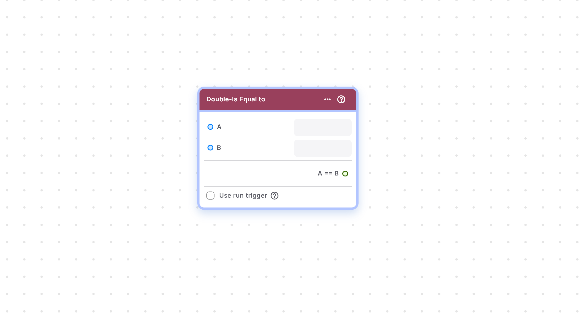

#### Components of Is Equal To

| Component           | Description                                                    |
| ------------------- | -------------------------------------------------------------- |
| **A**               | Input node providing the first decimal number (A).             |
| **B**               | Input node providing the second decimal number (B).            |
| **Use Run Trigger** | Checkbox to generate a run trigger in the node.                |
| **A == B**          | Output node providing the result of the comparison in Boolean. |

### Double | Not Equal To

This node checks whether two decimal numbers (A & B) are not equal.

#### Components of Not Equal To

| Component           | Description                                                    |
| ------------------- | -------------------------------------------------------------- |
| **A**               | Input node providing the first decimal number (A).             |
| **B**               | Input node providing the second decimal number (B).            |
| **Use Run Trigger** | Checkbox to generate a run trigger in the node.                |
| **A != B**          | Output node providing the result of the comparison in Boolean. |

## Duration Relational Operator Sub-Section

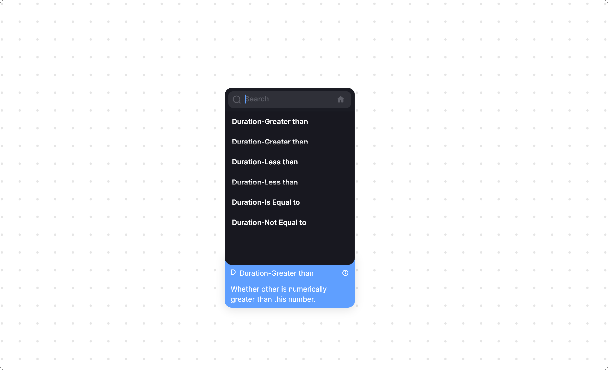

### Duration | Greater than

This node compares two durations and returns true if the first duration (A) is greater than the second duration (B).

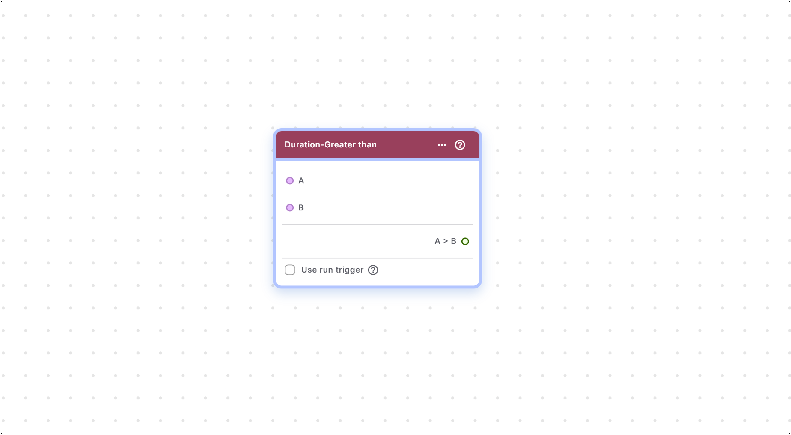

#### Components of Greater than

| Component           | Description                                                    |
| ------------------- | -------------------------------------------------------------- |
| **A**               | Input node providing the first duration (A)                    |
| **B**               | Input node providing the second duration (B).                  |
| **Use Run Trigger** | Checkbox to generate a run trigger in the node.                |
| **A > B**           | Output node providing the result of the comparison in Boolean. |

### Duration | Greater than or Equal To

This node performs a greater than or equal to comparison between two durations (A & B).

#### Components of Greater than or Equal To

| Component           | Description                                                    |
| ------------------- | -------------------------------------------------------------- |
| **A**               | Input node providing the first duration (A)                    |
| **B**               | Input node providing the second duration (B).                  |
| **Use Run Trigger** | Checkbox to generate a run trigger in the node.                |
| **A >= B**          | Output node providing the result of the comparison in Boolean. |

### Duration | Less than

This node compares two durations and returns true if the first duration (A) is less than the second duration (B).

#### Components of Less Than

| Component           | Description                                                    |
| ------------------- | -------------------------------------------------------------- |
| **A**               | Input node providing the first duration (A)                    |
| **B**               | Input node providing the second duration (B).                  |
| **Use Run Trigger** | Checkbox to generate a run trigger in the node.                |
| **A < B**           | Output node providing the result of the comparison in Boolean. |

### Duration | Less than or Equal To

This node performs a less than or equal to comparison between two durations (A & B).

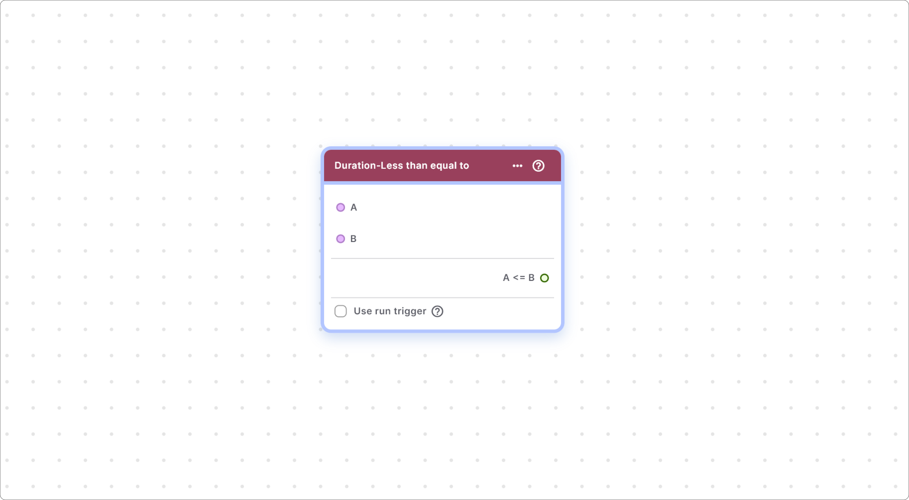

#### Components of Less than or Equal To

| Component           | Description                                                    |
| ------------------- | -------------------------------------------------------------- |
| **A**               | Input node providing the first duration (A)                    |
| **B**               | Input node providing the second duration (B).                  |
| **Use Run Trigger** | Checkbox to generate a run trigger in the node.                |
| **A <= B**          | Output node providing the result of the comparison in Boolean. |

### Duration | Is Equal To

This node checks whether two durations (A & B) are equal.

#### Components of Is Equal To

| Component           | Description                                                    |
| ------------------- | -------------------------------------------------------------- |
| **A**               | Input node providing the first duration (A)                    |
| **B**               | Input node providing the second duration (B).                  |
| **Use Run Trigger** | Checkbox to generate a run trigger in the node.                |
| **A == B**          | Output node providing the result of the comparison in Boolean. |

### Duration | Not Equal To

This node checks whether two durations (A & B) are not equal.

#### Components of Not Equal To

| Component           | Description                                                    |
| ------------------- | -------------------------------------------------------------- |
| **A**               | Input node providing the first duration (A)                    |
| **B**               | Input node providing the second duration (B).                  |
| **Use Run Trigger** | Checkbox to generate a run trigger in the node.                |
| **A != B**          | Output node providing the result of the comparison in Boolean. |

If you have any ideas to make Blup better you can share them through our [Discord community channel](https://discord.com/channels/940632966093234176/965313562425823303)

## Music to go with.


Lofi music

