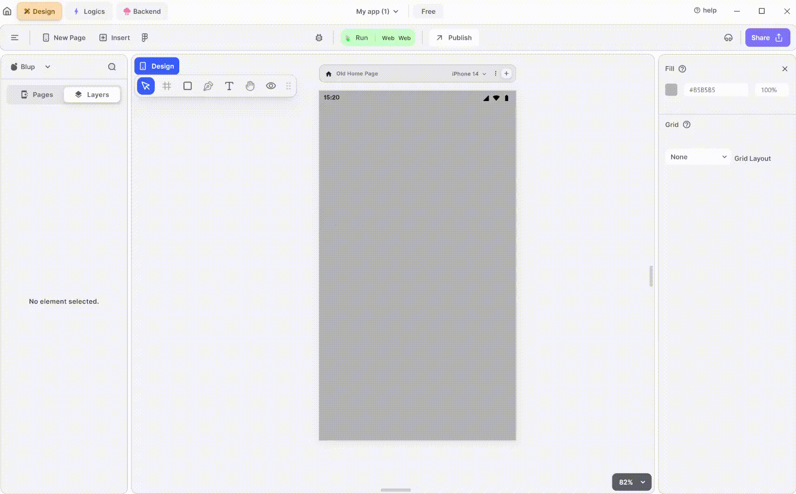

# Group UI Node

The Group node is useful when you want to perform any logic or change the property of the group dynamically on some event.

This node provides you with all properties that can be changed in a group.

## How to get the Group Node.

To get the group node first group the multiple elements present on the page or mobile canvas together and then select the group created with the selector toggle, then right-click on the group, arsenal panel of blup designer opens up, select the edit in blup lightning option from the dialog box, this will generate the group Node in blup Lightning.


<mark style="color:blue;">Note: the group node doesn’t have the onclick output node point so if you wanted to perform any logic when the user clicks on the group you have to do it through the rectangle present inside the group.</mark>


## Components of Group UI Node

| Component                   | Description                                                                                                                                                                                                                                              |
| --------------------------- | -------------------------------------------------------------------------------------------------------------------------------------------------------------------------------------------------------------------------------------------------------- |
| **Child**                   | This input node receives the parent widget of the container.                                                                                                                                                                                             |
| **On Click**                | This node allows you to trigger actions when the it is clicked.                                                                                                                                                                                          |
| **Column Properties**       | This node shows Column properties such as hide, width, height and many more.                                                                                                                                                                             |
| **Column Extra Properties** | This node offers additional options to customize the Group, such as padding, spacing, aspect ratio and many more.                                                                                                                                        |
| **Width**                   | This input node helps to define the width of the group.                                                                                                                                                                                                  |
| **Height**                  | This input node helps to define the height of the group.                                                                                                                                                                                                 |
| **Is Visible**              | This input node point helps to hide the group, this node point accepts a Boolean-type value if the value is true it hides the group, else the group is visible.                                                                                          |
| **Extra Data**              | This input node points help to store data. which can be used in further cases.                                                                                                                                                                           |
| **Edit Column Properties**  | 
This checkbox helps to access secondary input node points or Extra properties associated with the group node.

If the checkbox is checked then the secondary input node points are visible ; if not then they are hidden and cannot be used.
 |
| **S L Padding Left**        | This node point sets smart layout padding from the left side of the column.                                                                                                                                                                              |
| **S L Padding Right**       | This node point sets smart layout padding from the right side of the column.                                                                                                                                                                             |
| **S L Padding Top**         | This node point sets smart layout padding from the top side of the column.                                                                                                                                                                               |
| **S L Padding Bottom**      | This node point sets smart layout padding from the bottom side of the column.                                                                                                                                                                            |
| **S L Allignment**          | This node determines horizontal or vertical alignment according to your needs.                                                                                                                                                                           |
| **S L Direction**           | This node gives the direction inside the column.                                                                                                                                                                                                         |
| **S L Gap**                 | This node point specifies the direction inside the column.                                                                                                                                                                                               |
| **S L Spacing**             | This node point sets the gap inside the column.                                                                                                                                                                                                          |
| **Padding Left**            | This node adjusts the padding from the left side of the column.                                                                                                                                                                                          |
| **Padding Right**           | This node adjusts the padding from the right side of the column.                                                                                                                                                                                         |
| **Padding Top**             | This node adjusts the padding from the top side of the column.                                                                                                                                                                                           |
| **Padding Bottom**          | This node adjusts the padding from the bottom side of the column.                                                                                                                                                                                        |
| **Radius**                  | This node adjusts the radius of the column.                                                                                                                                                                                                              |
| **Fill**                    | This node help in filling the color to your column.                                                                                                                                                                                                      |
| **Border Fill**             | This node help in filling the color to your column border.                                                                                                                                                                                               |
| **Border Width**            | This node help in defining your coumn width.                                                                                                                                                                                                             |
| **Shadow Fill**             | This node help in filling the color to your column shadow.                                                                                                                                                                                               |
| **Shadow X**                | This node adjust the shadow on the x-axis.                                                                                                                                                                                                               |
| **Shadow Y**                | This node adjust the shadow on the y-axis.                                                                                                                                                                                                               |
| **Shadow Blur**             | This node guves the blury shadow to your column group.                                                                                                                                                                                                   |
| **Dotted Border**           | This node gives the dotted border to your column group.                                                                                                                                                                                                  |
| **Layer Blur**              | This node give the blury layer to your group.                                                                                                                                                                                                            |

If you have any ideas to make Blup better you can share them through our [Discord community channel](https://discord.com/channels/940632966093234176/965313562425823303)

## Music to go with.


Lofi music

