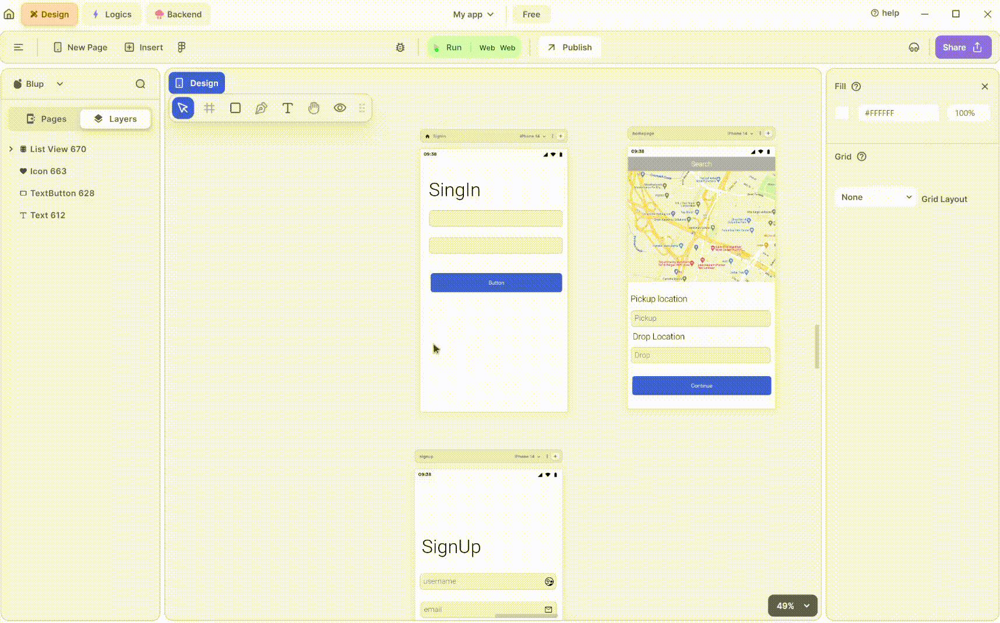

# Page ListView UI Node

Page ListView enables users to select different sections on one screen and navigate to corresponding screens in a ListView format. It provides flexibility to customize decorations according to your preferences.

## How to get the Page ListView Node.

To obtain the Page ListView, follow these steps:

**1.** Select a section similar to the rectangle UI node.

**2.** Right-click on the rectangle UI node, then choose "Page ListView."

**3.** On the right-hand side, below the margin settings, locate "Add Pages to PageList."

**4.** Select it and specify the container representing the page you want to display inside it.

### Components of Page ListView node

| Component                 | Description                                                                                                                       |
| ------------------------- | --------------------------------------------------------------------------------------------------------------------------------- |
| **Parent**                | This input node retrieves the parent node within it.                                                                              |
| **Is Update**             | This input node enables the updating of the Page ListView node.                                                                   |
| **Page Index**            | Use this node when you have multiple pages within a rectangular section and need to navigate them. Assign indexes to these pages. |
| **Item Count**            | This node allows you to count the number of items in the Page ListView.                                                           |
| **Is Hide**               | Use this input node to hide the Page ListView. It accepts a Boolean value; true hides the group, while false keeps it visible.    |
| **Extra Data**            | This input node points help to store data. which can be used in further cases.                                                    |
| **On Page Scroll**        | This node provides functionality for the page ListView is scrolled.                                                               |
| **List View Properties**  | Use this node to configure properties for your ListView, such as item count, visibility, and more.                                |
| **On Properties Update**  | This node allows you to update the decoration of your ListView by specifying width, spacing, and other attributes.                |
| **Edit Group Properties** | This checkbox helps to access secondary input node points or Extra properties associated with the Page ListView node.             |
| **Width**                 | Use this node to specify the width of your Page ListView Section.                                                                 |
| **Height**                | This node allows you to define the height of your Page ListView Section.                                                          |
| **Padding Left**          | This node point specify the padding from the left side of the Page ListView Section.                                              |
| **Padding Right**         | This node point specify the padding from the right side of the Page ListView Section.                                             |
| **Padding Top**           | This node point specify the padding from the top side of the Page ListView Section.                                               |
| **Padding Bottom**        | This node point specify the padding from the bottom side of the Page ListView Section.                                            |
| **Grid Row Count**        | This node point define the number of rows in the grid of the section.                                                             |
| **Item Spacing**          | This node determine the spacing between items inside the page ListView.                                                           |
| **Grid Spacing**          | This node point specify spacing in a grid manner.                                                                                 |

If you have any ideas to make Blup better you can share them through our [Discord community channel](https://discord.com/channels/940632966093234176/965313562425823303)

## Music to go with.


Lofi music

