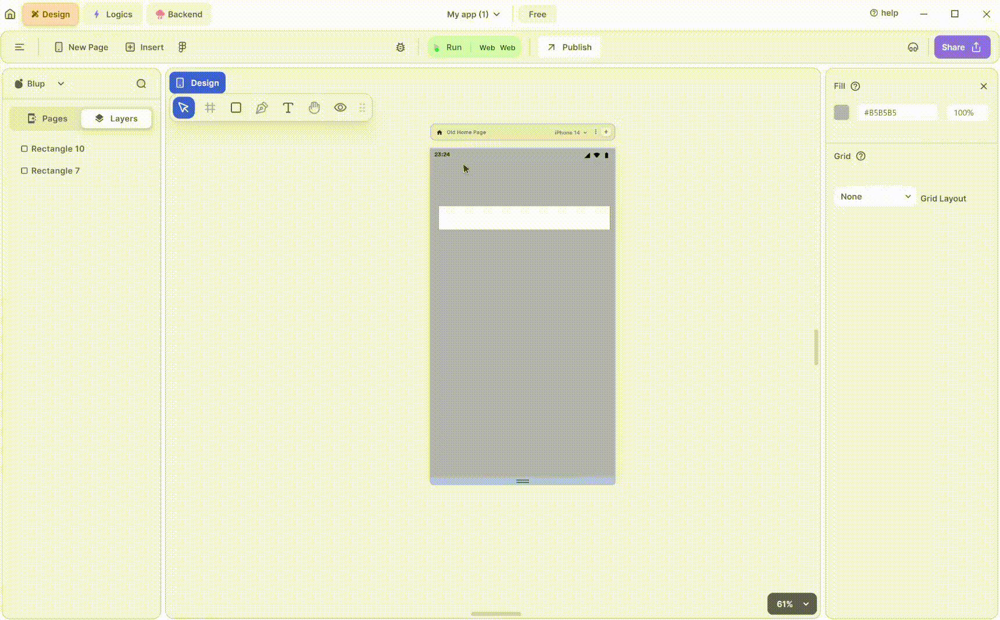

# Text UI Node

Text UI Node helps to perform logic On-click of text or when properties related to text changes.


<mark style="color:blue;">Note: Text or Text Field \[input box] has the same node i.e. text UI node.</mark>


### Components Of Text Node

| Component                 | Description                                                                                                                                                                                                              |
| ------------------------- | ------------------------------------------------------------------------------------------------------------------------------------------------------------------------------------------------------------------------ |
| **Child**                 | This input node receives the parent widget of the Text.                                                                                                                                                                  |
| **On Click**              | This node allows you to trigger actions when the Text is clicked.                                                                                                                                                        |
| **Text Properties**       | This node provides properties for the Text such as hide, extra data and many more.                                                                                                                                       |
| **Text Extra Properties** | This node offers additional options to customize the Text, such as padding, font size, letter spacing and many more.                                                                                                     |
| **Text**                  | This input node point helps to provide the text to be shown.                                                                                                                                                             |
| **Is Visible**            | This input node point is used to hide the Text or Textfield. This node point accepts a Boolean-type value if the value is true it hides the group, or else the group is visible.                                         |
| **Extra Data**            | This input node point helps to store data that can be used further down the line.                                                                                                                                        |
| **Edit Checkbox**         | This checkbox helps you to access secondary input node points of the selected Text or TextField. If the checkbox is checked, all the secondary input node points are visible; if not they are hidden and cannot be used. |
| **Padding Left**          | This node point helps to give the left padding.                                                                                                                                                                          |
| **Padding Right**         | This node point helps to give the Right padding.                                                                                                                                                                         |
| **Padding Top**           | This node point helps to give the Top padding.                                                                                                                                                                           |
| **Padding Bottom**        | This node point helps to give the Bottom padding.                                                                                                                                                                        |
| **Font Size**             | This input node point helps to define the font size of the text.                                                                                                                                                         |
| **Letter Spacing**        | This input node point helps to define the spacing between the letters of the text.                                                                                                                                       |
| **Line Height**           | This input node point helps to define a height between the text. The bigger the number, the bigger will be the height and vice versa.                                                                                    |
| **Max Lines**             | This input node point helps to define the max line to which your text can expand , for example, if you define the maxline value as 2 then your text can only take up 2 lines.                                            |
| **Text Vertical Wrap**    | As the name suggests, this property helps to rotate your text 90 degree..                                                                                                                                                |
| **Font Color**            | As the name suggests, this property helps to define the font colour.                                                                                                                                                     |
| **Is Ellipses**           | This input node point helps to convert the text expanded into multiple lines to a single line and show the rest of the text in “….” form.                                                                                |

If you have any ideas to make Blup better you can share them through our [Discord community channel](https://discord.com/channels/940632966093234176/965313562425823303)

## Music to go with.


Lofi music

