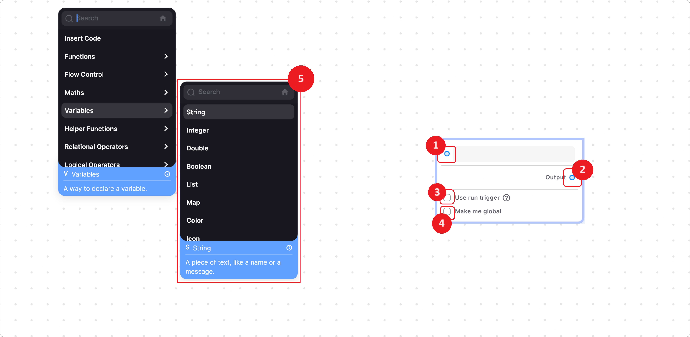

# Variables Node Section

The nodes in this section are used to store/hold some data. you can find all the literal nodes like string \[for storing the sequence of characters], double \[for storing the decimal number], integer \[for storing the whole numbers].

### Common Functionality In All Variables Nodes

**1.** **Input node point –** This node point is used to give the data dynamically instead of hardcoding them into the node.

**2.** **Output node point –** This node point is used to get the output or data you have entered or given through the input node point.

**3.** **Use Run trigger checkbox –** When you check this checkbox you will see that two new function node points will appear in the node one on the top left and one on the top right side.

* Run function node point On Left– this node point helps you to run the node on an event like on-click of a button.
* Run function node point on Right– this node point helps you to run your other logic after the current logic end has ended. For example, with one click of a button you want to assign data to a string node from the string node, and after the assignment of data you want to upload a file to the link present in the string node this run trigger help you out in such scenarios.
* Call set-state checkbox – this checkbox helps you with refreshing your UI, once your node is being called by some other node.

**4.** **Make me global functionality** – this checkbox helps you to make the node be available globally, which mean that you can use this data present in the node in other tabs also.


<mark style="color:blue;">Note: To get this data in other tabs, you can use Page| get global var node present in function section in arsenal or directly search it in the search box.</mark>


**5.** **Menu for other variables** - From this menu, you can select various types of variables according to your needs. Below are the details of each node:

<table><thead><tr><th width="169"></th><th></th></tr></thead><tbody><tr><td><strong>String Node</strong></td><td>This node is used to define text strings. You can input text directly into the node or use an input node point. Additionally, you can enable the multi-line checkbox to input multi-line text.</td></tr><tr><td><strong>Integer Node</strong></td><td>This node defines whole numbers without decimal points, such as 20, 25, 36, etc. You can input values directly into the node or use an input node point.</td></tr><tr><td><strong>Double Node</strong></td><td>The Double Node is for defining numbers with decimal points, like 10.20, 20.35, etc. Similar to other variable nodes, you can input values directly or use an input node point.</td></tr><tr><td><strong>Boolean Node</strong></td><td>Boolean values are either true or false. This node accepts such values. You can toggle the checkbox to set the value as true or false, or use an input node point.</td></tr><tr><td><strong>List Node</strong></td><td>This node helps you define a collection of elements in an ordered manner. These elements can be of any type, such as integers or strings. For instance, you can have a list of integers containing multiple integer values or a list of strings containing multiple string values.</td></tr><tr><td><strong>Map Node</strong></td><td>This node assists in defining a collection of key-value pairs, where each key is a unique element and each value is the data associated with that key.</td></tr><tr><td><strong>Color Node</strong></td><td>This node helps you to define a colour, to define a colour through this node just click on input [white colour], you can pick a colour by using the eyedropper, entering the hex code or from manually adjusting the RGB scroller and selecting the appropriate saturation and lighting.</td></tr><tr><td><strong>Icon Node</strong></td><td>This node helps you to add an icon. To Add the icon click on the add button present in the center of the node and select the icon of your choice from the list to provide or you can directly search for any icon with a name through the search input box provided.</td></tr><tr><td><strong>Date Time Node</strong></td><td>
This node is used to define a date or time, this node is very useful when you are dealing with data that is bounded by some date or time.

This node can be used in three ways
<ol><li>Date only- This option helps you to define date only.</li><li>Time only – This option helps you to define time only.</li><li>Date and Time - This option helps you to define both date and time.</li></ol></td></tr><tr><td><strong>Duration Node</strong></td><td>
This node is used to define the duration in terms of days, hours and minutes. This node can be used in many situations like when you want an event or any trigger to happen after some time.

To define the duration just get the duration node from the variables section in the arsenal or you can directly search by name. As you open the node you will see an input box, when you click on that input box a dialog box will show up and then you can give appropriate values according to your requirements, it can accept the duration from the input node point also.
</td></tr></tbody></table>

If you have any ideas to make Blup better you can share them through our [Discord community channel](https://discord.com/channels/940632966093234176/965313562425823303)

## Music to go with.


Lofi music

